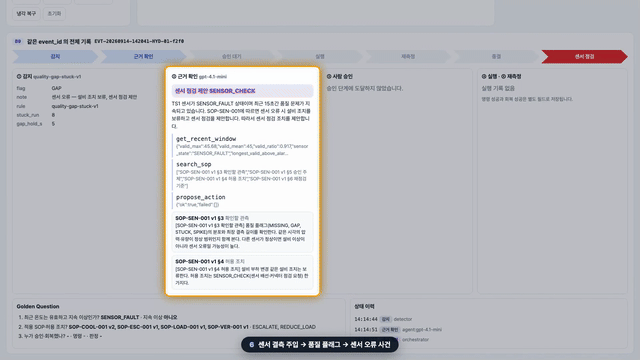

# 제조 피지컬 AI · 플랫폼 연계 교육과정 — 강의 패키지

실라버스 `제조_피지컬AI_플랫폼연계_실라버스_v2.docx` 를 실제로 수업할 수 있게 만든 결과물이다.
센서 데이터에서 시작해 이상 감지, 근거 있는 조치 제안, 사람 승인, 시뮬레이터 조치, 재측정까지 이어지는 시스템을 완성하고, 그 과정을 영상·그림·차수별 교재·실습으로 옮겼다.

## 설명 영상

GitHub는 저장소 안의 mp4를 다운로드 링크로만 처리해 인라인 재생을 지원하지 않는다. 위 GIF는 관제 화면(B9) 구간 미리보기이고, 나레이션·자막이 있는 전체 영상은 [video/HydOps_강의시스템_설명영상.mp4](video/HydOps_강의시스템_설명영상.mp4)(다운로드), 자막은 [video/HydOps_강의시스템_설명영상.srt](video/HydOps_강의시스템_설명영상.srt)에 있다.

| 폴더 | 내용 | 시작점 |
|---|---|---|
| `system/` | 강의용 완성 시스템 (B1~B9 + 교육용 플랫폼) · 테스트 · 준비 스크립트 | [system/README.md](system/README.md) |
| `video/` | 설명 영상 (실제 실행 녹화 + OpenAI TTS 나레이션 + 한국어 자막) | `HydOps_강의시스템_설명영상.mp4` · `video_report.txt` |
| `materials/` | 중간 결과물 — 데이터 그림 10 · 개념도 7 · 실제 화면 17 | [materials/index.html](materials/index.html) |
| `textbooks/` | 차수별 교재 — 실전반 9 · 통합반 10 (Markdown 원본, DOCX·HTML·PDF 빌드) | [textbooks/dist/index.html](textbooks/dist/index.html) |
| `labs/` | 회차별 실습 — 시작본 · 정답본 · 자동 검증 테스트 | `labs/practical/SXX` · `labs/integrated/SXX` |
| `tools/` | 교재 빌드 스크립트 | `python tools/build_textbooks.py --pdf` |

## 수업 전 강사 체크리스트

1. `cd system && docker compose up -d` → 스키마·그래프·SOP 인덱스 적재 (system/README §2)
2. `PYTHONPATH=. .venv/bin/python -m pytest tests -q` → 25 passed
3. `scripts/servers.sh platform 4 && PYTHONPATH=. .venv/bin/python scripts/bootstrap_platform.py --all && PYTHONPATH=. .venv/bin/python scripts/e2e_platform.py` → 7 사례 통과 (한 사건의 감지·조회·승인·조치·재측정 + 실패·중복 사례)
4. 회차에 맞게 플랫폼 준비 단계를 되돌린다: 예) 실전반 6회는 `--upto ontology` 까지만 (발행은 학생)
5. 실습 정답 검증: `for d in ../labs/*/S*; do LAB_SOLUTION=1 PYTHONPATH=. .venv/bin/python -m pytest $d -q; done` (결과 기록: `system/out/labs_verification.txt`)

## 원칙

- 실제 uEngine 플랫폼은 **참고만** 했다. 수업은 노트북에서 도는 교육용 플랫폼(`system/labplatform`)으로 하고, 교재마다 실제 플랫폼 대응표를 둔다.
- 수치 기준·시뮬레이터·제품 검사값은 교육용 가정과 합성 데이터다. UCI 설비 상태 라벨을 제품 불량이라 부르지 않는다.
- 종결 기준은 도구 호출 성공이 아니라 조치 이후 새 관측의 회복이다.
