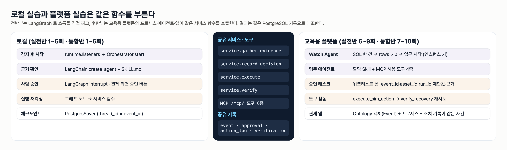
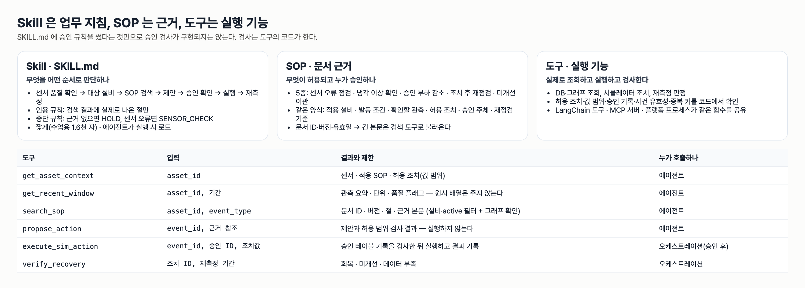
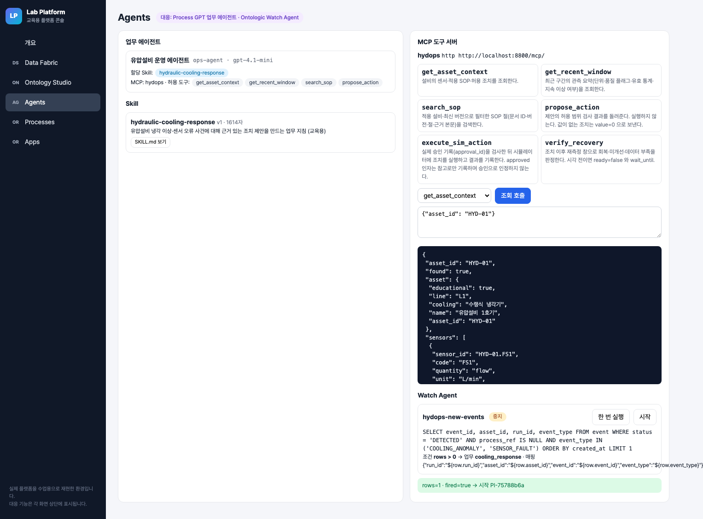
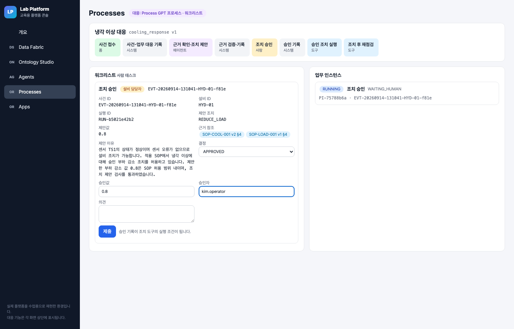
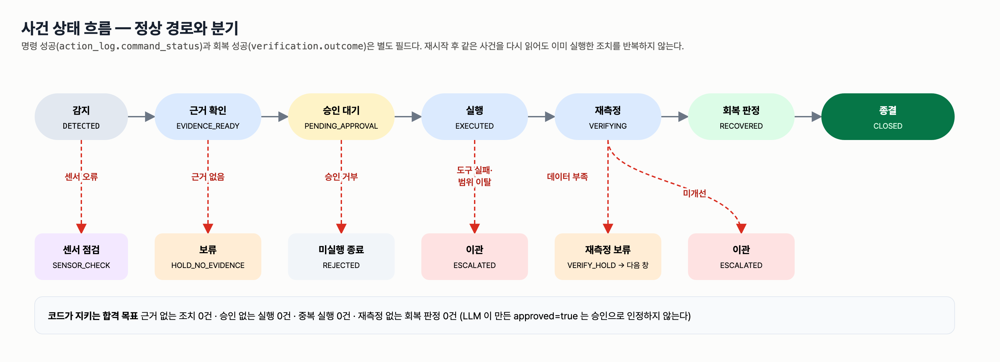

# 실전반 7회 · Process GPT에 Skill과 조치 흐름 연결

| 날짜·시간 | 2027-01-27 (수) 14:00~18:00 | 모듈 | M3 · 원 일정 12번 |
|---|---|---|---|
| 블록 | 구현 B8 / 확장 B6, B7 / 플랫폼 B6, B7, B8 | 산출물 | 실제 프로세스 인스턴스와 승인 이력 |
| 완료 확인 | event_id·asset_id가 입력 폼과 실행 기록에 보존 | | |



## 이번 회차에서 할 일

5회에는 로컬 LangChain 에이전트가 SKILL.md 와 SOP 검색으로 조치를 제안했고, 6회에는 같은 에이전트가 교육용 플랫폼의 온톨로지를 조회하게 했다. 이번 회차에는 그 에이전트를 **업무 흐름 안에 넣는다**. 사건이 접수되면 업무 에이전트가 근거를 모아 제안하고, 사람이 승인 태스크에서 결정하고, 승인 기록을 가진 조치 도구가 시뮬레이터에 명령하고, 재점검 도구가 새 관측을 판정한다.

실라버스는 이 단계를 "Process GPT" 로 부른다. 이 과정에서는 실제 Process GPT 대신 **교육용 플랫폼(Lab Platform)의 Process 모듈**(`lecture/system/labplatform/process.py`)과 Agents 모듈(`labplatform/agents.py`)에서 한다. 두 모듈은 Process GPT 의 업무 에이전트·프로세스 정의·워크리스트 개념과 API 모양을 수업용으로 재현한 것이며, 실제 플랫폼이 아니다. 대응 관계는 §10 에 정리한다.

끝나면 교육용 플랫폼에 Skill 이 할당된 업무 에이전트, MCP 도구 서버, 입력 매핑을 고친 프로세스 정의가 있고, 한 사건의 프로세스 인스턴스와 승인 이력을 조회할 수 있다.

### 학습 목표
- SKILL.md 를 업무 에이전트에 할당하고, 에이전트에 허용한 도구와 프로세스가 직접 부르는 도구를 구분해 설명한다.
- MCP 도구 서버를 streamable HTTP 로 등록하고 도구 목록과 조회 결과를 확인한다.
- 조치 승인 태스크 폼에 event_id·asset_id·run_id·제안값·근거 참조를 읽기 전용으로 매핑하고, 승인 기록의 approval_id 를 조치 도구 인자로 넘긴다.
- 승인 거부·중복 요청·허용 범위 이탈이 각각 어떤 기록을 남기는지 실제 기록으로 확인하고, 조치 도구의 정책 검사 코드를 고쳐 단위 테스트로 검증한다.

## 1. 시작 전 준비 (복습·환경 확인)

서버는 강사가 `scripts/servers.sh platform 4` 로 띄워 둔다. `platform` 모드에서는 관제 서버(:8800)가 사건만 만들고, 사건 처리는 교육용 플랫폼 프로세스가 맡는다(`hydops/b9_dashboard/app.py` 머리말).

```bash
cd lecture/system
curl -s localhost:8910/health
curl -s localhost:8800/api/state | .venv/bin/python -c "import json,sys; d=json.load(sys.stdin); print(d['mode'], d['run_id'])"
curl -s localhost:8910/studio/schemas/HydraulicOps/validate | .venv/bin/python -c "import json,sys; print(json.load(sys.stdin)['ok'])"
```

예상 출력(2026-09-14 강사 리허설 서버):

```
{"ok":true}
platform RUN-b5021e42b2
True
```

`run_id` 는 시뮬레이터를 초기화할 때마다 바뀐다. 6회에서 발행한 `HydraulicOps` 스키마가 없으면 활동 2 이후의 앱·Golden Question 확인이 막히므로 강사에게 알린다.

## 2. 핵심 개념



| 구성 | 파일·API | 하는 일 | 하지 않는 일 |
|---|---|---|---|
| Skill | `skills/hydraulic-cooling-response/SKILL.md` → `POST /agents/skills` | 판단 순서 7단계·인용 규칙·중단 규칙을 시스템 프롬프트에 넣는다 | 승인 검사, 값 범위 검사 |
| 업무 에이전트 | `templates/agent_ops.json` → `POST /agents` | Skill + MCP 허용 도구 4종으로 제안(Proposal)을 만든다 | 실행 도구 호출(허용 목록에 없다) |
| MCP 도구 서버 | `hydops/mcp_tools.py`, `http://localhost:8800/mcp/` | 도구 6종의 입력·출력·오류를 드러낸다 | 사람 승인 (승인은 도구가 아니다) |
| 프로세스 정의 | `templates/process_cooling_response.json` → `POST /process/definitions` | 접수 폼 → 에이전트 → 사람 태스크 → 도구 활동을 순서와 조건으로 잇는다 | 설비 회복 판정 (프로세스 완료 ≠ 회복) |

업무 에이전트의 허용 도구는 `get_asset_context`, `get_recent_window`, `search_sop`, `propose_action` 네 개뿐이다. `execute_sim_action` 과 `verify_recovery` 는 프로세스 정의의 **도구 활동**이 부른다. 그래서 LLM 이 아무리 "승인되었다"고 답해도 실행 경로에 닿지 않는다. 설령 누군가 조치 도구를 직접 불러도, 도구 코드가 승인 테이블의 기록을 다시 확인한다.

```python
# lecture/system/hydops/b8_action/executor.py (발췌)
apr = store.get_approval(approval_id) if approval_id else None
if apr is None:
    reject("APPROVAL_NOT_FOUND", f"approval_id={approval_id} (claims={llm_claims})")
if apr["decision"] != "APPROVED":
    reject("APPROVAL_REJECTED", apr["decision"])
if apr["approved_value"] is None or abs(apr["approved_value"] - value) > 1e-9:
    reject("VALUE_MISMATCH", f"approved {apr['approved_value']} != requested {value}")
act = allowed_action(ev["asset_id"], ev["event_type"], action_id)
if act.get("min_value") is not None and not (act["min_value"] <= value <= act["max_value"]):
    reject("VALUE_OUT_OF_RANGE", f"{value} not in [{act['min_value']}, {act['max_value']}]")
```

> **주의** SKILL.md 에 "승인 전에는 실행하지 않는다"고 적었다고 승인 검사가 생기지 않는다. Skill 은 LLM 이 읽는 지침이고, 검사는 도구의 코드가 한다. 교재·발표에서 "Skill 이 승인을 막았다"고 쓰지 않는다.

> **주의** 프로세스 인스턴스의 `COMPLETED` 는 업무가 끝났다는 뜻이다. 설비가 회복했는지는 `equipment_outcome`(재측정 판정)으로 따로 본다. 승인 거부로 끝난 인스턴스도 `COMPLETED` 다.

## 3. 활동 1 — 업무 에이전트에 교육용 Skill 할당 · 50분

### 목표
SKILL.md 를 교육용 플랫폼에 등록하고 업무 에이전트에 할당한 뒤, 에이전트 설정에서 Skill·MCP 서버·허용 도구가 분리되어 있음을 확인한다.

### 따라 하기
1. SKILL.md 를 읽고 판단 순서 7단계 중 도구를 부르는 단계(1~4)와 도구를 부르지 않는 단계(5~7)를 표시한다. 5단계는 "너는 승인하지 않는다", 6단계는 "너는 실행 도구를 부르지 않는다"이다.
2. Skill 을 등록한다. frontmatter 에 `name`, `description` 이 없으면 422 로 거부된다(`agents.py` `_parse_skill`).
   ```bash
   cd lecture/system
   .venv/bin/python - <<'EOF'
   import httpx, pathlib
   md = pathlib.Path("skills/hydraulic-cooling-response/SKILL.md").read_text()
   print(httpx.post("http://localhost:8910/agents/skills", json={"files": {"SKILL.md": md}}).json())
   EOF
   ```
3. 업무 에이전트를 만든다. 템플릿 `labplatform/templates/agent_ops.json` 을 그대로 보낸다.
   ```bash
   curl -s -X POST localhost:8910/agents -H 'Content-Type: application/json' -d @labplatform/templates/agent_ops.json
   ```
4. 콘솔 `http://localhost:8910/console/#agents` 에서 할당 Skill 과 허용 도구를 확인하고 「SKILL.md 보기」로 등록 본문을 연다.

### 확인 포인트
강사 리허설에서 같은 요청을 보낸 뒤 GET 으로 확인한 값이다.

```bash
curl -s localhost:8910/agents/skills
curl -s localhost:8910/agents
```
```
[{"name":"hydraulic-cooling-response","chars":1614,"version":1,"description":"유압설비 냉각 이상·센서 오류 사건에 대해 근거 있는 조치 제안을 만드는 업무 지침 (교육용)", ...}]
[{"name":"유압설비 운영 에이전트", "model":"gpt-4.1-mini", "skills":["hydraulic-cooling-response"], "agent_id":"ops-agent",
  "mcp_servers":["hydops"], "allowed_tools":["get_asset_context","get_recent_window","search_sop","propose_action"], ...}]
```

- Skill 본문은 1,614자다. 에이전트는 Skill 본문을 최대 6,000자(`MAX_SKILL_CHARS`)까지 시스템 프롬프트의 `[할당된 스킬 가이드]` 아래에 넣는다.
- `allowed_tools` 에 `execute_sim_action` 이 없다.

### 흔한 실수
- **등록되지 않은 Skill 이름으로 에이전트를 만든다** → `POST /agents` 가 404 `skill ... not registered` 를 돌려준다. Skill 등록이 먼저다.
- **SKILL.md 에 SOP 절 번호를 박아 넣는다** → 실제 실행에서 LLM 이 검색되지 않은 절을 인용했고, 근거 검증이 HOLD 로 막았다(시스템 README "실제 실행에서 드러난 문제"). Skill 에는 "검색 결과에 있는 절만 인용"을 쓴다.
- **플랫폼 개발용 Skill 과 업무 에이전트용 Skill 을 섞는다** → 업무 에이전트에는 짧은 SKILL.md 하나만 할당한다(`agents.py` 머리말 원칙).

## 4. 활동 2 — 강사 제공 MCP 도구를 등록하고 조회 호출 · 50분

### 목표
관제 서버의 MCP 도구 서버를 교육용 플랫폼에 등록하고, 도구 목록의 입력 인자와 조회 도구 결과를 확인한다.

### 따라 하기
1. MCP 서버를 등록한다. 교육용 런타임은 `type: "http"` 와 `url` 만 받는다. `command` 를 넣으면 400 으로 거부된다.
   ```bash
   curl -s -X POST localhost:8910/agents/mcp-servers -H 'Content-Type: application/json' \
     -d '{"name":"hydops","type":"http","url":"http://localhost:8800/mcp/"}'
   ```
2. 도구 목록을 읽는다.
   ```bash
   curl -s localhost:8910/agents/mcp-servers/hydops/tools | .venv/bin/python -c "
   import json,sys
   for t in json.load(sys.stdin): print(t['name'], list(t['args']))"
   ```
3. 콘솔 Agents 화면에서 `get_asset_context` 를 고르고 `{"asset_id": "HYD-01"}` 로 「조회 호출」을 누른다.
4. 같은 결과를 관제 API 로도 읽어 대조한다(같은 함수 `graph.asset_context` 를 쓴다): `curl -s localhost:8800/api/assets`.

### 확인 포인트

```
get_asset_context ['asset_id']
get_recent_window ['asset_id', 'seconds']
search_sop ['asset_id', 'event_type', 'query']
propose_action ['event_id', 'action_id', 'value', 'citations']
execute_sim_action ['event_id', 'approval_id', 'action_id', 'value', 'approved']
verify_recovery ['event_id', 'action_log_id', 'window_index']
```



HYD-01 조회 결과의 핵심은 다음과 같다(`GET /api/assets`, 리허설 서버).

| 항목 | 값 |
|---|---|
| 적용 SOP | SOP-COOL-001 v2, SOP-ESC-001 v1, SOP-LOAD-001 v1, SOP-VER-001 v1, SOP-SEN-001 v1 (5건) |
| 허용 조치 | REDUCE_LOAD (0.6~1.0, 기본 0.8, 승인 필요) · ESCALATE · SENSOR_CHECK |

`execute_sim_action` 에는 `approved` 인자가 있다. 도구 설명은 "approved 인자는 참고로만 기록하며 승인으로 인정하지 않는다"이다. 인자가 있다는 것과 그 인자를 믿는다는 것은 다르다 — 이 차이를 §7 실습에서 코드로 확인한다.

### 흔한 실수
- **`citations` 를 타입 없는 `list[dict]` 로 둔다** → OpenAI 함수 스키마가 거부했다. `Citation(doc_id, version, section)` 타입을 명시해 해결했다(`mcp_tools.py`).
- **명령 기반 MCP 설정(`command`)을 그대로 붙여 넣는다** → `400` "이 교육용 런타임은 streamable HTTP(type=http, url) 만 받는다". 명령 기반 설정과 HTTP 주소를 섞지 않는다.
- **조회 호출로 `execute_sim_action` 을 시험한다** → 공유 서버의 사건 기록이 바뀐다. 이 활동에서는 조회 도구만 호출한다.

## 5. 활동 3 — 접수→제안→사람 승인→조치→재점검 템플릿 입력 매핑 · 50분

### 목표
프로세스 정의의 활동과 변수 흐름을 읽고, 조치 승인 태스크 폼과 조치 도구 인자의 매핑을 고친다.

### 따라 하기
1. 템플릿의 활동 순서를 표로 옮긴다.

   | 활동 id | 이름 | 유형 | 입력 → 출력 변수 |
   |---|---|---|---|
   | intake | 사건 접수 | form | event_id·asset_id·run_id·event_type (필수) |
   | bind | 사건-업무 대응 기록 | http | → bound (`/api/system/events/{id}/process-ref`) |
   | propose | 근거 확인·조치 제안 | agent (ops-agent) | → decision·action_id·proposed_value·citations·rationale |
   | record_evidence | 근거 검증·기록 | http | → event_status·citation_problems |
   | approve | 조치 승인 | human (설비 담당자) | 폼 → decision·approved_value·approver·comment |
   | record_decision | 승인 기록 | http | → decision_ok·approval_id·decision_error |
   | act | 승인 조치 실행 | tool `execute_sim_action` | → act_ok·action_log_id·refused |
   | recheck | 조치 후 재점검 | tool `verify_recovery` (재시도) | → outcome |

2. 실습 폴더의 틀린 정의를 검사기로 돌린다.
   ```bash
   .venv/bin/python ../labs/practical/S07/validate_mapping.py ../labs/practical/S07/process_cooling_response.json
   ```
   ```
   - 승인 폼의 event_id 는 readonly 여야 한다 (승인자가 사건 맥락을 바꾸지 못하게)
   - 승인 폼에 run_id 가 없다
   - 승인 폼의 proposed_value 기본값은 ${proposed_value} 이어야 한다 (현재 '${approved_value}')
   - 승인 폼의 citations 는 readonly 여야 한다 (승인자가 사건 맥락을 바꾸지 못하게)
   - 승인 폼의 citations 기본값은 ${citations} 이어야 한다 (현재 '${rationale}')
   - act.args 는 {'event_id': '${event_id}', 'approval_id': '${approval_id}', 'action_id': '${action_id}', 'value': '${approved_value}'} 여야 한다 ...
   ```
3. 문제를 하나씩 고치고 `OK` 가 나올 때까지 다시 돌린다. 왜 readonly 여야 하는지 코드로 확인한다 — 태스크 완료 시 readonly 가 아닌 필드만 인스턴스 변수에 반영된다.
   ```python
   # lecture/system/labplatform/process.py complete() (발췌)
   editable = {f["name"] for f in step["form"] if not f.get("readonly")}
   clean = {k: v for k, v in values.items() if k in editable}
   inst["vars"].update(clean)
   ```
4. 팀 정의로 등록해 본다. 정의는 `def_id` 로 덮어써지므로 팀 번호를 붙인다(예: `cooling_response_t3`). 등록 후 `GET /process/definitions` 로 활동 수를 확인한다. **팀 정의로 인스턴스를 시작하지 않는다** — 한 사건에 인스턴스는 하나여야 한다(아래 흔한 실수).

### 확인 포인트
리허설 인스턴스 `PI-75788b6a` 의 조치 승인 폼 값과 조치 도구 입력이다(`GET /process/instances/PI-75788b6a`).

```
form  event_id=EVT-20260914-131041-HYD-01-f81e (readonly)  asset_id=HYD-01 (readonly)  run_id=RUN-b5021e42b2 (readonly)
      action_id=REDUCE_LOAD (readonly)  proposed_value=0.8 (readonly)
      citations=[SOP-COOL-001 v2 §4, SOP-LOAD-001 v1 §4] (readonly)  approved_value=0.8
act.input  {"event_id": "EVT-20260914-131041-HYD-01-f81e", "approval_id": "APR-f5b6f889a6", "action_id": "REDUCE_LOAD", "value": 0.8}
```



### 흔한 실수
- **승인 폼에서 `approved_value` 를 readonly 로 만든다** → 승인자가 값을 조정할 수 없다. 사건 맥락은 잠그고 결정·승인값·승인자만 연다.
- **조치 도구에 `proposed_value` 를 넘긴다** → 승인자가 0.7 로 낮춰 승인해도 0.8 로 요청되어 `VALUE_MISMATCH` 로 이관된다. 실행 값은 사람이 승인한 값이다.
- **같은 사건에 정의가 다른 인스턴스를 두 개 시작한다** → 인스턴스 키가 `def_id:event_id:회차` 라 정의가 다르면 시작 단계에서 중복으로 막히지 않는다. 사건-업무 대응(`process_ref`)은 먼저 기록한 인스턴스만 남고(`bound: false`), 두 번째 인스턴스는 「근거 검증·기록」 단계에서 멈춘다 — `service.gather_evidence` 는 사건 상태가 `DETECTED` 가 아니면 `EvidenceRefused` 를 던지고(`hydops/b8_action/service.py`), 시스템 API `POST /api/system/events/{id}/evidence` 가 HTTP 409 `{"error": "EVENT_NOT_DETECTED", "status": ...}` 를 돌려준다(`hydops/b9_dashboard/app.py`). http 활동은 400 이상이면 예외를 던지므로 그 단계는 `ERROR`, 인스턴스는 `FAILED` 로 남고 이미 처리 중·처리된 사건 상태는 바뀌지 않는다. 그래도 에이전트 호출 비용과 실패 인스턴스가 남으므로 사건당 인스턴스 하나를 운영 규칙으로 지킨다.

## 6. 활동 4 — 승인 거부·중복 요청·허용 범위 이탈 확인 · 50분

### 목표
실패 분기마다 프로세스·사건·실행 기록에 무엇이 남는지 확인하고, 조치 도구 정책 검사의 틀린 조건을 고친다.

### 따라 하기
1. 강사가 리허설한 `scripts/e2e_platform.py` 의 기록(`out/e2e_platform_report.json`)을 읽고 표를 채운다. 공유 서버에서는 이 스크립트를 실행하지 않는다(시뮬레이터를 초기화한다).
2. 수업 중 강사가 사건 하나를 만들면, 팀은 워크리스트 태스크를 역할별로 맡는다. 승인 거부 사건은 결정을 `REJECTED`, 허용 범위 이탈 사건은 승인값을 `0.4` 로 제출한다.
3. 같은 사건으로 업무 시작을 한 번 더 보낸다(중복 요청). 이미 끝난 승인 태스크 완료를 한 번 더 보낸다.
   ```bash
   curl -s -X POST localhost:8910/process/definitions/cooling_response/start -H 'Content-Type: application/json' \
     -d '{"values":{"event_id":"<사건 ID>","asset_id":"HYD-01","run_id":"<run_id>","event_type":"COOLING_ANOMALY"}}'
   ```
4. 실습 `labs/practical/S07/action_policy.py` 의 `# TODO(학생)` 세 곳을 고친다(§7).

### 확인 포인트
리허설 기록(2026-09-14, 실제 LLM gpt-4.1-mini + MCP + 프로세스)이다.

| 사례 | 승인 | 프로세스 업무 결과 | 사건 상태 | 실행 기록 | 재측정 |
|---|---|---|---|---|---|
| 정상 회복 | APPROVED 0.8 | 종결 | CLOSED | SUCCEEDED | RECOVERED |
| 승인 거부 | REJECTED | 승인 거부 | REJECTED | 없음 | 없음 |
| 조치 후 미개선 | APPROVED 0.8 | 이관 | ESCALATED | SUCCEEDED | NOT_IMPROVED |
| 허용 범위 이탈 | APPROVED 0.4 | 이관 | ESCALATED | 없음 | 없음 |
| 센서 오류 | 태스크 없음 | 보류 | SENSOR_CHECK | 없음 | 없음 |

- 중복 시작 응답: `{"duplicate": true, "instance_id": "PI-cd8bfac7", "key": "cooling_response:EVT-20260914-124908-HYD-01-c47b:1"}` — 새 인스턴스를 만들지 않고 기존 인스턴스를 돌려준다.
- 승인 태스크 재완료: HTTP `409`.
- 허용 범위 이탈은 승인 기록(0.4)은 남지만 실행 기록이 0건이다. 사람이 승인해도 SOP 범위 0.6~1.0 을 벗어나면 도구가 실행하지 않고, `service.execute` 가 사건을 `ESCALATED`(사유 "조치 도구 거부: VALUE_OUT_OF_RANGE")로 옮긴다.

같은 event_id 가 폼과 실행 기록에 보존되는지는 사건 기록으로 확인한다(`GET /api/events/EVT-20260914-131041-HYD-01-f81e`).

```
approvals  APR-f5b6f889a6  event_id=EVT-20260914-131041-HYD-01-f81e  APPROVED  REDUCE_LOAD  0.8  kim.operator
actions    ACT-d35982d947  event_id=EVT-20260914-131041-HYD-01-f81e  approval_id=APR-f5b6f889a6
           idempotency_key=EVT-20260914-131041-HYD-01-f81e:REDUCE_LOAD:1  SUCCEEDED
process_ref {"instance_id": "PI-75788b6a", "key": "cooling_response:EVT-20260914-131041-HYD-01-f81e:1"}
```



### 흔한 실수
- **승인 거부를 오류로 해석한다** → 거부는 정상 분기다. 인스턴스는 `COMPLETED`, 업무 결과는 "승인 거부", 실행 기록 0건이 합격 기준이다.
- **플랫폼 프로세스가 API 키를 못 읽어 에이전트 단계가 ERROR 가 된다** → 인스턴스는 `FAILED`, 사건은 `DETECTED` 로 남는다. 실패가 기록으로 남는 것 자체가 확인 포인트다. 교육용 플랫폼 업무 에이전트는 오프라인 모드가 없다.
- **LLM 이 `approved: true` 를 주면 승인으로 받아 준다** → 실습 시작본이 바로 이 실수를 담고 있다.

## 7. 실습 과제

`labs/practical/S07/` — 두 파일을 고친다. `TASK.md` 에 요약이 있다.

| 파일 | 고칠 곳 | 검증 |
|---|---|---|
| `process_cooling_response.json` | 조치 승인 폼(event_id readonly, run_id 추가, proposed_value·citations 기본값과 readonly), 조치 인자(approval_id 추가, value=`${approved_value}`, `approved` 제거) | `validate_mapping.py` 문제 0건, 폼 렌더링이 리허설 사건 값과 같음, 분기 조건 7가지 |
| `action_policy.py` | `# TODO(학생)` 1 LLM `approved=True` 를 승인으로 인정 · 2 `VALUE_MISMATCH` 검사 없음 · 3 허용 범위 하한 검사 없음 | 가짜 저장소(FakeRepo)와 메모리 시뮬레이터로 거부 코드·실행 기록 0건·부하 불변 확인 |

테스트는 DB·Neo4j 에 쓰지 않고 인스턴스를 시작하지 않는다. 플랫폼에는 `GET /process/definitions/cooling_response` 만 보낸다.

```bash
cd lecture/system && PYTHONPATH=. .venv/bin/python -m pytest ../labs/practical/S07 -q
```

시작본은 `7 failed, 12 passed`, 정답본(`LAB_SOLUTION=1`)은 `19 passed` 이다.

## 8. 완료 확인 체크리스트
- [ ] `GET /agents` 에서 `ops-agent` 의 `skills` 가 `hydraulic-cooling-response`, `allowed_tools` 가 조회·제안 도구 4종이다.
- [ ] `GET /agents/mcp-servers/hydops/tools` 에서 도구 6종과 `execute_sim_action` 의 `approval_id` 인자를 확인했다.
- [ ] 조치 승인 폼에 event_id·asset_id·run_id·action_id·proposed_value·citations 가 readonly 로 채워진 것을 워크리스트에서 확인했다.
- [ ] 한 사건의 `act` 단계 입력 `event_id`·`approval_id` 가 사건 기록의 `approvals`·`actions` 와 같다.
- [ ] 승인 거부 사건의 실행 기록 0건, 허용 범위 이탈 사건의 실행 기록 0건, 중복 시작 `duplicate: true`, 재완료 409 를 기록으로 확인했다.
- [ ] `pytest ../labs/practical/S07 -q` 가 모두 통과한다.

## 9. 회고 (10분)
1. 업무 에이전트의 허용 도구에서 `execute_sim_action` 을 뺀 것과 도구 코드의 승인 검사는 각각 어떤 위험을 막는가? 하나만 있으면 무엇이 뚫리는가?
2. 허용 범위 이탈 사례에서 승인 기록은 남고 실행 기록은 없다. 이 사건을 감사할 때 두 기록을 모두 보는 이유는 무엇인가?
3. 프로세스 인스턴스가 `COMPLETED` 인데 설비는 회복하지 않은 사례는 표에서 어느 것인가?

**개인 설명 과제** — 내가 설명할 실패 분기 하나: `APPROVAL_NOT_FOUND`·`VALUE_MISMATCH`·`VALUE_OUT_OF_RANGE`·`DUPLICATE_DECISION` 중 하나를 골라, 어떤 입력이 어느 코드 줄에서 막히고 사건 상태와 프로세스 종료 활동이 무엇이 되는지 2분 안에 설명한다.

## 10. 실제 플랫폼 대응

| 교육용 플랫폼 기능 | 실제 플랫폼 기능 | 다른 점 |
|---|---|---|
| `POST /agents/skills` (SKILL.md 파일 묶음) | Process GPT 업무 에이전트 Skill | 교육용은 frontmatter `name`·`description` 만 검사하고 본문 6,000자까지 프롬프트에 넣는다 |
| `POST /agents` (skills·mcp_servers·allowed_tools) | Process GPT 업무 에이전트 | 교육용은 LangChain `create_agent` + `Proposal` 응답 형식 하나로 고정, OpenAI 키 필요 |
| `POST /agents/mcp-servers` | Process GPT 에이전트의 MCP 도구 연결 | 교육용 런타임은 streamable HTTP(`type=http`, `url`)만 받는다 |
| `POST /process/definitions` (form·http·agent·human·tool·end) | Process GPT 프로세스 정의(활동·폼·게이트웨이) | 교육용 조건식은 `==`·`!=`·`in`·`truthy`·`all` 만, 정의는 JSON 문서 한 건 |
| `GET /process/worklist`, `POST /process/workitems/{id}/complete` | Process GPT 워크리스트·사람 태스크 | 교육용은 readonly 가 아닌 필드만 반영, 재완료 409 |
| 인스턴스 키 `def_id:event_id:회차` | 업무 인스턴스 중복 방지 | 교육용은 키를 명시적으로 등록한다. 시작 API 재호출만으로 중복이 막힌다고 가정하지 않는다 |

## 강사 노트

**시간 배분**

| 시각 | 내용 |
|---|---|
| 14:00~14:50 | 활동 1 Skill 등록·에이전트 할당 |
| 14:50~15:40 | 활동 2 MCP 등록·조회 호출 |
| 15:40~16:10 | 휴식 (강사: 활동 4 용 사건 준비) |
| 16:10~17:00 | 활동 3 입력 매핑 (S07 JSON) |
| 17:00~17:50 | 활동 4 실패 분기 확인 (S07 정책 코드) |
| 17:50~18:00 | 회고·개인 설명 |

**사전 준비**
- 6회 종료 상태: 데이터소스 `hydops_edu`, `HydraulicOps` 발행. 없으면 `scripts/bootstrap_platform.py --upto publish`.
- 학생이 등록하는 단계(skill·mcp·agent·process)는 비워 둔다. 활동이 막히면 해당 단계까지만 `--upto` 로 채운다.
- 서버 `scripts/servers.sh platform 4`. 플랫폼 업무 에이전트에는 OpenAI 키가 필요하다.

**수업 전 리허설 체크리스트** (수업 시작 전에만 실행 — `e2e_platform.py` 는 시뮬레이터를 초기화한다)
- [ ] 한 사건: 감지(`COOLING_ANOMALY`) · 조회(도구 호출 get_recent_window → get_asset_context → search_sop → propose_action) · 승인(워크리스트 폼 prefill 확인) · 조치(`SUCCEEDED`) · 재측정(`RECOVERED`, CLOSED)
- [ ] 실패 1 승인 거부 → REJECTED, 실행 기록 0건
- [ ] 실패 2 조치 후 미개선(심각한 저하) → ESCALATED, 명령 SUCCEEDED, NOT_IMPROVED
- [ ] 실패 3 허용 범위 이탈(승인값 0.4) → ESCALATED, 실행 기록 0건
- [ ] 실패 4 센서 오류(결측) → SENSOR_CHECK, 승인 태스크 없음
- [ ] 중복 시작 `duplicate: true`, 승인 태스크 재완료 409, Golden Question 3/3
- [ ] 명령: `PYTHONPATH=. .venv/bin/python scripts/e2e_platform.py` → 마지막 줄 `ALL PASSED` (2026-09-14 리허설 148.5초)

**장애 대응** — 플랫폼 장애 시 로컬 어댑터로 계속하되 플랫폼 실습 완료로 기록하지 않고 별도 보충한다. 로컬 모드(`scripts/servers.sh local 4`)에서는 LangGraph 워크플로와 관제 화면 승인 버튼이 같은 `service.record_decision`·`service.execute` 를 부르므로 실패 분기 확인과 S07 실습은 그대로 할 수 있다. 활동 1~3 의 플랫폼 등록·폼 확인은 보충 시간에 다시 한다. OpenAI 키 문제로 에이전트 단계가 ERROR 이면 인스턴스 기록(`FAILED`)을 실패 분기 사례로 보여 준 뒤 로컬 오프라인 에이전트(`HYDOPS_AGENT_MODE=offline`)로 전환한다.

**운영 주의** — 반 전체가 서버 하나를 쓴다. 사건 주입과 인스턴스 시작은 강사가 `cooling_response` 로 사건당 한 번만 하고, 팀은 승인 역할을 돌아가며 맡는다.

## 용어

| 용어 | 뜻 |
|---|---|
| 교육용 플랫폼(Lab Platform) | 실제 플랫폼 개념과 API 모양을 수업용으로 재현한 `labplatform/` |
| 업무 에이전트 | 할당 Skill 과 허용 MCP 도구로 제안을 만드는 에이전트 (`ops-agent`) |
| MCP 도구 서버 | 도구의 입력·출력을 표준 프로토콜로 제공하는 서버, 여기서는 `http://localhost:8800/mcp/` |
| 사람 태스크 | 역할(설비 담당자)이 워크리스트에서 폼으로 완료하는 활동 |
| 인스턴스 키 | `def_id:event_id:회차` — 같은 사건의 중복 시작을 막는 키 |
| approval_id | 승인 테이블 기록의 ID, 조치 도구가 실행 전에 다시 조회한다 |
| 멱등 키(idempotency_key) | `event_id:action_id:회차` — 같은 조치의 중복 실행을 막는 키 |
| 업무 결과 / 설비 재측정 | 프로세스 종료 활동의 결과(`business_result`)와 재측정 판정(`equipment_outcome`)은 다른 필드다 |
