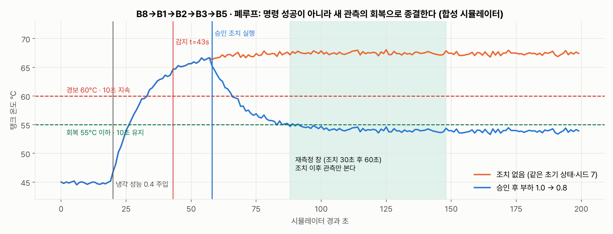
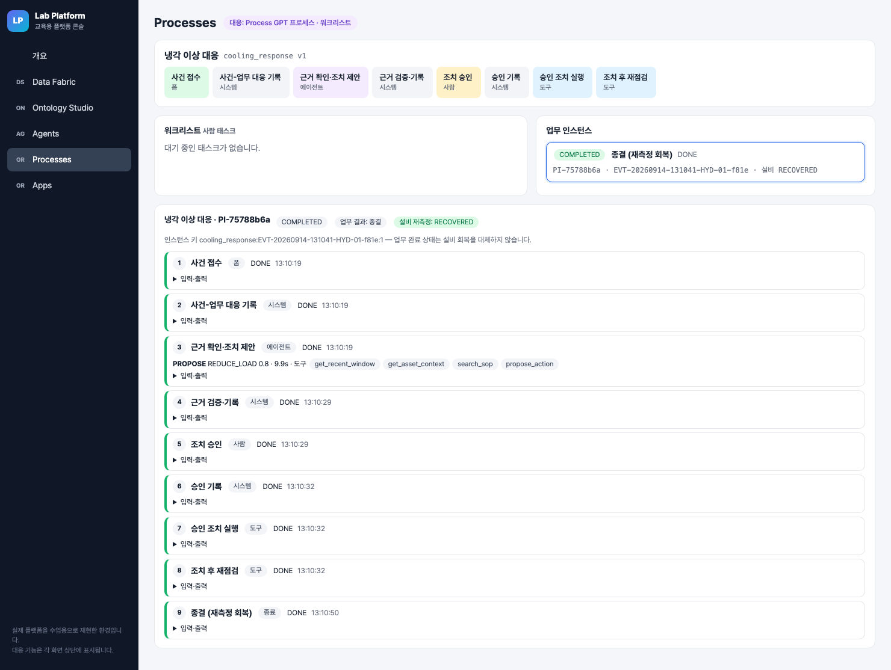
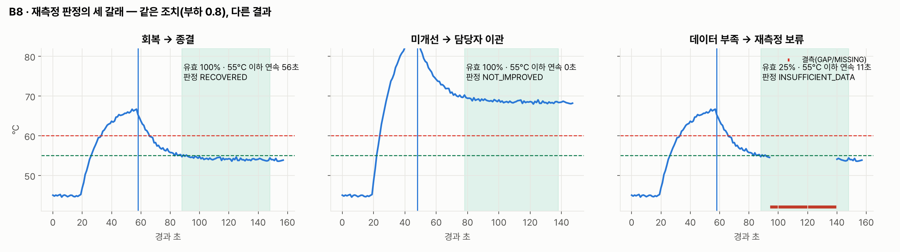
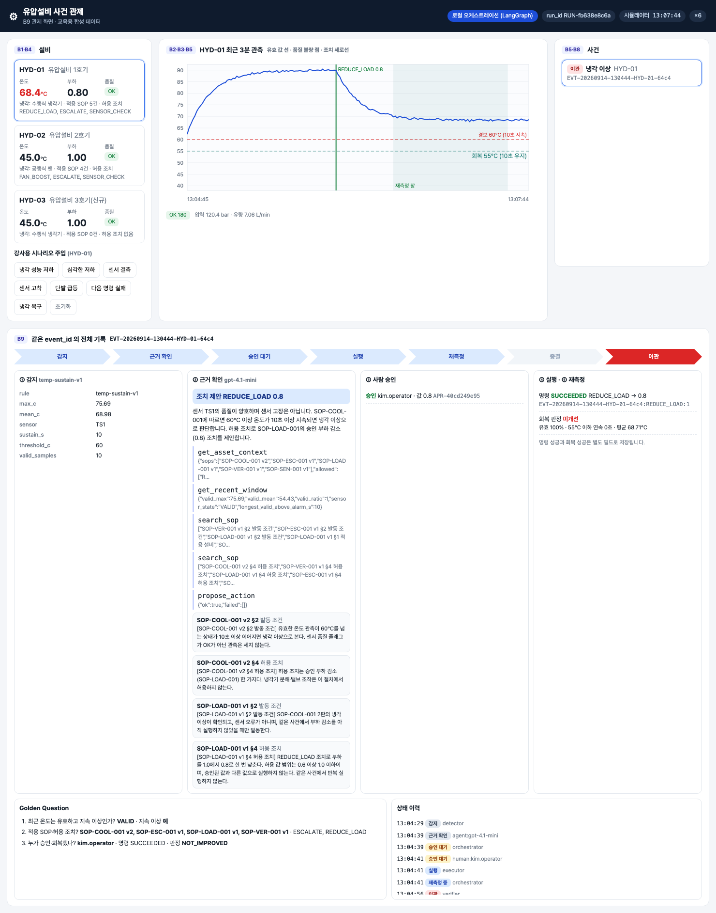

# 실전반 8회 · 플랫폼에서 조치와 재측정 폐루프

| 날짜·시간 | 2027-01-28 (목) 14:00~18:00 | 모듈 | M4 · 원 일정 14번 |
|---|---|---|---|
| 블록 | 확장 B1, B5, B8 | 산출물 | B8→B1→B2→B3→B5 재측정 루프 |
| 완료 확인 | 명령 성공과 실제 관측 회복을 별도로 판정 | | |


## 이번 회차에서 할 일

7회에 교육용 플랫폼(Lab Platform)의 프로세스가 사람 승인까지 사건을 끌고 왔다. 이번 회차에는 그 뒤, 즉 **조치 → 새 관측 → 판정**의 루프를 닫는다. 승인된 부하 감소 명령이 상태를 가진 시뮬레이터(B1)를 바꾸고, 바뀐 온도가 품질 검사(B2)를 거쳐 PostgreSQL(B3)에 쌓이고, 재점검 도구가 조치 이후의 관측만으로 회복·미개선·데이터 부족을 판정한다. 감지 규칙(B5)은 같은 관측 흐름에서 계속 돈다.

핵심 질문은 하나다. "명령이 성공했다"와 "설비가 회복했다"를 어떻게 따로 판정하고 따로 기록하는가. 끝나면 한 사건에 대해 `action_log.command_status` 와 `verification.outcome` 을 나란히 보여 줄 수 있고, 재측정 판정 함수의 틀린 조건을 고쳐 세 갈래를 테스트로 재현할 수 있다.

### 학습 목표
- 시뮬레이터 모델로 냉각 저하와 부하 감소가 온도에 주는 영향을 계산하고, 원본 CSV 재생으로는 폐루프를 검증할 수 없는 이유를 설명한다.
- 플랫폼 프로세스에서 승인 → `execute_sim_action` → `verify_recovery` 재시도로 이어지는 단계의 입력·출력을 읽는다.
- 재측정 창(조치 30초 후 60초), 회복 기준(55°C 이하 10초 연속), 유효 비율 기준(70%)으로 세 갈래 판정을 재현한다.
- 미개선·명령 실패·데이터 부족 분기 또는 Watch Agent 의 사건 조회를 기록으로 확인한다.

## 1. 시작 전 준비 (복습·환경 확인)

```bash
cd lecture/system
curl -s localhost:8800/api/state | .venv/bin/python -c "
import json,sys; d=json.load(sys.stdin); s=d['sim']['HYD-01']
print(d['mode'], s['load'], s['cooling_eff'], s['steady_temp_c'])"
curl -s localhost:8910/agents/watch | .venv/bin/python -c "
import json,sys; [print(w['watch_id'], w['enabled'], w['process_def_id']) for w in json.load(sys.stdin)]"
curl -s localhost:8910/process/instances | .venv/bin/python -c "
import json,sys; [print(i['instance_id'], i['status'], i['equipment_outcome']) for i in json.load(sys.stdin)]"
```

리허설 서버(2026-09-14, 정상 회복 사례가 끝난 상태)의 출력이다.

```
platform 0.8 0.4 54.0
hydops-new-events False cooling_response
PI-75788b6a COMPLETED RECOVERED
```

부하 0.8·냉각 0.4 에서 정상 상태 온도가 54.0°C 인 것은 직전 사례에서 승인 조치가 실행되었기 때문이다. 수업 시작 전에는 강사가 시뮬레이터를 초기화해 부하 1.0·냉각 1.0(45.0°C)으로 둔다. Watch 는 기본값이 꺼짐(`enabled: false`)이다.

## 2. 핵심 개념

### 2.1 왜 상태를 가진 시뮬레이터인가
UCI 원본 CSV 는 이미 기록된 값이라 부하를 낮춰도 온도가 바뀌지 않는다. 조치의 효과를 새 관측으로 재려면 조치에 반응하는 모델이 필요하다(`hydops/b1_data/simulator.py` 머리말).

```
T_ss = 30 + 15 · load² / cooling_eff        dT/dt = (T_ss − T) / 12s        노이즈 σ = 0.25°C
```

| 상황 | cooling_eff | 부하 1.0 | 부하 0.8 | 기대 결과 |
|---|---|---|---|---|
| 정상 | 1.0 | 45.0°C | — | 사건 없음 |
| 냉각 성능 저하 | 0.4 | 67.5°C → 경보 | 54.0°C | 회복 → 종결 |
| 심각한 저하 | 0.25 | — | 68.4°C | 미개선 → 이관 |

모든 기준(60°C·10초 경보, 부하 0.8, 55°C·10초 회복)은 교육용 가정값이다. 모델이 실제 설비의 물리 인과를 입증하지 않는다.



같은 시드 7 에서 냉각 0.4 를 t=20s 에 주입하면 t=43s 에 감지되고, t=58s 에 승인 조치를 실행한 경우 마지막 20초 최고 온도가 54.4°C, 조치하지 않은 경우 마지막 20초 최저 온도가 66.87°C 다.

### 2.2 명령 성공과 회복 판정은 다른 필드다

| 기록 | 테이블·필드 | 값 | 무엇을 뜻하나 |
|---|---|---|---|
| 명령 결과 | `action_log.command_status` | SUCCEEDED / FAILED | 시뮬레이터가 부하 변경 명령을 받았는가 |
| 재측정 판정 | `verification.outcome` | RECOVERED / NOT_IMPROVED / INSUFFICIENT_DATA | 조치 이후 새 관측이 회복 기준을 채웠는가 |
| 업무 결과 | 프로세스 `business_result` | 종결 / 이관 / 재측정 보류 … | 업무 흐름이 어느 종료 활동에 도착했는가 |

```python
# lecture/system/hydops/b8_action/executor.py verify_recovery (발췌)
start, _ = verify_window(act, th, window_index)           # 조치 시각 + 30초 (+ 창 번호 × 60초)
end = start + timedelta(seconds=th.verify_window_s)
rows = store.observations_between(ev["asset_id"], "TS1", start, end, run_id=ev["run_id"])
valid = [r for r in rows if r["quality_flag"] == OK and r["value"] is not None]
ratio = len(valid) / th.verify_window_s
...
if ratio < th.verify_min_valid_ratio:
    outcome = "INSUFFICIENT_DATA"
elif best >= th.recovery_sustain_s:
    outcome = "RECOVERED"
else:
    outcome = "NOT_IMPROVED"
```

> **주의** `command_status` 는 `metrics` 에 기록만 하고 판정에 쓰지 않는다. "명령 성공 → 회복"으로 쓰는 순간, 심각한 저하 사례에서 68°C 인 설비를 종결 처리하게 된다.

> **주의** 재측정 창의 시각은 시뮬레이터 시각(`sim_ts`)이다. 서버가 4배속·6배속으로 돌면 벽시계로는 창 90초가 훨씬 짧게 지나간다. 이 시각을 실제 수집 시각이라 부르지 않는다.

## 3. 활동 1 — 상태를 가진 시뮬레이터에 냉각 이상 주입 · 50분

### 목표
메모리 시뮬레이터로 주입·감지 시점을 직접 재고, 공유 서버에서는 강사가 한 번 주입한 사건이 감지 기록으로 남는 것을 확인한다.

### 따라 하기
1. 팀별로 메모리에서 같은 모델을 돌린다. DB 에 쓰지 않는다.
   ```bash
   PYTHONPATH=. .venv/bin/python - <<'EOF'
   from hydops.b1_data.simulator import HydraulicSimulator
   from hydops.b2_quality.checks import SensorQualityChecker
   from hydops.b5_detect.detector import ThresholdDetector
   for load, cool in [(1.0, 1.0), (1.0, 0.4), (0.8, 0.4), (0.8, 0.25)]:
       print(load, cool, round(HydraulicSimulator.steady_temp(load, cool), 2))
   sim, chk, det = HydraulicSimulator("HYD-01", seed=7), SensorQualityChecker(), ThresholdDetector()
   for s in range(120):
       if s == 20:
           sim.inject_cooling_degradation(0.4)
       for r in chk.check_many(sim.step()):
           for sig in det.feed(r):
               print("t=%d" % s, sig.event_type, sig.evidence)
   EOF
   ```
2. 강사가 관제 화면(`http://localhost:8800`)의 「냉각 성능 저하」 버튼으로 HYD-01 에 냉각 0.4 를 주입한다. 버튼은 `POST /api/sim/HYD-01/inject {"kind": "cooling"}` 를 보낸다. 팀은 주입하지 않는다.
3. 사건 목록에서 새 `COOLING_ANOMALY` 사건의 `event_id` 를 적고 감지 기록을 읽는다: `curl -s localhost:8800/api/events/<event_id>`.

### 확인 포인트
메모리 실행 출력:

```
1.0 1.0 45.0
1.0 0.4 67.5
0.8 0.4 54.0
0.8 0.25 68.4
t=43 COOLING_ANOMALY {'rule': 'temp-sustain-v1', 'sensor': 'TS1', 'threshold_c': 60.0, 'sustain_s': 10, 'valid_samples': 10, 'mean_c': 62.84, 'max_c': 64.64}
```

리허설 서버 사건 `EVT-20260914-131041-HYD-01-f81e` 의 첫 이력(`actor: detector`):

```
{"rule": "temp-sustain-v1", "max_c": 63.91, "mean_c": 62.09, "sensor": "TS1", "sustain_s": 10, "threshold_c": 60.0, "valid_samples": 10}
```

두 값이 다른 것은 정상이다. 서버 시뮬레이터는 설비별 시드(`seed + i`)와 주입 시점이 메모리 실행과 다르다. 같은 것은 규칙(60°C 초과 유효 관측 10초 연속)이다.

### 흔한 실수
- **센서 고장 주입과 냉각 저하 주입을 같은 것으로 본다** → 결측·고착·급등은 설비 상태(온도)를 바꾸지 않는다. `SENSOR_FAULT` 사건은 `SENSOR_CHECK` 로 가고 설비 조치를 하지 않는다.
- **팀마다 서버에 주입한다** → "설비·유형당 열린 사건 하나" 규칙(`store.create_event`)에 걸려 새 사건이 생기지 않고, 한 사건에 여러 팀의 조작이 섞인다.
- **이전 실행의 열린 사건이 새 감지를 막는다** → 실제로 겪은 문제다. 시뮬레이터 초기화 때 이전 run 의 열린 사건을 `RUN_ENDED` 로 닫는다(회복으로 기록하지 않는다).

## 4. 활동 2 — 플랫폼 승인 후 부하 감소 도구 실행 · 50분

### 목표
사건이 프로세스 인스턴스로 들어가 승인 태스크를 거쳐 `execute_sim_action` 도구 활동으로 실행되는 과정을 입력·출력으로 확인한다.

### 따라 하기
1. 강사가 콘솔 Agents 화면에서 Watch `hydops-new-events` 의 「한 번 실행」을 누른다(활동 4 에서 SQL 을 읽는다). 인스턴스가 시작되고 에이전트 제안까지 자동으로 진행된다.
2. 콘솔 Processes 화면의 워크리스트에서 조치 승인 태스크를 연다. 팀 대표가 폼의 사건 맥락을 읽어 확인하고, 결정 `APPROVED`, 승인값은 제안값 그대로, 승인자 이름을 넣어 제출한다.
3. 인스턴스를 열어 「승인 기록」「승인 조치 실행」 단계의 입력·출력을 펼친다. 같은 내용을 API 로 읽는다.
   ```bash
   curl -s localhost:8910/process/instances/<instance_id> | .venv/bin/python -c "
   import json,sys
   for s in json.load(sys.stdin)['steps']:
       if s['activity_id'] in ('record_decision','act'): print(s['activity_id'], json.dumps(s['input'], ensure_ascii=False)[:300]); print('  ->', json.dumps(s['output'], ensure_ascii=False)[:400])"
   ```
4. 시뮬레이터 상태에서 부하가 바뀌었는지 본다: `GET /api/state` 의 `sim.HYD-01.load`, `steady_temp_c`.

### 확인 포인트
리허설 인스턴스 `PI-75788b6a` 의 조치 단계:

```
act  {"server": "hydops", "tool": "execute_sim_action",
      "args": {"event_id": "EVT-20260914-131041-HYD-01-f81e", "approval_id": "APR-f5b6f889a6", "action_id": "REDUCE_LOAD", "value": 0.8}}
  -> {"ok": true, "action_log": {"action_log_id": "ACT-d35982d947", "command_status": "SUCCEEDED",
      "command_detail": {"ok": true, "from": 1.0, "to": 0.8, "sim_ts": "2026-09-14T13:12:22+00:00", "llm_claims_ignored": null},
      "idempotency_key": "EVT-20260914-131041-HYD-01-f81e:REDUCE_LOAD:1"}, "wait_until": "2026-09-14T13:13:52+00:00"}
```

- `wait_until` 은 `sim_ts` + 30초 대기 + 60초 창 = 13:13:52 이다.
- 사건 이력은 `PENDING_APPROVAL → EXECUTED (executor) → VERIFYING (orchestrator)` 로 이어진다. 이 시점에서 사건은 아직 종결이 아니다.
- 조치 후 `GET /api/state`: `load 0.8`, `cooling_eff 0.4`, `steady_temp_c 54.0`.

### 흔한 실수
- **`EXECUTED` 를 보고 "조치 완료 = 해결"로 보고한다** → 다음 상태는 `VERIFYING` 이다. 판정 전에는 종결을 말하지 않는다.
- **같은 조치를 한 번 더 요청한다** → 같은 멱등 키면 기존 기록을 `duplicate: true` 로 돌려주고 명령을 다시 보내지 않는다. 회차를 바꿔 요청해도 사건이 이미 `PENDING_APPROVAL` 을 떠났으므로 `EVENT_NOT_EXECUTABLE` 로 거부되고, 그 검사를 지나더라도 성공한 실행 기록이 있으면 `REPEAT_SUPPRESSED`(사건당 최대 1회, `max_action_attempts = 1`)로 거부된다.
- **승인값을 SOP 범위 밖으로 바꿔 제출한다** → 7회에 확인한 `VALUE_OUT_OF_RANGE` 분기로 가서 이관된다. 이번 회차 정상 경로에서는 제안값을 그대로 승인한다.

## 5. 활동 3 — 새 관측으로 회복 또는 미개선 판단 · 50분

### 목표
재점검 도구 활동의 재시도와 판정 지표를 읽고, 메모리 관측으로 같은 판정 함수를 고쳐 세 갈래를 재현한다.

### 따라 하기
1. 인스턴스의 「조치 후 재점검」 단계를 연다. 도구 활동에 `retry_until` 이 있다.
   ```json
   {"id": "recheck", "type": "tool", "tool": "verify_recovery",
    "args": {"event_id": "${event_id}", "action_log_id": "${action_log_id}", "window_index": "${window_index}"},
    "retry_until": {"path": "result.final", "equals": true, "interval_s": 2, "update_vars": {"window_index": "result.next_window_index"}},
    "outputs": {"outcome": "result.outcome"}}
   ```
   창이 끝나기 전 호출은 `ready: false` 와 `wait_until` 을 돌려주고, 프로세스는 2초 뒤 다시 부른다. 데이터 부족이면 `next_window_index` 로 다음 창을 잰다(최대 2창, `service.MAX_VERIFY_WINDOWS`).
2. 사건 기록의 `verifications` 를 읽고 표를 채운다: 창 시작·끝, 유효 표본 수, 유효 비율, 55°C 이하 최장 연속, 판정.
3. 실습 `labs/practical/S08/recovery.py` 를 연다. 원본 `verify_recovery` 를 메모리 관측 행에 적용하도록 옮긴 복사본이며 조건 세 곳이 틀렸다(§7). 테스트를 돌려 실패 메시지를 읽고 하나씩 고친다.

### 확인 포인트
리허설 인스턴스의 재점검 단계는 `attempts: 7` 로 끝났고, 출력은 다음과 같다.

```
{"ready": true, "final": true, "outcome": "RECOVERED",
 "verification": {"verification_id": "VER-2ed5682ceb", "window_start": "2026-09-14T13:12:52+00:00", "window_end": "2026-09-14T13:13:52+00:00",
  "metrics": {"window_s": 60, "valid_samples": 60, "valid_ratio": 1.0, "longest_below_s": 56, "required_below_s": 10,
              "recovery_temp_c": 55.0, "mean_c": 54.2, "last_c": 53.92, "command_status": "SUCCEEDED"}}}
```

창 시작 13:12:52 는 조치 `sim_ts` 13:12:22 보다 30초 뒤다. 재측정은 조치 이후의 관측만 본다.





| 갈래 | 조건(시드 7) | 유효 비율 | 55°C 이하 최장 연속 | 판정 | 사건 상태 |
|---|---|---|---|---|---|
| 회복 | 냉각 0.4, 부하 0.8 | 100% | 56초 | RECOVERED | CLOSED |
| 미개선 | 냉각 0.25, 부하 0.8 | 100% | 0초 | NOT_IMPROVED | ESCALATED |
| 데이터 부족 | 냉각 0.4, 창 안 결측 | 25% | 11초 | INSUFFICIENT_DATA | VERIFY_HOLD → 다음 창 |

데이터 부족 사례는 55°C 이하 연속이 11초로 기준 10초를 넘지만, 유효 비율이 70% 에 못 미쳐 회복으로 판정하지 않는다.

### 흔한 실수
- **창의 끝만 자르고 시작을 자르지 않는다** → 주입 전 정상 온도(45°C) 구간이 섞여 심각한 저하 사례도 RECOVERED 가 된다. S08 시작본의 TODO 1 이다.
- **결측 행을 먼저 지우고 비율을 계산한다** → 분모가 줄어 유효 비율이 늘 100% 가 된다. 비율의 분모는 창 길이 60초다. TODO 2.
- **"60°C 아래로 내려왔다"를 회복으로 본다** → 경보 기준과 회복 기준은 다르다. 냉각 0.33 이면 부하 0.8 에서 60°C 아래(마지막 값 59.3°C 부근)지만 55°C 이하 10초를 채우지 못한다. TODO 3.

## 6. 활동 4 — 실패 분기 검증 또는 제공 Watch Agent 사건 조회 실습 · 50분

팀별로 A(실패 분기) 또는 B(Watch Agent) 중 하나를 고른다.

### 목표
A: 명령 성공·미개선, 명령 실패, 데이터 부족이 각각 다른 기록을 남기는 것을 확인한다. B: Watch Agent 가 SQL 한 건 → 조건 → 업무 시작으로 사건을 가져오는 방식과 중복 방지 장치를 확인한다.

### 따라 하기 — A. 실패 분기
1. 강사가 사건 하나를 초기화 후 「심각한 저하」(`{"kind": "severe"}`, 냉각 0.25)로 만든다. 승인은 제안값 0.8.
2. 사건 기록에서 `actions[0].command_status` 와 `verifications[0].outcome` 을 나란히 적는다.
3. 강사 시연: 「다음 명령 실패」(`{"kind": "fail_command"}`)를 주입한 뒤 승인한다. `service.execute` 코드를 읽고 어떤 기록이 남을지 먼저 예측한 다음 결과와 비교한다.
4. 메모리에서 재측정 창 안 결측을 만들고(`inject_sensor_fault("dropout", 45)`), S08 테스트 `test_dropout_case_next_window_recovers` 가 두 번째 창에서 무엇을 판정하는지 확인한다.

### 따라 하기 — B. Watch Agent
1. Watch 정의를 읽는다: `curl -s localhost:8910/agents/watch`.
   ```sql
   SELECT event_id, asset_id, run_id, event_type FROM event
   WHERE status = 'DETECTED' AND process_ref IS NULL AND event_type IN ('COOLING_ANOMALY', 'SENSOR_FAULT')
   ORDER BY created_at LIMIT 1
   ```
   조건 `rows > 0`, 매핑 `param_map` 은 행의 네 열을 접수 폼 네 필드로 옮긴다.
2. 콘솔 Data Fabric 화면에서 같은 SQL 을 읽기 전용 질의로 실행해 결과 행 수를 본다. Data Fabric 질의는 쓰기 문장을 거부한다.
3. 강사가 「한 번 실행」을 누른 결과(`rows`, `fired`, 시작한 인스턴스)를 기록하고, 곧바로 같은 SQL 을 다시 실행해 행이 사라졌는지 본다.

### 확인 포인트
A — 심각한 저하 리허설 사건 `EVT-20260914-130444-HYD-01-64c4`(관제 화면 로컬 오케스트레이션 기록):

```
actions        SUCCEEDED 0.8
verifications  NOT_IMPROVED  valid_ratio 1.0  longest_below_s 0  mean_c 68.71  last_c 68.64
status         ESCALATED  "조치 후 미개선 — 담당자 이관"
```

플랫폼 폐루프 리허설의 "조치 후 미개선" 사례도 명령 `SUCCEEDED`, 재측정 `NOT_IMPROVED`, 업무 결과 "이관"이었다(`out/e2e_platform_report.json`).



명령 실패는 리허설 기록이 없으므로 코드로 확인한다. `service.execute` 는 `command_status` 가 `FAILED` 인 실행 기록을 남기고 사건을 `ESCALATED`(사유 "도구 실패 — 이관")로 옮긴 뒤 `{"ok": false, "command_failed": true, ...}` 를 돌려준다. 프로세스는 `act_ok` 가 거짓이라 재점검 없이 「담당자 이관」으로 끝난다. 재측정 기록은 없다.

B — 콘솔의 리허설 결과는 `rows=1 · fired=true → 시작 PI-75788b6a` 였다(§4 활동 2 의 S14 화면 하단). 인스턴스의 첫 단계 입력에는 `"source": "watch:hydops-new-events"` 가 남는다. 인스턴스가 「사건-업무 대응 기록」 단계를 지나면 `process_ref` 가 채워져 같은 사건이 SQL 결과에서 빠진다. 그 사이에 한 번 더 실행해도 인스턴스 키(`cooling_response:<event_id>:1`)가 이미 있어 `duplicate: true` 로 기존 인스턴스를 돌려준다.

### 흔한 실수
- **미개선을 "조치 실패"라고 부른다** → 조치(명령)는 성공했다. 실패한 것은 회복이다. 기록에서도 두 필드가 다르다.
- **미개선 사건에 부하를 더 낮추는 조치를 반복한다** → 반복 조치 억제로 거부되고, SOP-ESC-001 에 따라 담당자 이관이 다음 단계다.
- **Watch 를 켜 둔 채(`enabled: true`) 사건을 여러 개 만든다** → 3초마다 한 건씩 업무가 자동 시작되어 팀 활동과 겹친다. 수업에서는 꺼 두고 「한 번 실행」만 쓴다.

## 7. 실습 과제

`labs/practical/S08/recovery.py` — `judge_recovery(rows, action, th, window_index)` 의 `# TODO(학생)` 세 곳을 고친다.

| TODO | 틀린 조건 | 드러내는 테스트 |
|---|---|---|
| 1 | 창 시작(`start < ts`)을 자르지 않아 조치 전 관측이 섞인다 | `test_pre_action_observations_are_ignored`, `test_severe_degradation_not_improved_although_command_succeeded` |
| 2 | 결측 행을 먼저 지워 유효 비율이 늘 100% | `test_missing_rows_count_against_valid_ratio`, `test_dropout_in_window_is_insufficient_data` |
| 3 | 명령 성공 + 마지막 값 60°C 미만 → RECOVERED | `test_command_success_alone_is_not_recovery`, `test_below_alarm_but_above_recovery_is_not_improved` |

관측은 `HydraulicSimulator(seed=7)` → `SensorQualityChecker` → `ThresholdDetector` 로 메모리에서 만들고, 기대값은 F07 그림 데이터(`materials/figures/figures_data.json`)의 56초·0초·25%·11초와 같다. DB 에 쓰지 않는다.

```bash
cd lecture/system && PYTHONPATH=. .venv/bin/python -m pytest ../labs/practical/S08 -q
```

시작본은 `6 failed, 4 passed`, 정답본(`LAB_SOLUTION=1`)은 `10 passed` 이다.

## 8. 완료 확인 체크리스트
- [ ] 한 사건에 대해 `action_log.command_status` 와 `verification.outcome` 을 따로 적었다.
- [ ] 재측정 창 시작이 조치 `sim_ts` 보다 30초 뒤이고 창 길이가 60초임을 기록에서 확인했다.
- [ ] 명령 SUCCEEDED 이면서 NOT_IMPROVED 인 사건(심각한 저하)을 기록 또는 테스트로 제시했다.
- [ ] 유효 비율 70% 미만이면 연속 조건을 채워도 INSUFFICIENT_DATA 인 것을 테스트로 확인했다.
- [ ] 프로세스 `business_result`(업무 결과)와 `equipment_outcome`(재측정 판정)을 구분해 말했다.
- [ ] `pytest ../labs/practical/S08 -q` 가 모두 통과한다.

## 9. 회고 (10분)
1. 재측정 창을 조치 직후가 아니라 30초 뒤에 여는 이유는 무엇인가? 시뮬레이터 시정수(12초)와 연결해 설명한다.
2. 데이터 부족 사례에서 두 번째 창도 부족하면 사건은 `VERIFY_HOLD` 로 남는다. 회복으로도 미개선으로도 기록하지 않는 것이 운영에서 어떤 의미인가?
3. Watch Agent 의 SQL 에 `process_ref IS NULL` 이 없으면 무슨 일이 생기는가? 인스턴스 키가 이를 어디까지 막아 주는가?

**개인 설명 과제** — 내가 설명할 실패 분기 하나: 미개선·명령 실패·데이터 부족 중 하나를 골라, `metrics` 또는 `command_status` 의 어떤 값이 판정을 결정했고 사건 상태와 프로세스 종료 활동이 무엇이 되는지 설명한다.

## 10. 실제 플랫폼 대응

| 교육용 플랫폼 기능 | 실제 플랫폼 기능 | 다른 점 |
|---|---|---|
| 도구 활동 `retry_until`(path·equals·interval_s·update_vars) | Process GPT 프로세스의 도구(서비스) 활동 재시도 | 교육용 엔진은 1초 주기로 인스턴스를 훑고 한 번에 최대 10단계를 진행한다 |
| `POST /agents/watch`, `POST /agents/watch/{id}/tick` | Ontologic Watch Agent (SQL → 조건 → 업무 시작) | 교육용 조건은 `rows > N`·`>=`·`==` 형식만, 한 번에 한 행(`limit=1`)만 읽는다 |
| Data Fabric `POST /fabric/datasources/{name}/query` | Data Fabric 데이터소스 질의 | 교육용은 `lab_reader` SELECT 전용 계정 + 읽기 전용 트랜잭션 + 쓰기 키워드 거부 |
| 인스턴스 `business_result` / `equipment_outcome` | 업무 인스턴스 상태와 업무 데이터 | 교육용은 설비 판정을 별도 필드로 강제한다 |

## 강사 노트

**시간 배분**

| 시각 | 내용 |
|---|---|
| 14:00~14:50 | 활동 1 모델 계산·강사 주입 1회 |
| 14:50~15:40 | 활동 2 Watch 한 번 실행 → 승인 → 조치 단계 읽기 |
| 15:40~16:10 | 휴식 (강사: 재측정 완료 확인, 활동 4 사건 준비) |
| 16:10~17:00 | 활동 3 재측정 기록 읽기·S08 수정 |
| 17:00~17:50 | 활동 4 A/B 선택 |
| 17:50~18:00 | 회고·개인 설명 |

**사전 준비**
- `scripts/bootstrap_platform.py --upto watch` (Watch 는 꺼진 채 등록된다). 7회에 학생이 등록한 Skill·에이전트·정의가 있으면 그대로 쓴다.
- `scripts/servers.sh platform 4`. 수업 직전에 관제 화면 「초기화」로 부하 1.0·냉각 1.0 을 확인한다.

**수업 전 리허설 체크리스트** (수업 시작 전에만 — `e2e_platform.py` 는 시뮬레이터를 초기화한다)
- [ ] 한 사건: 감지 · 조회(도구 호출 순서) · 승인 · 조치(`SUCCEEDED`, `wait_until`) · 재측정(`RECOVERED`, CLOSED)
- [ ] 실패 1 승인 거부 → REJECTED, 실행 기록 0건
- [ ] 실패 2 조치 후 미개선 → ESCALATED, SUCCEEDED + NOT_IMPROVED
- [ ] 실패 3 허용 범위 이탈 0.4 → ESCALATED, 실행 기록 0건
- [ ] 실패 4 센서 오류 → SENSOR_CHECK
- [ ] `PYTHONPATH=. .venv/bin/python scripts/e2e_platform.py` → `ALL PASSED`
- [ ] 명령 실패 분기(`fail_command`)는 e2e 에 없으므로 따로 한 번 손으로 확인한다.

**장애 대응** — 플랫폼 장애 시 로컬 어댑터로 계속하되 플랫폼 실습 완료로 기록하지 않고 별도 보충한다. `scripts/servers.sh local 4` 로 전환하면 LangGraph 워크플로가 같은 `service.execute`·`service.verify` 로 조치와 재측정을 하므로, 관제 화면 승인 버튼으로 활동 2·3·4A 의 기록 확인을 이어 갈 수 있다. S08 실습은 서버와 무관하게 진행한다. 활동 2 의 프로세스 단계 입력·출력 읽기와 활동 4B 는 보충 시간에 한다.

## 용어

| 용어 | 뜻 |
|---|---|
| 상태를 가진 시뮬레이터 | 온도·부하·냉각 효율을 기억하고 명령에 반응하는 합성 설비 모델 |
| 재측정 창 | 조치 `sim_ts` + 30초부터 60초 구간, 데이터 부족이면 다음 60초 창 |
| 유효 비율 | 창 안 품질 OK 관측 수 ÷ 창 길이(60) |
| RECOVERED / NOT_IMPROVED / INSUFFICIENT_DATA | 회복 / 미개선 / 데이터 부족 판정 |
| VERIFY_HOLD | 데이터 부족으로 회복 판정을 보류한 사건 상태 |
| retry_until | 도구 결과가 조건을 만족할 때까지 도구 활동을 다시 부르는 설정 |
| Watch Agent | SQL 결과와 조건으로 업무를 시작하는 감시 에이전트 |
