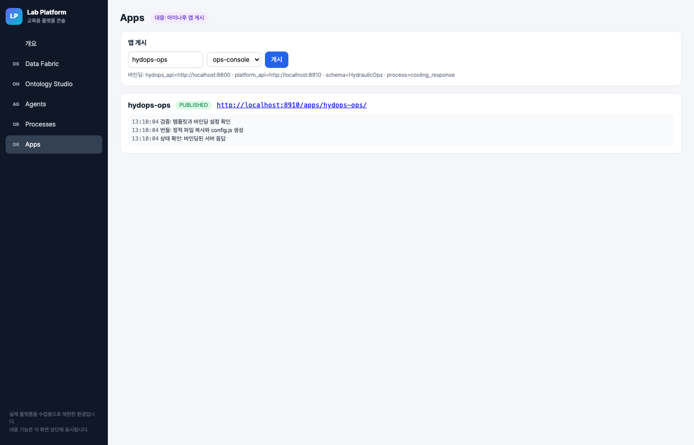
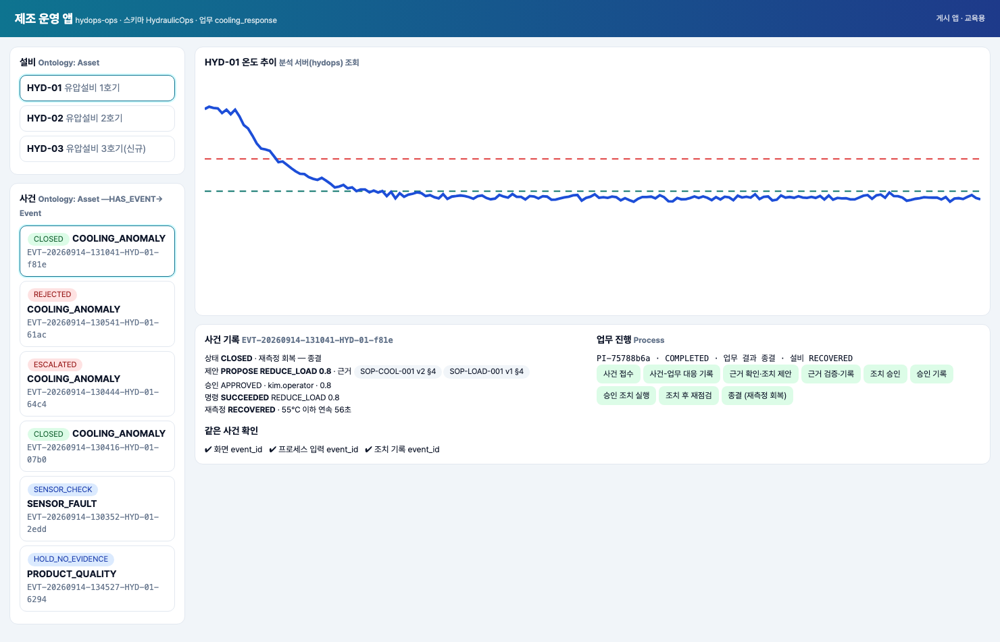

# 실전반 9회 · 아이나루 관제 앱 게시와 통합 시연

| 날짜·시간 | 2027-01-29 (금) 14:00~18:00 | 모듈 | M4 · 원 일정 16번 |
|---|---|---|---|
| 블록 | 확장 B9 / 플랫폼 B9 | 산출물 | 우리 플랫폼에서 사용하는 제조 운영 앱 |
| 완료 확인 | 화면·프로세스·조치 기록이 같은 사건을 가리킴 | | |


## 이번 회차에서 할 일

마지막 회차다. 지금까지 만든 것은 서로 다른 화면에 흩어져 있다 — 설비와 사건은 Ontology Studio 객체로, 승인·조치·재측정 기록은 관제 서버(hydops)에, 업무 진행은 교육용 플랫폼(Lab Platform)의 프로세스에 있다. 이번 회차에는 제공 Vue 화면(`labplatform/app_templates/ops-console/index.html`)을 이 세 곳에 바인딩해 **하나의 제조 운영 앱**으로 게시한다. 실라버스가 말하는 "아이나루 앱 게시"는 이 과정에서 교육용 플랫폼의 Apps 모듈(`labplatform/apps.py`)로 하고, "Process GPT 업무 열기"는 교육용 플랫폼 Process 모듈의 업무 시작으로 한다.

마지막 활동에서는 게이트웨이가 보내는 낯선 센서 이름을 표준 센서 코드에 매핑하는 별칭 기능을 확인하고, 한 사건의 폐루프를 앱 하나로 끝까지 시연한다. 합격 기준은 앱의 「같은 사건 확인」 세 항목(화면 event_id · 프로세스 입력 event_id · 조치 기록 event_id)이 모두 같은 사건을 가리키는 것이다.

### 학습 목표
- 앱 설정(`window.APP_CONFIG`)의 네 바인딩과 화면의 조회 URL 을 실제 API(Studio 객체·관계, hydops 사건 기록, 프로세스)에 맞춘다.
- 선택한 사건에서 업무를 시작할 때 접수 폼 필수 입력과 같은 값을 보내고, 중복 시작이 기존 인스턴스로 돌아오는 것을 확인한다.
- 앱을 게시하고 게시 로그의 검증·번들·상태 확인 단계를 읽는다.
- 센서 별칭을 정확 일치로만 매핑하고 모르는 이름이 섞인 묶음을 거부하는 함수를 고쳐 검증하고, 폐루프를 앱에서 시연한다.

## 1. 시작 전 준비 (복습·환경 확인)

```bash
cd lecture/system
curl -s localhost:8910/process/definitions | .venv/bin/python -c "import json,sys; [print(d['def_id'], len(d['activities'])) for d in json.load(sys.stdin)]"
curl -s localhost:8910/studio/schemas/HydraulicOps/objects/Asset/HYD-01/related/HAS_EVENT | .venv/bin/python -c "
import json,sys; d=json.load(sys.stdin); print(d['relationship'], d['count']); e=d['objects'][0]; print(e['event_id'], e['status'])"
curl -s localhost:8910/apps/templates
```

리허설 서버(2026-09-14) 출력:

```
cooling_response 13
HAS_EVENT 6
EVT-20260914-131041-HYD-01-f81e CLOSED
["ops-console"]
```

`HAS_EVENT` 관계가 스키마 발행 전이면 409 로 거부된다(6회 내용). 발행 버전이 없으면 강사에게 알린다.

## 2. 핵심 개념

앱은 데이터를 스스로 갖지 않는다. 세 서버의 기존 API 를 읽고, 업무 시작과 승인 제출만 프로세스 API 로 보낸다.

| 화면 요소 | 읽는 곳 | 호출 (index.html) | 연결 키 |
|---|---|---|---|
| 설비 목록 | Ontology Studio 객체 `Asset` | `POST {platform_api}/studio/schemas/{schema_name}/objects/Asset/fetch` | asset_id |
| 사건 목록 | Studio 관계 `Asset —HAS_EVENT→ Event` | `GET .../objects/Asset/{asset_id}/related/HAS_EVENT` | asset_id → event_id |
| 사건 기록 | hydops 사건 추적 | `GET {hydops_api}/api/events/{event_id}` | event_id |
| 온도 추이 | hydops 관측 | `GET {hydops_api}/api/series?asset_id=...&seconds=180` | asset_id |
| 업무 진행 | 프로세스 인스턴스 | `GET {platform_api}/process/instances/{process_ref.instance_id}` | event_id → instance_id |
| 업무 열기 | 프로세스 시작 | `POST {platform_api}/process/definitions/{process_def_id}/start` | event_id·asset_id·run_id·event_type |
| 승인 제출 | 워크리스트 | `POST {platform_api}/process/workitems/{id}/complete` | workitem_id |

「같은 사건 확인」은 화면 코드의 계산식 세 개다.

```javascript
// lecture/system/labplatform/app_templates/ops-console/index.html (발췌)
sameUi() { return !!this.detail && this.detail.event.event_id === this.eventId; },
sameProcess() { return !!this.instance && this.instance.vars.event_id === this.eventId; },
sameAction() { return !!this.detail && this.detail.actions.length > 0 && this.detail.actions.every(a => a.event_id === this.eventId); },
```

> **주의** 앱이 "종결"을 보여 줄 때 두 값을 구분한다. 업무 결과(`business_result`)는 프로세스가 도착한 종료 활동이고, 설비(`equipment_outcome`)는 재측정 판정이다. 승인 거부 사건은 업무 결과가 "승인 거부"이고 설비 판정은 비어 있다.

> **주의** 게시된 앱은 교육용 플랫폼이 정적 파일을 복사하고 `config.js` 를 만든 것이다. 실제 아이나루 앱 게시와 같은 것으로 부르지 않는다(§10).

## 3. 활동 1 — 제공 Vue 화면을 설비·이벤트 조회에 바인딩 · 50분

### 목표
제공 화면의 fetch 호출을 바인딩 표로 옮기고, 설정 키와 URL 이 실제 API 와 맞는지 GET 과 정적 검사로 확인한다.

### 따라 하기
1. `index.html` 의 `methods` 에서 `loadAssets`, `loadEvents`, `refreshEvent`, `openWork`, `submitWork`, `tick` 을 찾아 각 호출의 서버·경로·메서드를 §2 표와 대조한다.
2. 실습 `labs/practical/S09/config.js`·`binding.js` 를 연다. `binding.js` 는 화면 호출을 표로 옮긴 것이고 네 곳이 틀렸다(§7). 게시 API 의 필수 바인딩은 `apps.py` 에 있다.
   ```python
   # lecture/system/labplatform/apps.py (발췌)
   required = ["hydops_api", "platform_api", "schema_name", "process_def_id"]
   missing = [k for k in required if k not in cfg]
   if missing:
       step("실패: 바인딩 누락", missing=missing)
       raise HTTPException(422, {"error": "바인딩 누락", "missing": missing, "steps": steps})
   ```
3. GET 바인딩을 직접 불러 본다.
   ```bash
   curl -s localhost:8910/studio/schemas/HydraulicOps/objects/Asset/HYD-01/related/HAS_SENSOR | head -c 200; echo
   curl -s localhost:8910/studio/schemas/HydraulicOps/objects/Asset/HYD-01/related/HAS_EVENT | head -c 200; echo
   curl -s localhost:8800/api/events/EVT-20260914-131041-HYD-01-f81e | .venv/bin/python -c "import json,sys; print(list(json.load(sys.stdin)))"
   ```
4. 테스트로 확인한다: `PYTHONPATH=. .venv/bin/python -m pytest ../labs/practical/S09 -q -k "config or binding or placeholder or studio or event_detail"`.

### 확인 포인트
- `HAS_SENSOR` 결과는 `{"from":"Asset:HYD-01","relationship":"HAS_SENSOR","to":"Sensor","count":3,"objects":[{"sensor_id":"HYD-01.FS1","code":"FS1", ...` — 오류가 아니라 센서 목록이 온다. 틀린 관계를 써도 화면은 조용히 잘못된 목록을 보여 준다.
- `HAS_EVENT` 결과는 `{"from":"Asset:HYD-01","relationship":"HAS_EVENT","to":"Event","count":6,"objects":[{"event_id":"EVT-20260914-131041-HYD-01-f81e", ... "status":"CLOSED", ...` 로 시작한다.
- 사건 기록 응답 키: `['event', 'history', 'approvals', 'actions', 'verifications', 'workflow', 'graph', 'golden', 'citation_texts']`. 승인·조치·재측정은 hydops 서버에만 있다. 교육용 플랫폼(:8910)에는 `/api/events` 경로가 없다.
- 게시본 설정(`labplatform/data/apps/hydops-ops/config.js`):
  ```javascript
  window.APP_CONFIG = {
    "hydops_api": "http://localhost:8800",
    "platform_api": "http://localhost:8910",
    "schema_name": "HydraulicOps",
    "process_def_id": "cooling_response",
    "app_name": "hydops-ops"
  };
  ```

### 흔한 실수
- **사건 목록을 `HAS_SENSOR` 관계로 읽는다** → 센서 객체가 사건 목록에 들어온다. 관계 이름은 온톨로지 템플릿의 관계 8개 중 `HAS_EVENT` 다.
- **키 이름을 줄여 쓴다(`process_def`)** → 게시 단계에서 422 `바인딩 누락` 으로 멈춘다. 화면 코드는 `cfg.process_def_id` 를 읽는다.
- **스키마 이름 대소문자를 바꾼다** → Studio 경로의 스키마를 찾지 못한다. 발행한 이름은 `HydraulicOps` 다.

## 4. 활동 2 — 선택 이벤트에서 Process GPT 업무 열기 · 50분

### 목표
앱에서 고른 사건으로 교육용 플랫폼 프로세스 업무를 시작하거나 기존 업무를 열고, 승인 태스크를 앱에서 제출하는 흐름을 확인한다.

### 따라 하기
1. `openWork` 를 읽는다. 시작 입력은 사건 기록의 네 값이다.
   ```javascript
   const r = await post(`${cfg.platform_api}/process/definitions/${cfg.process_def_id}/start`,
     { values: { event_id: e.event_id, asset_id: e.asset_id, run_id: e.run_id, event_type: e.event_type } });
   this.startMsg = r.duplicate ? `이미 시작된 업무 ${r.instance_id} 를 엽니다 (중복 시작 없음)` : `업무 ${r.instance_id} 시작`;
   ```
2. 앱 `http://localhost:8910/apps/hydops-ops/` 에서 이미 처리된 사건(CLOSED 또는 REJECTED)을 누른다. 사건에 `process_ref` 가 있으면 「업무 열기」 버튼 대신 인스턴스 단계가 바로 보인다.
3. 강사가 새 사건을 만들면 한 팀이 「업무 열기」를 누르고, 다른 팀이 같은 사건에서 한 번 더 누른다. 두 번째 메시지를 기록한다.
4. 승인 태스크가 앱에 나타나면 결정·승인값·승인자를 넣어 제출한다. 제출 전에 앱의 승인값 기본값이 어디서 오는지 `data()` 의 `draft`·`draftFor` 와 `refreshEvent` 에서 찾는다.

### 확인 포인트
- 리허설 기록의 중복 시작 응답은 `{"duplicate": true, "instance_id": "PI-cd8bfac7", "key": "cooling_response:EVT-20260914-124908-HYD-01-c47b:1"}` 이었다. 앱은 이 응답으로 "이미 시작된 업무 … 를 엽니다 (중복 시작 없음)"를 보여 준다.
- 승인값 기본값은 워크리스트 폼에서 온다. 현재 제공 화면(`labplatform/app_templates/ops-console/index.html`)은 `draft.approved_value` 를 `null` 로 시작하고, `refreshEvent` 가 새 태스크를 만나면(`draftFor !== work.workitem_id`) 폼의 `approved_value`(기본값 = 제안값, 없으면 `proposed_value`)로 채운다.
  ```javascript
  if (this.draftFor !== this.work.workitem_id) { this.draftFor = this.work.workitem_id; this.draft.approved_value = f.approved_value ?? f.proposed_value; }
  ```
- 이 코드는 수업 준비 중 실제로 고친 결함이다. 이전 화면은 `draft: { approved_value: 0.8, ... }` 로 고정하고 값이 비어 있을 때만 폼 값을 넣었기 때문에, 앱에서 제출하는 승인값이 제안값과 상관없이 0.8 이었다. HYD-01 의 REDUCE_LOAD(제안 0.8)에서는 드러나지 않지만, 고정 0.8 이면 HYD-02 FAN_BOOST(허용 1.0~1.5, 기본 1.3) 승인이 범위 이탈로 이관된다 — 조치 도구가 `VALUE_OUT_OF_RANGE` 로 거부한다(`hydops/b8_action/executor.py` 범위 검사). S09 `binding.js` 의 `approval_draft` 가 이 연결을 다시 만드는 과제다.


### 흔한 실수
- **업무 시작 입력에서 `run_id` 를 뺀다** → 접수 폼 필수 입력 누락으로 422 `{"detail": {"error": "접수 폼 필수 입력 누락", "missing": ["run_id"]}}` 가 난다(`process.start_instance`).
- **`event.id` 처럼 없는 필드를 쓴다** → 값이 `undefined` 라 JSON 에서 빠지고, 접수 폼 필수 입력 `event_id` 누락 422 가 난다. 사건 기록의 필드는 `event_id` 다.
- **Watch 가 이미 업무를 시작한 사건에서 「업무 열기」를 누르면 새 업무가 생긴다고 생각한다** → 인스턴스 키가 같아 기존 인스턴스가 열린다.

## 5. 활동 3 — 준비된 배포 환경에 게시하고 로그 확인 · 50분

### 목표
앱을 교육용 플랫폼에 게시하고, 게시 로그의 네 단계와 상태 값을 읽는다.

### 따라 하기
1. 콘솔 Apps 화면에서 이름 `hydops-ops`, 템플릿 `ops-console` 로 「게시」를 누른다. 같은 요청을 API 로 보내면 다음과 같다(팀별 이름은 `hydops-ops-t3` 처럼 영문·숫자·하이픈만 쓴다).
   ```bash
   curl -s -X POST localhost:8910/apps -H 'Content-Type: application/json' -d '{"name":"hydops-ops-t3","template":"ops-console",
     "config":{"hydops_api":"http://localhost:8800","platform_api":"http://localhost:8910","schema_name":"HydraulicOps","process_def_id":"cooling_response"}}'
   ```
2. 게시 로그를 읽는다: `curl -s localhost:8910/apps/hydops-ops/logs`.
3. 앱 URL 을 열고 설비 세 대, 사건 목록, 온도 추이가 보이는지 확인한다.
4. 일부러 `process_def_id` 를 뺀 요청을 보내 422 와 실패 로그를 확인한다(게시본을 바꾸지 않는다 — 검증 단계에서 멈춘다).

### 확인 포인트
리허설 게시 로그(`GET /apps/hydops-ops/logs`, 시각 순):

```
13:10:04 검증: 템플릿과 바인딩 설정 확인     {"bindings": ["hydops_api","platform_api","schema_name","process_def_id"], "template": "ops-console"}
13:10:04 번들: 정적 파일 복사와 config.js 생성 {"files": ["config.js","index.html","vue.global.prod.js"]}
13:10:04 상태 확인: 바인딩된 서버 응답        {"hydops_api": 200, "platform_api": 200}
13:10:04 게시 완료: /apps/hydops-ops/          {"status": "PUBLISHED"}
```



| 상태 | 조건 (`apps.py`) |
|---|---|
| PUBLISHED | `hydops_api` 의 `/api/state` 와 `platform_api` 의 `/health` 가 모두 200 |
| PUBLISHED_WITH_WARNINGS | 파일은 게시했지만 둘 중 하나가 200 이 아니다 |
| 422 바인딩 누락 | 필수 키 누락 — 파일을 복사하기 전에 멈춘다 |

### 흔한 실수
- **`PUBLISHED_WITH_WARNINGS` 를 성공으로 넘긴다** → 앱 URL 은 열리지만 설비·사건이 비어 보인다. 상태 확인 로그의 응답 코드를 먼저 본다.
- **같은 이름으로 다시 게시하면 이전 설정이 남는다고 생각한다** → 같은 이름의 게시 폴더는 지우고 새로 복사한다(`shutil.rmtree`). 다른 팀 앱 이름과 겹치지 않게 한다.
- **앱 게시를 분석 서버 배포로 오해한다** → 분석·시뮬레이터 서버는 사전 운영하고, 학생은 화면만 게시한다(`apps.py` 머리말).

## 6. 활동 4 — 새 센서 별칭 매핑과 폐루프 최종 시연 · 50분

### 목표
외부 게이트웨이의 센서 이름을 그래프 별칭으로 표준 코드에 매핑하는 규칙을 코드와 테스트로 확인하고, 한 사건의 폐루프를 앱에서 시연해 같은 사건 확인 세 항목을 채운다.

### 따라 하기 — 별칭 매핑
1. 관제 서버의 두 API 를 읽는다.
   ```python
   # lecture/system/hydops/b9_dashboard/app.py (발췌)
   @app.put("/api/sensors/{sensor_id}/aliases")
   def set_aliases(sensor_id: str, body: dict = Body(...)):
       clash = graph.run("""MATCH (a:Asset)-[:HAS_SENSOR]->(me:Sensor {sensor_id:$id}) MATCH (a)-[:HAS_SENSOR]->(other:Sensor)
              WHERE other <> me AND any(x IN $aliases WHERE x = other.code OR x IN coalesce(other.aliases, []))
              RETURN other.sensor_id AS sensor_id""", id=sensor_id, aliases=body["aliases"])
       if clash:
           raise HTTPException(409, {"error": "다른 센서가 이미 쓰는 이름", "sensors": [c["sensor_id"] for c in clash]})
       rows = graph.run("MATCH (s:Sensor {sensor_id:$id}) SET s.aliases=$aliases RETURN s {.*} AS s", id=sensor_id, aliases=body["aliases"])

   @app.post("/api/ingest/{asset_id}")
   def ingest(asset_id: str, body: dict = Body(...)):
       hit = graph.run("MATCH (:Asset {asset_id:$a})-[:HAS_SENSOR]->(s:Sensor) WHERE s.code=$n OR $n IN coalesce(s.aliases, []) "
                       "RETURN s.code AS code, s.unit AS unit", a=asset_id, n=r["sensor"])
       ...
       if unknown:
           raise HTTPException(422, {"error": "등록되지 않은 센서 별칭", "unknown": sorted(unknown)})
       checked = plant.runtime.checker.check_many(mapped)
       store.insert_observations(plant.runtime.run_id, checked)
       events = plant.runtime.detect(checked)  # 적재한 관측도 시뮬레이터 관측과 같은 탐지 경로를 지난다
       return {"inserted": len(checked), "flags": [c["quality_flag"] for c in checked], "events": [e["event_id"] for e in events]}
   ```
2. 현재 그래프를 읽기 전용으로 확인한다. HYD-03 의 센서는 `HYD-03.FS1`·`HYD-03.PS1`·`HYD-03.TS1` 이고 별칭(`aliases`)은 아직 없다. 같은 조회 Cypher 에 이름 `TS1`, `TT-101`, `ts1` 을 넣으면 `TS1` 만 `{'code': 'TS1', 'unit': '°C'}` 를 돌려주고 나머지는 빈 결과다.
3. 실습 `labs/practical/S09/alias_mapping.py` 의 TODO 세 곳을 고친다(§7).
4. 강사 시연: HYD-03 에 별칭을 등록하고 게이트웨이 행을 적재한다. HYD-03 은 적용 SOP 가 없는 신규 설비라 조치·재측정 기록이 생기지 않으므로, 적재한 행이 다른 사건의 재측정 창에 섞이지 않는다(관측 테이블에는 같은 시각 중복 행을 막는 제약이 없다). 적재한 행은 시뮬레이터 관측과 같은 탐지기(`PlantRuntime.detect`, `hydops/runtime.py`)를 지나므로, 60°C 를 넘는 값을 이어 보내면 HYD-03 에 사건이 생길 수 있다 — 시연 값은 현재 온도 부근(정상 45°C)으로 둔다.
   ```bash
   curl -s -X PUT localhost:8800/api/sensors/HYD-03.TS1/aliases -H 'Content-Type: application/json' -d '{"aliases":["tank_temp","TT-101"]}'
   T=$(curl -s localhost:8800/api/state | .venv/bin/python -c "import json,sys; print(json.load(sys.stdin)['sim']['HYD-03']['t'])")
   curl -s -X POST localhost:8800/api/ingest/HYD-03 -H 'Content-Type: application/json' \
     -d "{\"rows\":[{\"sensor\":\"TT-101\",\"ts\":\"$T\",\"value\":45.1},{\"sensor\":\"oil_temp_B\",\"ts\":\"$T\",\"value\":47.0}]}"
   ```
   먼저 모르는 이름이 섞인 묶음을 보내 거부를 확인하고, `oil_temp_B` 를 뺀 묶음을 다시 보낸다. 이어서 `HYD-03.PS1` 에 `["TT-101"]` 을 PUT 해 이름 충돌 거부를 확인한다.

### 따라 하기 — 폐루프 최종 시연
1. 강사가 관제 화면 「초기화」 후 HYD-01 에 「냉각 성능 저하」를 주입한다.
2. 앱에서 HYD-01 의 새 사건을 고르고 「업무 열기」를 누른다(또는 Watch 「한 번 실행」).
3. 에이전트 제안이 끝나면 앱의 승인 카드에서 승인값 0.8 을 확인하고 제출한다.
4. 사건 기록이 `재측정 RECOVERED` 가 될 때까지 기다린 뒤 「같은 사건 확인」 세 항목과 업무 진행 단계를 캡처해 제출한다.

### 확인 포인트
- 응답 형식은 코드(`hydops/b9_dashboard/app.py`) 기준으로 다음과 같다. 강사 시연 결과는 수업에서 실제 응답으로 기록한다.

  | 요청 | 응답 |
  |---|---|
  | 적재 성공 | `{"inserted": n, "flags": [...], "events": [새로 생긴 event_id ...]}` — 사건이 없으면 `events: []` |
  | 모르는 이름이 섞인 적재 | 422 `{"detail": {"error": "등록되지 않은 센서 별칭", "unknown": ["oil_temp_B"]}}` — **한 행도 적재하지 않는다** |
  | 같은 설비의 다른 센서 코드·별칭과 겹치는 별칭 PUT | 409 `{"detail": {"error": "다른 센서가 이미 쓰는 이름", "sensors": ["HYD-03.TS1"]}}` — 별칭을 바꾸지 않는다 |
  | 정상 별칭 PUT | 센서 노드 속성(`aliases` 포함) — 목록 전체를 보낸 값으로 **교체**한다 |
- S09 테스트의 게이트웨이 행(`TT-101`, `main_pressure`, `cooler_flow`, `TS1`)은 `TS1 °C`, `PS1 bar`, `FS1 L/min`, `TS1 °C` 로 매핑되고 새 검사기로 검사하면 모두 `OK` 다. `tt-101`, `TS10`, `PS10`, `ts1_backup`, `tank_temp_2`, `TEMP` 는 매핑되지 않는다.
- 리허설 앱 화면(아래)에서 사건 `EVT-20260914-131041-HYD-01-f81e` 는 상태 CLOSED, 제안 PROPOSE REDUCE_LOAD 0.8(근거 SOP-COOL-001 v2 §4, SOP-LOAD-001 v1 §4), 승인 APPROVED kim.operator 0.8, 명령 SUCCEEDED, 재측정 RECOVERED(55°C 이하 연속 56초), 인스턴스 `PI-75788b6a` COMPLETED · 업무 결과 종결 · 설비 RECOVERED, 같은 사건 확인 ✔ 세 개였다.



### 흔한 실수
- **별칭을 추가하려고 PUT 에 새 이름 하나만 보낸다** → `SET s.aliases=$aliases` 는 목록 전체를 바꾼다. 기존 별칭이 사라진다.
- **두 센서에 같은 이름을 준다** → 별칭 PUT 이 409 `다른 센서가 이미 쓰는 이름` 으로 거부한다. 다른 센서의 표준 코드(예: `PS1` 을 TS1 의 별칭으로)도 같은 이유로 거부된다. 실습 `alias_conflicts` 는 같은 검사를 등록 전에 메모리에서 한다.
- **적재 API 를 "저장만 하는 통로"로 본다** → 적재한 행도 품질 검사 후 같은 탐지기로 들어가 사건을 만들 수 있다(응답의 `events`). 반대로 품질 플래그가 OK 가 아닌 값(결측·급등)은 설비 이상 판정에 쓰이지 않는다.
- **게이트웨이 행의 시각을 시뮬레이터 시각보다 미래로 보낸다** → 최근 구간 조회는 설비의 마지막 관측 시각(`max(ts)`)을 기준으로 잡으므로 창이 미래로 끌려간다. 현재 시뮬레이터 시각 이하로 보내고, 품질 검사기가 설비별 직전 유효값과 비교하므로(1초 점프 8°C 초과는 SPIKE) 현재 온도와 가까운 값을 쓴다.

## 7. 실습 과제

`labs/practical/S09/` — 세 파일을 고친다.

| 파일 | 고칠 곳 | 검증 |
|---|---|---|
| `config.js` | `platform_api` 포트(:8910), `schema_name`(`HydraulicOps`), 키 이름 `process_def_id` | `apps.py` 필수 바인딩 목록을 코드에서 읽어 대조 |
| `binding.js` | 사건 목록 `related/HAS_EVENT`, 사건 상세 `{hydops_api}`, 업무 시작 입력(`event.event_id`, `run_id`), 승인 초안 `approved_value` = `{form.approved_value}` | 접수 폼 필수 입력과 비교, 리허설 사건으로 URL 렌더링, 서버가 떠 있으면 GET 두 개 호출 |
| `alias_mapping.py` | `# TODO(학생)` 1 대소문자 무시·부분 문자열 매칭 · 2 모르는 이름을 조용히 버림 · 3 게이트웨이 단위를 그대로 씀 | 정확 일치만 매핑, `UnknownAliasError(["oil_temp_B"])`, 표준 단위, 별칭 충돌 검출 |

테스트는 앱을 게시하지 않고, 별칭을 PUT 하지 않고, 관측을 적재하지 않는다.

```bash
cd lecture/system && PYTHONPATH=. .venv/bin/python -m pytest ../labs/practical/S09 -q
```

시작본은 `16 failed, 4 passed`, 정답본(`LAB_SOLUTION=1`)은 `20 passed` 이다.

## 8. 완료 확인 체크리스트
- [ ] 게시 로그에 검증·번들·상태 확인·게시 완료 네 단계가 있고 상태가 `PUBLISHED` 다.
- [ ] 앱에서 고른 사건의 event_id 가 사건 기록(`/api/events/{id}`)의 event_id 와 같다 (✔ 화면 event_id).
- [ ] 같은 사건의 프로세스 인스턴스 `vars.event_id` 가 같다 (✔ 프로세스 입력 event_id).
- [ ] 같은 사건의 조치 기록 `actions[].event_id` 가 모두 같다 (✔ 조치 기록 event_id). 승인 거부 사건은 "조치 기록 없음(실행 전 종료)"으로 표시되는 것을 확인했다.
- [ ] 두 번째 「업무 열기」가 기존 인스턴스를 연다.
- [ ] 모르는 센서 이름이 섞인 묶음이 전체 거부되는 것을 테스트 또는 시연으로 확인했다.
- [ ] `pytest ../labs/practical/S09 -q` 가 모두 통과한다.

## 9. 회고 (10분)
1. 앱의 세 가지 같은 사건 확인 중 하나만 ✘ 라면 어느 연결이 끊긴 것인가? 각 항목이 어느 서버의 어느 필드를 읽는지로 답한다.
2. 이전 화면의 승인값 0.8 고정은 HYD-01 시연에서는 드러나지 않았다. 이런 결함을 게시 전에 찾으려면 무엇을 검사해야 하는가?
3. 별칭 매핑에서 "비슷한 이름은 알아서 맞춰 주는" 편의 기능이 운영에서 위험한 이유는 무엇인가?

**개인 설명 과제** — 내가 설명할 질의 또는 실패 분기 하나: 사건 목록 관계 질의(`related/HAS_EVENT`), 업무 시작 중복 분기(`duplicate: true`), 별칭 거부 분기(422 `unknown`) 중 하나를 골라 입력·코드 위치·결과를 설명한다. 9회 동안 맡은 블록 하나를 완성 아키텍처 그림에서 가리키며 마무리한다.

## 10. 실제 플랫폼 대응

| 교육용 플랫폼 기능 | 실제 플랫폼 기능 | 다른 점 |
|---|---|---|
| `POST /apps` {name, template, config} | 아이나루 앱 생성·게시 | 교육용은 템플릿 `ops-console` 하나를 폴더로 복사하고 `config.js` 를 생성한다 |
| 게시 로그 `GET /apps/{name}/logs` | 아이나루 배포 이력 | 교육용 상태 확인은 바인딩 서버 두 곳에 GET 한 번씩 |
| 앱의 업무 열기 → `POST /process/definitions/{id}/start` | Process GPT 업무 시작 | 교육용은 인스턴스 키로 중복 시작을 기존 인스턴스로 돌려준다 |
| Studio `objects/{class}/fetch`, `related/{rel}` | Ontology Studio 발행 객체 조회 | 교육용은 발행 전 409, virtual 클래스는 Data Fabric 데이터소스의 테이블을 읽는다 |
| hydops `PUT /api/sensors/{id}/aliases`, `POST /api/ingest/{asset}` | (분석 서버 기능, 플랫폼 기능 아님) | 별칭은 Neo4j `Sensor.aliases` 목록(PUT 은 전체 교체, 같은 설비 안 이름 충돌 409), 적재는 품질 검사·저장·탐지까지 한다 |

## 강사 노트

**시간 배분**

| 시각 | 내용 |
|---|---|
| 14:00~14:50 | 활동 1 바인딩 표·S09 config/binding |
| 14:50~15:40 | 활동 2 업무 열기·중복 시작·승인값 기본값 토론 |
| 15:40~16:10 | 휴식 (강사: 게시 상태·최종 시연 사건 준비) |
| 16:10~17:00 | 활동 3 팀별 게시·로그 |
| 17:00~17:50 | 활동 4 별칭 매핑(S09 alias) · 폐루프 최종 시연 |
| 17:50~18:00 | 회고·개인 설명 |

**사전 준비**
- `scripts/bootstrap_platform.py --upto watch` (앱은 학생이 게시한다). 리허설에는 `--all` 로 `hydops-ops` 까지 게시해 둔다.
- `scripts/servers.sh platform 4`. HYD-03 센서에 이전 수업의 별칭이 남아 있으면 `GET` 으로 먼저 확인한다.

**수업 전 리허설 체크리스트** (수업 시작 전에만 — `e2e_platform.py` 는 시뮬레이터를 초기화한다)
- [ ] 한 사건: 감지 · 조회(도구 호출 순서) · 승인 · 조치(`SUCCEEDED`) · 재측정(`RECOVERED`) — 앱에서 같은 사건 확인 ✔ 세 개
- [ ] 실패 1 승인 거부 → REJECTED, 앱에 "조치 기록 없음(실행 전 종료)"
- [ ] 실패 2 조치 후 미개선 → ESCALATED, 명령 SUCCEEDED · 재측정 NOT_IMPROVED
- [ ] 실패 3 허용 범위 이탈 0.4 → ESCALATED, 실행 기록 0건
- [ ] 실패 4 센서 오류 → SENSOR_CHECK
- [ ] `PYTHONPATH=. .venv/bin/python scripts/e2e_platform.py` → `ALL PASSED`, 이어서 `GET /apps` 에서 리허설 앱 `hydops-ops` 상태 `PUBLISHED` 확인
- [ ] 서버를 수정된 코드로 재기동했는지 확인한다: 앱 승인 카드의 승인값이 태스크 폼 값으로 채워지는지(HYD-02 FAN_BOOST 제안이면 1.3), `POST /api/ingest` 응답에 `events` 키가 있는지. 재기동 전 서버라면 앱 승인값이 0.8 로 고정되므로 HYD-02 는 콘솔 워크리스트에서 승인한다.

**장애 대응** — 플랫폼 장애 시 로컬 어댑터로 계속하되 플랫폼 실습 완료로 기록하지 않고 별도 보충한다. `scripts/servers.sh local 4` 의 관제 화면(`http://localhost:8800`)은 같은 사건의 감지·근거·승인·명령·재측정을 한 화면에 보여 주므로 폐루프 시연은 이어 갈 수 있다. 앱 게시·업무 열기·같은 사건 확인(프로세스 항목)은 보충 시간에 한다. S09 실습의 정적 검사와 별칭 함수는 서버 없이 진행하며, 서버가 없으면 GET 테스트 하나만 건너뛴다.

**제출물** — 팀별로 게시 앱 이름, 최종 시연 사건 event_id·instance_id, 같은 사건 확인 캡처, S09 테스트 결과를 제출받는다.

## 용어

| 용어 | 뜻 |
|---|---|
| 게시 앱 | 교육용 플랫폼 Apps 가 템플릿을 복사하고 `config.js` 를 만들어 `/apps/{name}/` 로 여는 화면 |
| 바인딩 | 앱이 읽는 서버 주소·스키마 이름·프로세스 정의 ID (`window.APP_CONFIG`) |
| 같은 사건 확인 | 화면·프로세스 입력·조치 기록의 event_id 가 같은지 앱이 계산하는 세 항목 |
| process_ref | 사건에 기록한 프로세스 인스턴스 대응(`instance_id`, `def_id`, `key`) |
| 센서 별칭 | 게이트웨이가 쓰는 센서 이름을 표준 코드(TS1·PS1·FS1)에 매핑하는 `Sensor.aliases` 목록 |
| 게이트웨이 적재 | `POST /api/ingest/{asset_id}` — 별칭 매핑 → 품질 검사 → 관측 저장 |
