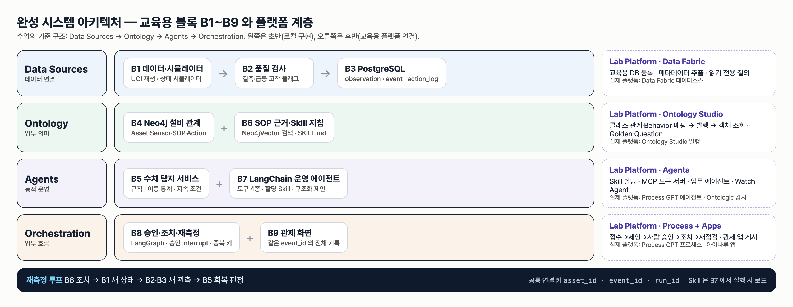
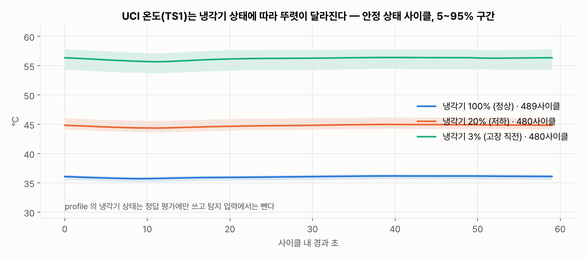
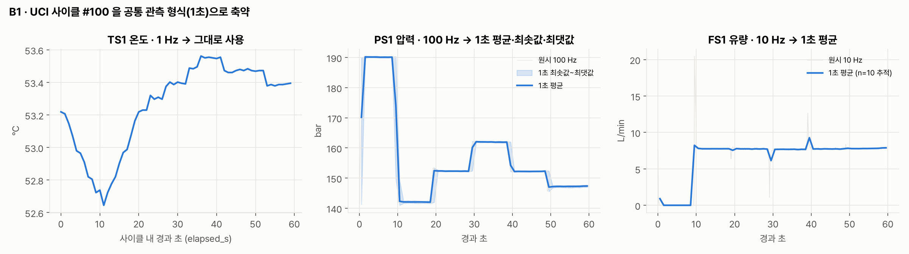
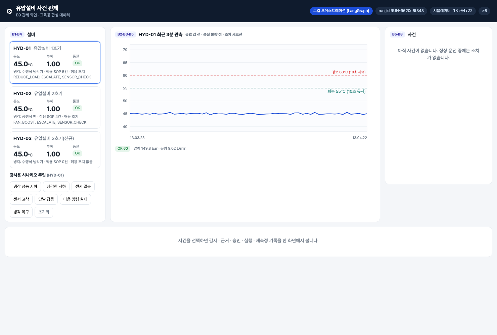
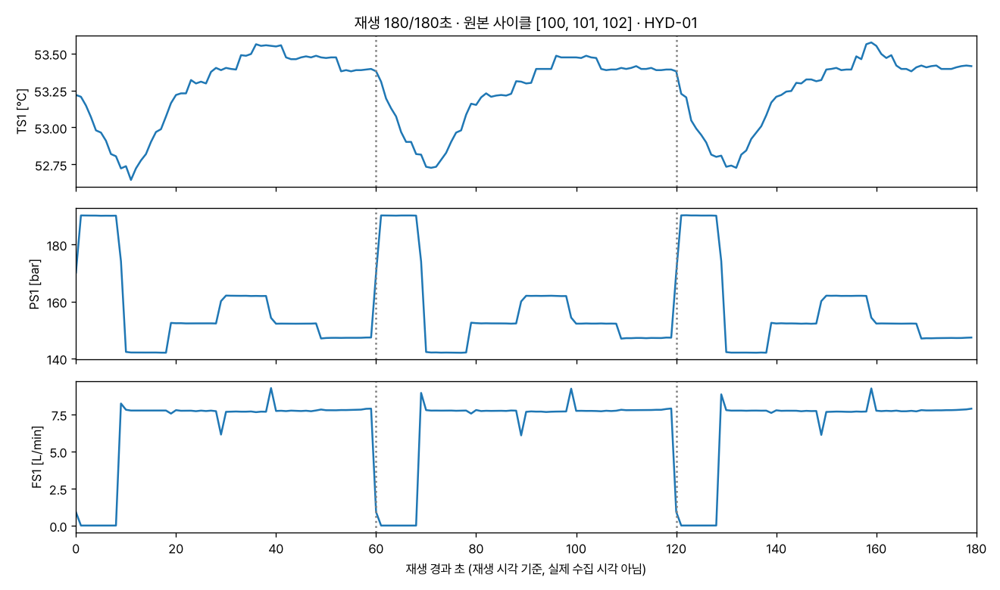

# 통합반 1회 · 센서와 데이터 흐름 알아보기

| 날짜·시간 | 2026-11-14 (토) 09:00~13:00 | 모듈 | M1 · 원 일정 5번 |
|---|---|---|---|
| 블록 | 구현 B1 · B2 | 산출물 | B1→B2 데이터 읽기 |
| 완료 확인 | 값 하나의 설비·센서·단위·출처를 설명 | | |


## 이번 회차에서 할 일

우리가 열 번에 걸쳐 완성할 시스템은 유압설비의 냉각 이상을 발견하고, 설비 관계와 매뉴얼(SOP)을 확인한 뒤, 사람이 승인한 조치를 실행하고 새 관측으로 회복을 다시 재는 시스템이다. 오늘은 그 출발점인 **B1 데이터**와 **B2 품질 검사**의 입구를 연다. 센서 파일 세 개를 제공 노트북으로 열어 보고, "이 숫자는 어느 설비의 어느 센서가, 어떤 단위로, 어느 파일에서 온 값인가"를 표로 정리한다. 수업이 끝나면 노트북 하나가 원본 파일 → 1초 축약 → 공통 관측 레코드 → 재생 그래프 → 저장본까지 한 번에 돌아가고, 그 결과를 방학 동안 보관할 체크포인트로 남긴다.

### 학습 목표
- 완성 시스템의 네 계층(Data Sources · Ontology · Agents · Orchestration)과 B1~B9 블록 이름을 화면과 그림에서 **찾아 가리킨다**.
- TS1·PS1·FS1 원본 파일을 열어 한 줄의 칸 수로 **측정 빈도(Hz)를 계산한다**.
- 설비·센서·단위·빈도·출처 파일을 담은 매핑 표의 빈칸을 **채우고 제공 코드와 대조한다**.
- 관측 값 하나(사이클 #100, TS1, 30초째)의 설비·센서·단위·출처를 **한 문장으로 설명한다**.

## 1. 시작 전 준비 (복습·환경 확인)

첫 회차이므로 복습 대신 환경을 확인한다. 강사가 DB 컨테이너와 가상환경을 미리 준비해 두었다. 학생은 **확인만** 한다(DB 관리와 설치는 평가에서 제외한다).

1. DB 컨테이너가 떠 있는지 본다.

```bash
cd lecture/system
docker compose ps --format "table {{.Name}}\t{{.Image}}\t{{.Status}}"
```

예상 출력(가동 시간은 다를 수 있다):

```
NAME              IMAGE                STATUS
hydops-neo4j      neo4j:5              Up About an hour
hydops-postgres   postgres:16-alpine   Up About an hour
```

2. 제공 노트북을 연다. VS Code 에서 `lecture/labs/integrated/S01/S01_sensor_flow.ipynb` 를 열고, 오른쪽 위 커널 선택에서 `lecture/system/.venv` 의 Python 을 고른다. 첫 셀(0. 준비)을 실행한다.

```
제공 코드 위치: system / 원본 폴더: data/raw
```

> **주의** 노트북은 반드시 `lecture/labs/integrated/S01` 폴더 안에서 연다. 첫 셀은 현재 폴더에서 위로 올라가며 `system/hydops` 를 찾는다. 다른 폴더(예: 바탕화면)로 복사해서 열면 `StopIteration` 오류가 난다.

## 2. 핵심 개념

### 2.1 네 계층과 아홉 블록



완성 시스템은 **Data Sources → Ontology → Agents → Orchestration** 네 계층으로 되어 있다. 공장에 비유하면 Data Sources 는 "계기판에서 숫자를 받아 적는 사람", Ontology 는 "그 숫자가 어느 기계의 무엇인지 알려 주는 설비 대장과 매뉴얼", Agents 는 "숫자를 보고 이상을 알아채고 매뉴얼을 찾아 조치를 제안하는 사람", Orchestration 은 "승인·실행·재점검 순서를 지키게 하는 업무 흐름"이다.

| 계층 | 블록 | 오늘 관련 |
|---|---|---|
| Data Sources | B1 데이터·시뮬레이터 · B2 품질 검사 · B3 PostgreSQL | **B1 · B2 (오늘)**, B3 는 2회 |
| Ontology | B4 Neo4j 설비 관계 · B6 SOP 근거·Skill 지침 | 3회 · 5회 |
| Agents | B5 수치 탐지 · B7 운영 에이전트 | 4회 · 6회 |
| Orchestration | B8 승인·조치·재측정 · B9 관제 화면 | 6회 · 4회 |

모든 블록은 `asset_id`(설비 ID)·`event_id`(사건 ID)·`run_id`(실행 ID) 세 열쇠로 이어진다. 오늘은 그중 `asset_id` 가 처음 등장한다.

### 2.2 UCI 유압설비 데이터

수업의 원본 데이터는 공개 데이터셋 UCI *Condition monitoring of hydraulic systems* 이다. 실험용 유압 장치가 **60초짜리 운전을 2,205번(사이클)** 반복하며 여러 센서를 기록했다. 우리는 그중 세 센서만 쓴다.

| 센서 코드 | 무엇을 재나 | 단위 | 1초에 몇 번 | 원본 파일 | 한 줄의 칸 수 |
|---|---|---|---|---|---|
| TS1 | 온도 | °C | 1 Hz | `TS1.txt` | 60 |
| PS1 | 압력 | bar | 100 Hz | `PS1.txt` | 6,000 |
| FS1 | 유량 | L/min | 10 Hz | `FS1.txt` | 600 |

파일은 **탭으로 칸을 나눈 표**(CSV 와 같은 표 형식)다. 한 줄이 한 사이클이고, 한 칸이 한 번의 측정이다. 시험지 답안지를 떠올리면 쉽다. 한 줄이 학생 한 명(사이클), 칸이 문항(측정 시각)이다. 60초 동안 100번씩 쟀다면 칸이 6,000개가 된다.

`profile.txt` 에는 사이클마다 냉각기 상태(100%·20%·3%) 같은 **정답 라벨**이 있다. 이것은 나중에 탐지가 맞았는지 채점할 때만 쓰고, 탐지 입력에는 넣지 않는다. 시험 중에 답안지를 보면 안 되는 것과 같다.



위 그림처럼 안정 상태 사이클의 평균 온도는 냉각기 100% 에서 36.02°C(489 사이클), 20% 에서 44.75°C(480), 3% 에서 56.19°C(480)로 뚜렷이 다르다. 온도 센서 하나만 봐도 냉각 상태가 드러나기 때문에 이 과정의 주인공 센서가 TS1 이다.

### 2.3 1초 축약과 공통 관측 레코드

센서마다 빈도가 달라서 그대로는 한 표에 나란히 놓을 수 없다. 강사가 모든 센서를 **1초 단위로 줄인 축약본**(`data/reduced/hydraulic_1s.npz`)을 미리 만들어 두었다. 100 Hz 인 PS1 은 1초 안의 100개 값을 평균·최솟값·최댓값으로 요약하고, 몇 개를 요약했는지(n=100)도 함께 남긴다.



그다음 제공 함수 `cycle_observations` 가 한 사이클을 **공통 관측 레코드** 목록으로 바꾼다. 레코드 한 줄에는 다음 칸이 있다(`hydops/b1_data/uci.py`).

```python
rows.append(
    {
        "asset_id": asset_id,                 # 어느 설비 (교육용 HYD-01)
        "sensor_id": sid,                     # 어느 센서 (TS1)
        "ts": replay_start + timedelta(seconds=s),   # 재생 시각
        "elapsed_s": s,                       # 사이클 안에서 몇 초째
        "origin_cycle_id": int(cycle_id),     # UCI 원본 몇 번째 사이클
        "raw_value": mean,                    # 값
        "unit": meta["unit"],                 # 단위
        "agg": None if meta["hz"] == 1 else {"min": ..., "max": ..., "n": ..., "source_hz": ...},
        "is_synthetic": False,                # 원본(False) / 시뮬레이터 합성(True)
    }
)
```

> **주의** `ts` 는 **재생 시각**이다. 수업에서 정한 시작 시각(예: 2026-11-14 09:00)에 경과 초를 더한 값일 뿐, UCI 장치가 실제로 측정한 시각이 아니다. 원본을 되짚을 때는 `origin_cycle_id` 와 `elapsed_s` 를 쓴다.

### 2.4 B2 품질 검사 미리 보기

B2 는 관측마다 **품질 플래그**(`OK / MISSING / GAP / SPIKE / STUCK / OUT_OF_RANGE`)를 붙인다. 원시 값(`raw_value`)은 그대로 두고, 품질이 OK 일 때만 정제 값(`value`)을 채운다. 오늘은 활동 4 에서 플래그가 붙는 모습만 보고, 기준값은 2회에서 직접 채운다.

> **주의** 플래그는 "이 값은 의심스럽다"는 표시이지 "설비가 고장 났다"는 뜻이 아니다. 오늘 실제로 유량이 0 에서 8 L/min 으로 켜지는 순간에도 SPIKE 가 찍히는 것을 보게 된다.

### 2.5 오늘 데이터가 지나가는 길

택배에 비유하면, 원본 파일은 창고에 쌓인 상자이고, 축약은 상자를 같은 크기로 다시 포장하는 일이며, 공통 관측 레코드는 상자마다 붙이는 **송장**이다. 송장에 보내는 곳(설비)·물건 이름(센서)·무게 단위(단위)·출고 창고(원본 파일과 사이클)가 빠지면, 받는 쪽은 상자를 열어 보기 전까지 무엇인지 알 수 없다. 오늘 매핑 표를 채우는 일은 이 송장 양식을 완성하는 일이다.

| 단계 | 들어가는 것 | 나오는 것 | 담당 코드 | 오늘 노트북 셀 |
|---|---|---|---|---|
| ① 원본 읽기 | `TS1.txt`·`PS1.txt`·`FS1.txt` | 사이클 × 칸 행렬 | `uci.load_sensor_matrix` | 2-1 |
| ② 1초 축약 | 센서별 행렬 | 사이클 × 60초 × (mean·min·max·n) | `uci.reduce_to_1s` → 축약본 파일 | 2-3 |
| ③ 레코드 만들기 | 축약본 + 설비 ID + 재생 시작 시각 | 공통 관측 레코드 180줄/사이클 | `uci.cycle_observations` | 3-3 |
| ④ 재생 | 사이클 번호 목록 | 이어 붙인 레코드 | `uci.replay_cycles` | 4-1 |
| ⑤ 품질 표시 | 레코드 | 레코드 + `quality_flag`·`value` | `SensorQualityChecker.check_many` | 4-2 |
| ⑥ 저장 | 표시된 레코드 | CSV·PNG 저장본 | (노트북 셀) | 4-3 |

②의 축약은 강사가 이미 해 두었으므로 오늘은 결과 파일만 읽는다. 원본 PS1 파일은 87MB 이지만 축약본 전체는 2.3MB 로, 학생 노트북에서도 가볍게 돌아간다. ⑥ 다음 단계인 PostgreSQL 적재(B3)는 2회에서 한다.

## 3. 활동 1 — 완성 시연과 아키텍처 블록 카드 읽기 · 50분

### 목표
완성 시스템이 실제로 돌아가는 모습을 보고, 화면의 각 영역이 어느 블록인지 블록 카드로 짝짓는다.

### 따라 하기
1. 강사가 관제 화면 `http://localhost:8800` 을 띄운다. 먼저 정상 운전 화면을 본다.



2. 화면에서 다음을 찾아 손가락으로 가리킨다.
   - 왼쪽 **설비** 패널의 `B1·B4` 표시와 HYD-01·HYD-02·HYD-03 카드 (온도·부하·품질)
   - 가운데 **최근 3분 관측** 그래프의 `B2·B3·B5` 표시, 경보 60°C 선과 회복 55°C 선
   - 오른쪽 **사건** 패널의 `B5·B8` 표시 ("아직 사건이 없습니다")
   - 위쪽 `run_id` 칩과 "시뮬레이터 시각" 칩
3. 강사가 "강사용 시나리오 주입"의 **센서 결측** 버튼을 누른다. 그래프에 빨간 점(품질 불량)이 찍히고 사건이 "센서 점검"으로 분류되는 과정을 본다(3회 이후 회차에서 이 흐름을 하나씩 만든다).
4. 팀별로 **블록 카드**(B1~B9, 한 장에 블록 하나)를 받아 아래 표를 채운다. 그림 D01 과 화면을 번갈아 본다.

| 카드 | 한 줄 설명 (내 말로) | 화면에서 보이는 곳 | 코드 파일 |
|---|---|---|---|
| B1 | | 설비 카드의 온도 숫자 | `hydops/b1_data/uci.py` · `simulator.py` |
| B2 | | 그래프의 품질 불량 점 · 품질 칩 | `hydops/b2_quality/checks.py` |
| B3 | | (저장소라 화면에 직접 없음) | `hydops/b3_tsdb/store.py` |
| B4 | | 설비 카드의 "적용 SOP 5건" | `hydops/b4_ontology/graph.py` |
| B5 | | 경보선 · 사건 목록 | `hydops/b5_detect/detector.py` |
| B6~B8 | | 사건을 누르면 나오는 근거·승인·실행 | `hydops/b6_sop` · `b7_agent` · `b8_action` |
| B9 | | 이 화면 전체 | `hydops/b9_dashboard/app.py` |

### 확인 포인트
- 설비 카드 HYD-03 에 "적용 SOP 0건 · 허용 조치 없음"이 보인다 → 신규 설비라 매뉴얼이 없다는 뜻이며, 뒤 회차에서 "근거 없음 보류" 사례가 된다.
- 화면 부제목에 "교육용 합성 데이터"라고 적혀 있다 → 관제 화면의 실시간 온도는 UCI 원본이 아니라 **시뮬레이터** 값이다. 오늘 노트북에서 여는 UCI 파일과 구분한다.

### 흔한 실수
- 관제 화면의 시각을 UCI 측정 시각으로 읽는다 → 시뮬레이터 시각이다.
- 경보선 60°C 를 UCI 설비의 실제 운전 기준으로 받아들인다 → 모든 수치 기준은 **교육용 가정값**이다.
- B3 카드를 화면에서 찾으려고 한다 → 저장소는 화면 뒤에 있다. "보이지 않는 블록도 있다"는 것이 오늘의 발견이다.

## 4. 활동 2 — 세 센서 CSV를 제공 노트북으로 열기 · 50분

### 목표
원본 파일 세 개와 정답 라벨 파일, 강사 제공 축약본을 열어 모양(줄 수·칸 수)을 확인한다.

### 따라 하기
1. 노트북 셀 **2-1** 을 실행한다. PS1 파일은 87MB 로 커서 앞 3줄만 읽는다.

```python
for name in ['TS1.txt', 'PS1.txt', 'FS1.txt']:
    head = pd.read_csv(RAW / name, sep='\t', header=None, nrows=3)
    print(f'{name:8s} 한 줄(사이클)의 칸 수 = {head.shape[1]:5d}  →  {head.shape[1] // 60:3d} Hz   첫 값 = {head.iloc[0, 0]}')
```

2. 셀 **2-2** 로 정답 라벨을 본다. 사이클 0·100·1500 의 냉각기 상태를 확인한다.
3. 셀 **2-3** 으로 축약본을 불러온다.
4. 셀 **2-4** 로 사이클 #100 의 세 센서 그래프를 그린다. `CYCLE = 100` 을 다른 번호(예: 1500)로 바꿔 한 번 더 실행해 본다.

### 확인 포인트
실제 실행 결과는 다음과 같다.

```
TS1.txt  한 줄(사이클)의 칸 수 =    60  →    1 Hz   첫 값 = 35.57
PS1.txt  한 줄(사이클)의 칸 수 =  6000  →  100 Hz   첫 값 = 151.47
FS1.txt  한 줄(사이클)의 칸 수 =   600  →   10 Hz   첫 값 = 8.99
사이클(줄) 수 = 2205
```

```
                 cooler_pct  valve_pct  pump_leak  accumulator_bar  \
origin_cycle_id
0                         3        100          0              130
100                       3        100          0              130
1500                    100        100          0               90
```

```
TS1 → {'mean': (2205, 60), 'min': (2205, 60), 'max': (2205, 60), 'n': (2205, 60)}
PS1 → {'mean': (2205, 60), 'min': (2205, 60), 'max': (2205, 60), 'n': (2205, 60)}
FS1 → {'mean': (2205, 60), 'min': (2205, 60), 'max': (2205, 60), 'n': (2205, 60)}
```

- 원본은 센서마다 칸 수가 다르지만(60 / 6,000 / 600), 축약본은 모두 `(2205, 60)` 이다. **"사이클 2,205개 × 60초"로 줄을 맞춘 것**이 축약의 목적이다.
- 사이클 #100 은 냉각기 3%(고장 직전) 사이클이라 TS1 이 약 53°C 대에 있다. 사이클 #1500 은 냉각기 100% 사이클이다.
- 2-4 그래프에서 PS1 은 사이클 초반 약 190 bar 로 높았다가 10초 무렵 약 142 bar 로 떨어지고, FS1 은 0 근처에 있다가 9초 무렵 약 8 L/min 으로 올라간다. UCI 장치가 사이클마다 **같은 운전 순서**를 되풀이하기 때문에 생기는 계단 모양이다. 이 모양을 기억해 두면 활동 4 의 품질 플래그를 해석할 때 도움이 된다.

### 흔한 실수
- `PS1.txt` 전체를 `nrows` 없이 읽어 셀이 오래 멈춘다 → 앞 몇 줄이면 칸 수를 알 수 있다.
- 2-1 의 "첫 값 151.47"(사이클 0 의 첫 측정)과 2-4 그래프의 사이클 #100 값을 같은 것으로 착각한다 → 사이클 번호가 다르고, 그래프는 1초 평균이다.
- `profile.txt` 의 `cooler_pct` 를 "센서 값"으로 생각한다 → 사이클마다 붙은 **정답 라벨**이다.

## 5. 활동 3 — 설비·센서·단위 매핑 표 채우기 · 50분

### 목표
노트북의 매핑 표 빈칸을 채우고, 값 하나를 설비·센서·단위·출처로 설명한다.

### 따라 하기
1. 셀 **3-1** 의 `____` 를 채운다. 무엇을 넣을지는 활동 2 의 출력과 2.2 절 표에 모두 있다.

```python
SENSOR_TABLE = {
    'TS1': {'asset_id': ASSET_ID, 'sensor_id': ____, 'quantity': 'temperature', 'unit': ____, 'hz': ____, 'file': 'TS1.txt'},
    'PS1': {'asset_id': ASSET_ID, 'sensor_id': 'HYD-01.PS1', 'quantity': 'pressure', 'unit': ____, 'hz': ____, 'file': ____},
    'FS1': {'asset_id': ASSET_ID, 'sensor_id': ____, 'quantity': 'flow', 'unit': ____, 'hz': ____, 'file': ____},
}
```

   - `sensor_id` 는 PS1 줄에 예시가 있다. **설비ID.센서코드** 모양이다. 이 모양은 3회에서 Neo4j 그래프의 센서 ID 로 그대로 쓴다.
   - `unit` 과 `file` 은 따옴표로 감싼 문자열, `hz` 는 따옴표 없는 정수다.
2. 셀 **3-2** 를 실행해 제공 코드 `uci.SENSOR_MAP` 과 한 칸씩 비교한다. 모든 칸이 `True` 가 될 때까지 고친다.
3. 셀 **3-3** 을 실행해 공통 관측 레코드 한 줄을 본다.
4. 셀 **3-4** 의 `ONE_VALUE` 빈칸을 3-3 출력을 보며 채우고 실행한다.

### 확인 포인트
정답을 채운 뒤의 실제 출력이다.

```
    asset_id   sensor_id     quantity   unit   hz     file
TS1   HYD-01  HYD-01.TS1  temperature     °C    1  TS1.txt
PS1   HYD-01  HYD-01.PS1     pressure    bar  100  PS1.txt
FS1   HYD-01  HYD-01.FS1         flow  L/min   10  FS1.txt
```

```
TS1 {'file': True, 'hz': True, 'unit': True, 'quantity': True}
PS1 {'file': True, 'hz': True, 'unit': True, 'quantity': True}
FS1 {'file': True, 'hz': True, 'unit': True, 'quantity': True}
```

```
레코드 수 = 180 (= 센서 3개 × 60초)
{'asset_id': 'HYD-01',
 'sensor_id': 'TS1',
 'ts': datetime.datetime(2026, 11, 14, 9, 0, 30, tzinfo=datetime.timezone.utc),
 'elapsed_s': 30,
 'origin_cycle_id': 100,
 'raw_value': 53.402,
 'unit': '°C',
 'agg': None,
 'is_synthetic': False}
```

```
설비 HYD-01 의 센서 TS1 값 53.402 °C 은(는) 원본 파일 TS1.txt 의 사이클 #100, 30초째 값이다.
```

이 마지막 문장이 오늘의 **완료 확인**이다. 팀원 한 명씩 자기 말로 소리 내어 설명한다. 예: "이 53.402 는 교육용 설비 HYD-01 에 붙인 온도 센서 TS1 의 °C 값이고, UCI 원본 `TS1.txt` 의 101번째 줄(사이클 #100, 0부터 셈) 31번째 칸(30초째)에서 왔다. 합성 값이 아니다."

TS1 은 1 Hz 라 `agg` 가 `None` 이다. 같은 30초째의 PS1 레코드는 `'agg': {'max': 162.26, 'min': 161.85, 'n': 100, 'source_hz': 100}` 처럼 **원래 100개 값을 요약했다는 흔적**을 남긴다.

### 흔한 실수
- `'unit': bar` 처럼 따옴표를 빼면 `NameError: name 'bar' is not defined` 가 난다.
- `'hz': '100'` 처럼 숫자를 따옴표로 감싸면 3-2 비교가 `False` 로 나온다. 문자열 `'100'` 과 정수 `100` 은 다르다.
- `sensor_id` 를 `'TS1'` 로만 쓴다 → 그래프에서는 설비가 여러 대라 `HYD-01.TS1`, `HYD-02.TS1` 을 구분해야 한다.
- `origin_cycle_id` 가 100 이라 "파일의 100번째 줄"이라고 말한다 → 번호는 0부터 세므로 파일의 101번째 줄이다.
- 빈칸을 비운 채 마지막 셀을 실행하면 `확인 필요: TS1.hz, TS1.unit, ...` 처럼 남은 칸 이름이 나온다. 이 목록을 할 일 목록으로 쓴다.

## 6. 활동 4 — 재생 버튼으로 그래프 확인하고 저장본 남기기 · 50분

### 목표
사이클 여러 개를 이어 재생해 보고, 품질 플래그를 붙여 본 뒤, 결과를 파일로 저장한다.

### 따라 하기
1. 셀 **4-1** 을 고르고 **▶ 실행 버튼**을 누른다. 사이클 [100, 101, 102] 가 10초씩 늘어나며 그려진다. 점선은 사이클 경계(60초·120초)다.
2. `REPLAY_CYCLES = [100, 101, 102]` 를 `[1500, 1501, 1502]` 등으로 바꿔 다시 누른다. 온도 높이가 어떻게 달라지는지 2.2 절의 그림과 비교한다.
3. `REPLAY_CYCLES` 를 다시 `[100, 101, 102]` 로 되돌리고 셀 **4-2** 로 품질 플래그를 붙인다.
4. 셀 **4-3** 으로 저장본을 남기고, 셀 **5 (자기 점검)** 를 실행한다.
5. 노트북을 저장(Ctrl+S)한다.

### 확인 포인트



```
재생한 관측 레코드 수 = 540
```

```
sensor_id  quality_flag
FS1        OK              170
           SPIKE            10
PS1        OK              180
TS1        OK              180
```

```
    sensor_id  origin_cycle_id  elapsed_s  raw_value  value quality_flag
27        FS1              100          9     8.2292    NaN        SPIKE
30        FS1              100         10     7.8076    NaN        SPIKE
180       FS1              101          0     0.9101    NaN        SPIKE
183       FS1              101          1     0.0009    NaN        SPIKE
207       FS1              101          9     8.9437    NaN        SPIKE
...
```

```
S01_replay_last_frame.png
S01_replay_observations.csv
S01_sensor_table.csv
```

```
모든 빈칸 통과
```

- 540 = 사이클 3개 × 센서 3개 × 60초.
- SPIKE 10개는 모두 FS1 이고, 모두 **사이클의 0~1초와 9~10초**에 있다. 그래프를 보면 이때 유량이 0 근처에서 약 8 L/min 으로 켜지거나(9초), 사이클이 바뀌며 다시 0 으로 떨어진다(0초). 품질 검사는 "1초 사이에 6 L/min 넘게 뛰었다"는 사실만 보고 SPIKE 로 표시했고, 그런 점프가 세 번째로 이어지자 수준 변화로 받아들여 OK 로 돌아갔다. 이것은 **센서가 고장 난 것도, 설비가 고장 난 것도 아니다.** 운전 순서에 따른 정상 변화다. 2회에서 이 기준을 직접 다룬다.
- SPIKE 행의 `value` 는 `NaN`(비어 있음)이고 `raw_value` 는 남아 있다. 원시 값은 지우지 않는다.

### 흔한 실수
- 재생 셀을 여러 번 빠르게 누르면 그림이 겹쳐 보인다 → 실행이 끝난 뒤(왼쪽 숫자가 채워진 뒤) 다시 누른다.
- 재생 그래프의 가로축을 "실제 경과 시간"으로 설명한다 → 재생 시각 기준이다. 원본에서 세 사이클이 연달아 측정됐는지는 이 그림으로 알 수 없다.
- 4-2 의 SPIKE 를 보고 "유량 센서 고장"이라고 적는다 → 위 설명처럼 운전 단계 변화다. 플래그는 **판단 재료**이지 결론이 아니다.
- `saved/` 폴더를 지운 채 체크포인트를 묶는다 → 4-3 셀을 다시 실행하면 같은 파일이 다시 생긴다.

## 7. 실습 과제

- 통합반: `labs/integrated/S01/` — 제공 노트북 `S01_sensor_flow.ipynb`
  - 빈칸 1: 셀 3-1 (태그 `mapping`) `SENSOR_TABLE` 의 `sensor_id` · `unit` · `hz` · `file` 10칸
  - 빈칸 2: 셀 3-4 (태그 `one_value`) `ONE_VALUE` 의 `asset_id` · `raw_value` · `unit` · `source_file` · `is_synthetic` 5칸
  - 검사 내용: 제공 코드 `uci.SENSOR_MAP` 과 같은지, `hz` 가 원본 파일 한 줄의 칸 수 ÷ 60 과 같은지, 값 하나가 실제 레코드와 같은지, 노트북이 위에서 아래로 끝까지 실행되어 `모든 빈칸 통과` 와 540행 저장본이 생기는지
  - 셀 태그와 변수 이름은 바꾸지 않는다. 정답본은 `solution/` 에 있다(강사 확인용).
- 확인 명령: `cd lecture/system && PYTHONPATH=. .venv/bin/python -m pytest ../labs/integrated/S01 -q`

빈칸을 채우기 전에는 `4 failed`, 모두 채우면 다음이 나온다.

```
....                                                                     [100%]
4 passed
```

경험자 과제: 원본에는 TS2(온도, 1 Hz, °C)도 있다. `SENSOR_TABLE` 에 `'TS2'` 한 줄을 더해 보고(`sensor_id` 는 같은 규칙), 셀 3-2 가 "제공 코드에 없는 센서 (경험자 확장 칸)"라고 알려 주는지 확인한다. 한 줄을 더해도 테스트는 통과한다.

## 8. 완료 확인 체크리스트

- [ ] 관제 화면에서 B1·B2 가 보이는 영역(설비 카드 온도·품질 칩·그래프의 품질 불량 점)을 가리켰다.
- [ ] TS1·PS1·FS1 의 한 줄 칸 수(60·6,000·600)로 Hz 를 계산해 말했다.
- [ ] 셀 3-2 에서 세 센서의 `file·hz·unit·quantity` 가 모두 `True` 다.
- [ ] 값 53.402 에 대해 **설비(HYD-01) · 센서(TS1) · 단위(°C) · 출처(TS1.txt, 사이클 #100, 30초째)** 를 한 문장으로 말했다.
- [ ] `ts` 가 재생 시각이며 실제 수집 시각이 아님을 설명했다.
- [ ] `saved/` 에 CSV·PNG 세 파일이 있고, 자기 점검 셀이 `모든 빈칸 통과` 다.
- [ ] `pytest ../labs/integrated/S01 -q` 가 `4 passed` 다.
- [ ] 팀 체크포인트 파일을 만들었다(강사 노트 참고).

## 9. 회고 (10분)

1. 오늘 설명한 값 하나에서, 설비 ID 가 없다면 어떤 문제가 생길까? (힌트: 관제 화면의 설비는 세 대다)
2. FS1 의 SPIKE 10개를 보고 처음에 무엇이라고 생각했나? 그래프를 본 뒤 생각이 어떻게 바뀌었나?
3. `profile.txt` 의 냉각기 상태를 탐지 입력에 넣으면 왜 안 되는가?

회고 답은 팀 메모 `saved/team_note.txt` 에 두세 줄로 적어 체크포인트에 함께 넣는다. 두 달 뒤 2회차 첫 시간에 이 메모를 먼저 읽고 시작한다. 1번 질문은 3회(설비와 센서 관계), 2번 질문은 2회(품질 기준), 3번 질문은 4회(평가 구간)에서 다시 만난다.

## 10. 실제 플랫폼 대응 (해당 회차만)

이번 회차는 해당하지 않는다. 교육용 플랫폼(Lab Platform) 연결은 7회부터 다룬다. 오늘 만든 매핑 표의 `asset_id` · `sensor_id` 규칙은 7회 Data Fabric·Ontology Studio 매핑에서 다시 쓴다.

## 강사 노트

### 시간 배분 (09:00~13:00)

| 시간 | 내용 |
|---|---|
| 09:00~09:50 | 활동 1 완성 시연·블록 카드 (시연 15분, 카드 작성 25분, 팀 발표 10분) |
| 09:50~10:40 | 활동 2 파일 열기 (환경 확인 10분 포함) |
| 10:40~11:10 | 휴식 30분 · 이때 팀 역할 교대 |
| 11:10~12:00 | 활동 3 매핑 표·값 하나 설명 |
| 12:00~12:50 | 활동 4 재생·품질 플래그·저장본, 체크포인트 저장 |
| 12:50~13:00 | 회고 10분 |

### 사전 준비
- `cd lecture/system && docker compose up -d` 로 DB 두 개를 띄운다. 오늘은 DB 에 쓰지 않지만 1절 확인과 활동 1 시연에 필요하다.
- 가상환경에 노트북 실행 패키지가 있는지 확인한다: `.venv/bin/jupyter kernelspec list` 에 `python3 .../lecture/system/.venv/share/jupyter/kernels/python3` 가 보여야 한다. 없으면 `VIRTUAL_ENV=.venv uv pip install nbformat nbconvert ipykernel`. JupyterLab 은 설치되어 있지 않으므로 학생은 VS Code 의 Jupyter 확장으로 연다.
- 시연용 관제 화면: `scripts/servers.sh local 4` (로컬 오케스트레이션, 4배속). 시연 전 한 번 열어 사건 목록이 비어 있는지 본다. 이전 실행의 열린 사건은 초기화 시 `RUN_ENDED` 로 닫힌다.
- 블록 카드 B1~B9 를 팀 수만큼 인쇄한다(그림 D01 의 블록 제목과 부제목을 그대로 옮긴다).
- 정답 노트북 `labs/integrated/S01/solution/S01_sensor_flow.ipynb` 는 실행 결과가 저장되어 있으므로 화면 공유용으로 쓴다.

### 팀 역할 (데이터 / 관계·문서 / 에이전트·조치)

| 역할 | 전반(활동 1·2) | 후반(활동 3·4, 휴식 후 교대) |
|---|---|---|
| 데이터 담당 | 노트북 셀 2-1~2-4 실행, 칸 수·Hz 기록 | 셀 4-1 재생, `REPLAY_CYCLES` 바꿔 비교 |
| 관계·문서 담당 | 블록 카드 표 작성, `description.txt` 에서 단위 찾기 | 셀 3-1 `sensor_id` 규칙 확인, 값 하나 설명 문장 정리 |
| 에이전트·조치 담당 | 관제 화면에서 블록 위치 찾기, 센서 결측 시연 관찰 기록 | 셀 4-2 플래그 해석, 저장본·체크포인트 묶기 |

휴식 시간에 역할을 한 칸씩 돌린다. 초보자는 빈칸 완성까지, 경험자는 7절의 TS2 한 줄 추가를 맡긴다. 완료 확인 문장은 **팀원 전원**이 한 번씩 말하게 한다.

### 자주 나오는 질문과 답
- "왜 UCI 데이터를 HYD-01 이라고 부르나요?" → UCI 장치에는 설비 ID 가 없다. 수업에서 재생할 설비 ID 를 우리가 정해 붙인 것이고, 그래서 `asset_id` 는 매핑 표에서 **우리가 정하는 값**, 단위·빈도는 **원본이 정한 값**이라는 차이가 있다.
- "PS1 을 1초 평균으로 줄이면 정보가 사라지지 않나요?" → 사라진다. 그래서 최솟값·최댓값·개수(n)를 함께 남긴다. 그림 F01 의 PS1 패널에서 옅은 띠가 최솟값~최댓값이다.
- "관제 화면 온도는 45°C 인데 노트북은 53°C 예요." → 관제 화면은 시뮬레이터(정상 운전 가정), 노트북 사이클 #100 은 UCI 냉각기 3% 사이클이다. 서로 다른 데이터다.
- "SPIKE 가 났으니 이상 아닌가요?" → 활동 4 확인 포인트의 설명을 함께 읽는다. 그래프에서 같은 시점에 무슨 일이 있었는지 먼저 본다.

### 장애 대응
- 노트북 커널이 `.venv` 를 못 찾는 경우: 명령줄 실행으로 대신한다. `cd lecture/labs/integrated/S01 && ../../../system/.venv/bin/jupyter nbconvert --to notebook --execute --inplace S01_sensor_flow.ipynb` 로 실행한 뒤 VS Code 에서 결과만 연다.
- 관제 화면 서버가 안 뜨는 경우: 활동 1 은 스크린숏 S01·S02 와 그림 D01 로 진행한다. 오늘 활동 2~4 는 서버 없이 노트북만으로 끝난다.
- DB 컨테이너 문제: 오늘 노트북은 파일만 읽으므로 수업은 계속한다.

### 체크포인트 저장 (학기 마지막 시간 — 필수)
통합반은 이번 1회가 학기 마지막 시간이고 다음 수업은 2027-01-25 이다. 수업 끝 10분 전에 **코드·데이터·설정** 세 가지를 저장한다.

| 구분 | 무엇 | 방법 |
|---|---|---|
| 코드 | 빈칸을 채운 `S01_sensor_flow.ipynb` | 노트북 저장(Ctrl+S) |
| 데이터 | `saved/` 의 CSV·PNG 세 파일 | 셀 4-3 실행 결과 |
| 설정 | 팀 역할표, 경험자가 추가한 센서 줄, `.venv` 커널 경로 메모 | 팀 메모 파일 `saved/team_note.txt` 에 적는다 |

팀별로 묶는다(팀 이름만 바꾼다).

```bash
cd lecture
tar czf checkpoint_I01_team1.tgz labs/integrated/S01/S01_sensor_flow.ipynb labs/integrated/S01/saved
tar tzf checkpoint_I01_team1.tgz
```

`tar tzf` 출력에 노트북과 `saved/` 안의 파일 이름이 나오면 된다(정답본으로 실행해 확인한 목록: `S01_sensor_flow.ipynb`, `saved/`, `saved/S01_sensor_table.csv`, `saved/S01_replay_last_frame.png`, `saved/S01_replay_observations.csv`). 강사는 묶음 파일을 수업 저장소나 공유 드라이브로 모은다.

강사 쪽 환경은 컨테이너를 **멈추기만** 한다: `docker compose stop`. `docker compose down -v` 는 DB 볼륨(`hydops-lecture_hydops-pg`, `hydops-lecture_hydops-neo4j`)을 지우므로 쓰지 않는다. 2회차 첫 활동이 이 체크포인트로 환경을 복구한다.

## 용어

| 용어 | 뜻 |
|---|---|
| 사이클 | UCI 장치의 60초 운전 한 번. 원본 파일의 한 줄 |
| Hz | 1초에 측정한 횟수. 한 줄 칸 수 ÷ 60 |
| 1초 축약 | 빈도가 다른 센서를 1초 단위 평균·최솟값·최댓값·개수로 줄이는 일 |
| 공통 관측 레코드 | 설비·센서·재생 시각·경과 초·원본 사이클·값·단위·합성 여부를 담은 한 줄 |
| `asset_id` | 설비 ID. 교육용 설비 HYD-01·HYD-02·HYD-03 |
| `sensor_id` | 관측 레코드에서는 센서 코드(TS1), 그래프에서는 설비ID.센서코드(HYD-01.TS1) |
| `origin_cycle_id` | UCI 원본 사이클 번호(0부터 셈). 합성 데이터는 없음 |
| `elapsed_s` | 사이클 안에서 몇 초째인지(0~59) |
| 재생 시각(`ts`) | 수업에서 정한 시작 시각 + 경과 초. 실제 수집 시각이 아님 |
| 정답 라벨 | `profile.txt` 의 냉각기·밸브·펌프·축압기 상태. 채점에만 쓴다 |
| 품질 플래그 | 관측마다 붙는 OK/MISSING/GAP/SPIKE/STUCK/OUT_OF_RANGE 표시 |
| `raw_value` / `value` | 원시 값(항상 보존) / 정제 값(품질 OK 일 때만) |
| 체크포인트 | 다음 학기에 이어 하기 위해 저장한 코드·데이터·설정 묶음 |
