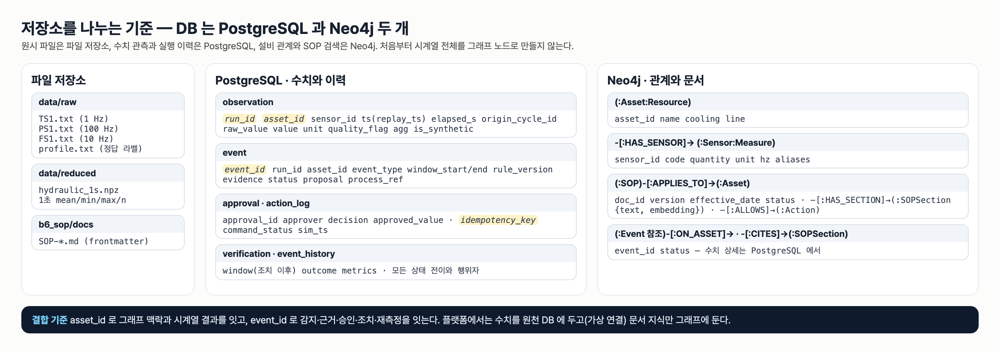
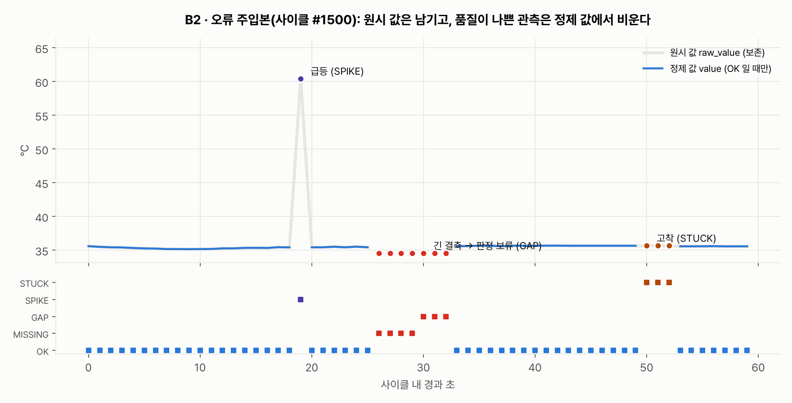

# 통합반 2회 · 품질 플래그와 시계열 DB

| 날짜·시간 | 2027-01-25 (월) 09:00~13:00 | 모듈 | M1 · 원 일정 9번 |
|---|---|---|---|
| 블록 | 구현 B3 / 확장 B2 | 산출물 | B1→B2→B3 저장과 조회 |
| 완료 확인 | 센서 오류를 곧바로 설비 고장으로 해석하지 않음 | | |


## 이번 회차에서 할 일

방학 뒤 첫 시간이다. 먼저 1회에 저장한 체크포인트로 환경을 되살린다. 그다음 1회에 맛보기로 본 **B2 품질 검사**를 넓혀, 일부러 망가뜨린 "오류 주입본"에서 결측·급등·고착을 눈으로 찾고 품질 기준값을 직접 채운다. 품질 플래그가 붙은 관측을 **B3 PostgreSQL** 에 적재하고, SQL 로 최근 60초를 꺼내 본다. 마지막으로 조회 구간을 바꿔 가며 "판정해도 되는 구간(VALID)"과 "판정을 보류할 구간(SENSOR_FAULT)"을 비교한다. 수업이 끝나면 B1→B2→B3 경로가 연결되어, 원시 값·정제 값·품질 플래그·원본 사이클 번호가 한 줄에 함께 저장되고 조회된다.

### 학습 목표
- 체크포인트를 풀고 DB 연결과 1회 실습 테스트로 환경이 **복구되었음을 확인한다**.
- 오류 주입본에서 결측·급등·고착 위치를 **찾아 적고**, 품질 기준(gap_hold_s·stuck_run·spike_delta) 빈칸을 채운다.
- 품질 플래그와 원본 사이클 번호를 포함한 최근 60초 조회 SQL 을 **완성하고 실행한다**.
- 정상 구간과 보류 구간의 조회 결과를 비교해, 센서 오류 구간에서 설비 조치를 **보류하는 이유를 설명한다**.

## 1. 시작 전 준비 (복습·환경 확인)

환경 복구는 활동 1 에서 단계별로 한다. 여기서는 1회의 핵심 세 가지만 떠올린다.

| 1회에 한 일 | 오늘 이어지는 곳 |
|---|---|
| 값 53.402 는 HYD-01 · TS1 · °C · `TS1.txt` 사이클 #100 30초째 | 오늘은 사이클 #1500 을 같은 레코드 모양으로 DB 에 넣는다 |
| `ts` 는 재생 시각, 원본 추적은 `origin_cycle_id`·`elapsed_s` | 오늘 SQL 에서 `origin_cycle_id` 를 꺼낸다 |
| FS1 이 켜지는 순간 SPIKE 가 찍혔지만 고장이 아니었다 | 오늘은 진짜로 망가뜨린 값과 비교한다 |

## 2. 핵심 개념

### 2.1 센서 오류와 설비 이상은 다르다

체온계를 떠올린다. 체온계가 42°C 를 한 번 보였다고 바로 응급실에 가지 않는다. 먼저 체온계가 제대로 꽂혀 있었는지, 한 번 더 재면 어떤지 확인한다. 공장도 같다. 센서 값이 이상해 보이면 **먼저 센서를 의심**하고, 센서가 믿을 만할 때만 설비 상태를 판단한다.

B2 는 이 "먼저 의심하기"를 코드로 한다(`hydops/b2_quality/checks.py`). 기준은 `hydops/config.py` 의 `QualityRules` 에 있다.

| 플래그 | 뜻 | 기준 (교육용 가정값) | 비유 |
|---|---|---|---|
| OK | 믿을 수 있는 값 | — | 정상 측정 |
| MISSING | 값이 없음(짧은 결측) | 연속 결측 4초까지 | 체온계를 잠깐 뗌 |
| GAP | 긴 결측 → **판정 보류** | 연속 결측이 `gap_hold_s=5` 초째부터 | 체온계를 오래 뗌 |
| SPIKE | 1초 사이 물리적으로 어려운 점프 | TS1 은 직전 유효값과 `spike_delta` 8°C 넘게 차이 (PS1 60 bar, FS1 6 L/min) | 뜨거운 물에 한 번 닿음 |
| STUCK | 같은 값이 계속 반복(고착) | 같은 값이 `stuck_run=8` 번째 반복될 때부터 | 체온계 화면이 멈춤 |
| OUT_OF_RANGE | 물리 범위 밖 | TS1 −10~120°C, PS1 0~250 bar, FS1 0~30 L/min | 체온계에 200°C |

검사기의 핵심 부분은 짧다.

```python
if raw is None:
    self._missing_run[key] += 1
    # 짧은 결측은 MISSING, 기준 이상 이어지면 GAP (판정 보류 신호)
    flag = GAP if self._missing_run[key] >= self.rules.gap_hold_s else MISSING
...
if self._same_run[key] >= self.rules.stuck_run:
    flag = STUCK
elif recent and abs(raw - recent[-1]) > self.rules.spike_delta.get(sid, float("inf")):
    # 1초 사이에 물리적으로 불가능한 점프 → 급등. 단, 3회 이상 연속이면 수준 변화로 받아들인다
    self._spike_run[key] += 1
    flag = SPIKE if self._spike_run[key] < 3 else OK
...
return {**row, "quality_flag": flag, "value": raw if flag == OK else None}
```

마지막 줄이 중요하다. **원시 값 `raw_value` 는 그대로 두고**, 품질이 OK 일 때만 정제 값 `value` 를 채운다. 긴 결측을 앞뒤 값으로 메워 정상처럼 보이게 하지 않는다.

> **주의** 급등을 "최근 5개의 중앙값"과 비교하던 초기 규칙은, 냉각이 크게 나빠져 온도가 빠르게 오를 때 모든 값을 SPIKE 로 막아 사건이 생기지 않았다. 그래서 지금은 **직전 유효값과의 1초 점프**를 보고, 3회 연속이면 수준 변화로 인정한다. 1회에 본 FS1 의 SPIKE 2개가 곧 OK 로 돌아간 것도 이 규칙 때문이다.

### 2.2 구간을 판정하는 `classify_window`

관측 하나하나에 붙은 플래그를 모아 **구간 전체**를 판정하는 함수가 `classify_window` 다.

```python
def classify_window(rows: list[dict], rules: QualityRules = QR) -> str:
    """구간이 '센서 오류'인지 판단한다. 센서 오류면 설비 조치를 보류한다."""
    q = window_quality(rows)
    if q["n"] == 0:
        return "NO_DATA"
    if q["longest_gap_s"] >= rules.gap_hold_s or q["flags"].get(STUCK, 0) > 0:
        return "SENSOR_FAULT"
    if q["valid_ratio"] < 0.7:
        return "SENSOR_FAULT"
    return "VALID"
```

5초 이상 이어진 결측, 고착 하나, 유효 비율 70% 미만 중 하나라도 있으면 `SENSOR_FAULT` 다. **SPIKE 한 번만으로는 SENSOR_FAULT 가 되지 않는다.** 교육용 SOP `SOP-SEN-001` §2 도 "단발 급등은 한 번이면 기록만 하고 발동하지 않는다"고 적고, §4 는 센서 오류일 때 "설비 부하 변경 같은 설비 조치는 보류한다. 허용 조치는 SENSOR_CHECK 한 가지"라고 적는다.

### 2.3 저장소를 나누는 기준



수치 관측과 실행 이력은 PostgreSQL, 설비 관계와 SOP 는 Neo4j(3회)에 둔다. 오늘 쓰는 표는 `observation` 하나다. 도서관에 비유하면 `observation` 은 "대출 기록 장부"다. 한 줄에 누가(설비·센서) 언제(재생 시각) 무엇을(값) 어떤 상태로(품질) 빌렸는지 적고, `run_id` 는 "어느 날의 장부인지"를 구분하는 표지다.

```
     Column      |           Type           | Nullable |  Default
-----------------+--------------------------+----------+----------
 run_id          | text                     | not null |
 asset_id        | text                     | not null |
 sensor_id       | text                     | not null |
 ts              | timestamp with time zone | not null |
 elapsed_s       | integer                  |          |
 origin_cycle_id | integer                  |          |
 raw_value       | double precision         |          |
 value           | double precision         |          |
 unit            | text                     | not null |
 quality_flag    | text                     | not null | 'OK'::text
 agg             | jsonb                    |          |
 is_synthetic    | boolean                  | not null | false
Indexes:
    "ix_obs_asset_sensor_ts" btree (asset_id, sensor_id, ts DESC)
    "ix_obs_run" btree (run_id)
```

(`docker exec hydops-postgres psql -U hydops -c "\d observation"` 실제 출력에서 id 열과 Collation 칸을 줄였다.) `raw_value` 와 `value` 는 비워 둘 수 있고(Nullable 빈칸), `quality_flag` 는 반드시 있어야 한다.

> **주의** 공유 DB 에는 관제 화면 시뮬레이터의 관측도 계속 쌓이고 있다. 실습 적재는 반드시 `run_id` 를 `LAB-` 로 시작하게 하고, 끝나면 **자기 run_id 의 행만** 지운다. 테이블 전체 삭제(TRUNCATE)나 스키마 초기화는 절대 하지 않는다.

## 3. 활동 1 — 환경 복구와 첫 시간 복습 · 50분

### 목표
DB 컨테이너·가상환경·1회 체크포인트를 되살리고, 1회 테스트가 다시 통과하는지 확인한다.

### 따라 하기
1. DB 컨테이너를 띄운다(강사 PC 또는 실습 PC, 강사 안내에 따른다). 방학 동안 멈춰 두었던 컨테이너가 다시 시작된다.

```bash
cd lecture/system
docker compose up -d
docker compose ps --format "table {{.Name}}\t{{.Image}}\t{{.Status}}"
```

```
NAME              IMAGE                STATUS
hydops-neo4j      neo4j:5              Up About an hour
hydops-postgres   postgres:16-alpine   Up About an hour
```

(가동 시간 칸은 방금 띄웠다면 `Up 10 seconds` 처럼 나온다.)

2. 파이썬에서 두 DB 에 모두 닿는지 확인한다.

```bash
PYTHONPATH=. .venv/bin/python -c "
from hydops.b3_tsdb import store
from hydops.b4_ontology import graph
with store.connect() as c:
    print('PostgreSQL', c.execute('SELECT 1 AS ok').fetchone())
print('Neo4j', graph.run('RETURN 1 AS ok'))
"
```

```
PostgreSQL {'ok': 1}
Neo4j [{'ok': 1}]
```

3. 팀 체크포인트를 푼다(1회에 만든 파일 이름을 쓴다).

```bash
cd lecture
tar xzf checkpoint_I01_team1.tgz
tar tzf checkpoint_I01_team1.tgz
```

4. 1회 테스트를 다시 돌린다.

```bash
cd lecture/system
PYTHONPATH=. .venv/bin/python -m pytest ../labs/integrated/S01 -q
```

```
....                                                                     [100%]
4 passed
```

5. 팀 메모 `saved/team_note.txt` 를 읽고, 1회 회고 질문 2번("FS1 SPIKE 를 처음에 무엇이라고 생각했나")에 대한 팀의 답을 서로 말한다.

### 확인 포인트
- 두 DB 모두 `ok: 1` 이 나온다.
- S01 테스트가 `4 passed` 다. 실패하면 노트북의 빈칸이 체크포인트에 저장되지 않은 것이므로 활동 3 전까지 셀 3-1·3-4 를 다시 채운다(정답을 외울 필요 없이 1회 교재 5절 표를 보고 채운다).

### 흔한 실수
- `docker compose down -v` 로 "깨끗이 다시 시작"하려 한다 → DB 볼륨이 지워져 강사가 적재한 그래프·SOP 까지 사라진다. 컨테이너 문제는 강사에게 알린다.
- `.venv` 가 아닌 시스템 파이썬으로 실행해 `ModuleNotFoundError: No module named 'hydops'` 가 난다 → `cd lecture/system` 후 `PYTHONPATH=. .venv/bin/python` 으로 실행한다.
- 체크포인트를 `lecture` 가 아닌 폴더에서 풀어 `labs/integrated/S01` 이 두 개가 된다 → 반드시 `lecture` 폴더에서 푼다.

## 4. 활동 2 — 오류 주입본의 결측·급등·고착 찾기 · 50분

### 목표
검사기를 돌리기 전에 원시 값에서 오류를 눈으로 찾고, 품질 기준 빈칸을 채워 검사기 결과와 맞춰 본다.

### 따라 하기
1. 제공 함수 `inject_sensor_errors` 는 사이클 #1500(냉각기 100%) TS1 에 급등 1건, 7초 결측, 10초 고착을 섞는다. 검사 전에 원시 값을 본다.

```bash
cd lecture/system
PYTHONPATH=. .venv/bin/python -c "
import sys; sys.path.insert(0, '../labs/integrated/S02')
import quality_lab as q
ts1 = sorted([r for r in q.make_injected_rows() if r['sensor_id'] == 'TS1'], key=lambda r: r['elapsed_s'])
print([(r['elapsed_s'], r['raw_value']) for r in ts1[17:21]])
print([(r['elapsed_s'], r['raw_value']) for r in ts1[25:34]])
print([(r['elapsed_s'], r['raw_value']) for r in ts1[42:54]])
"
```

```
[(17, 35.437), (18, 35.41), (19, 60.414), (20, 35.422)]
[(25, 35.426), (26, None), (27, None), (28, None), (29, None), (30, None), (31, None), (32, None), (33, 35.586)]
[(42, 35.668), (43, 35.652), (44, 35.652), (45, 35.652), (46, 35.652), (47, 35.652), (48, 35.652), (49, 35.652), (50, 35.652), (51, 35.652), (52, 35.652), (53, 35.57)]
```

2. 팀 활동지에 적는다: 급등은 몇 초? 결측은 몇 초부터 몇 초까지 몇 초 동안? 고착은 몇 초부터 몇 초까지 몇 번 반복?
3. `labs/integrated/S02/quality_lab.py` 를 열어 **[빈칸 1]** 을 채운다. 값은 `hydops/config.py` 의 `QualityRules` 에서 찾는다.

```python
RULES = QualityRules(
    gap_hold_s=____,  # 몇 초 이상 연속으로 값이 없으면 GAP(판정 보류)인가
    stuck_run=____,  # 같은 값이 몇 번째 반복될 때부터 STUCK(고착)인가
    spike_delta={"TS1": ____, "PS1": 60.0, "FS1": 6.0},  # 1초 사이 온도(TS1)가 몇 °C 넘게 뛰면 SPIKE 인가
)
```

4. 파일을 실행해 ① 줄만 먼저 본다(SQL 빈칸이 남아 있으면 ② 이후에서 오류가 나는 것이 정상이다).

```bash
PYTHONPATH=. .venv/bin/python ../labs/integrated/S02/quality_lab.py
```



### 확인 포인트
기준을 올바르게 채우면 ① 줄이 다음과 같다.

```
① TS1 플래그 개수: {'OK': 49, 'SPIKE': 1, 'MISSING': 4, 'GAP': 3, 'STUCK': 3}
   PS1: {'OK': 60}  FS1: {'OK': 58, 'SPIKE': 2}
```

손으로 찾은 것과 비교한다.

| 눈으로 찾은 오류 | 경과 초 | 검사기 플래그 | 왜 그렇게 나뉘나 |
|---|---|---|---|
| 급등 60.414°C | 19 | SPIKE 1개 | 직전 유효값 35.41 과 25°C 차이 > 8°C |
| 결측 7초 | 26~32 | MISSING 4개(26~29) + GAP 3개(30~32) | 5초째(30초)부터 GAP |
| 고착 10초 35.652 | 43~52 | STUCK 3개(50~52) | 같은 값 8번째(50초)부터 STUCK |

- 고착은 10초였지만 STUCK 은 3개뿐이다. 검사기는 값이 들어오는 순간마다 판단(스트리밍)하므로, "8번째로 같은 값"이 된 뒤에야 고착임을 안다. 앞의 7초는 OK 로 지나갔다. 이것은 **실시간 판정의 지연**이며 토론 거리다.
- 그림 F03 에서 원시 값(회색 굵은 선)은 급등·고착 구간에도 남아 있고, 정제 값(파란 선)은 그 자리가 비어 있다.
- PS1 은 모두 OK, FS1 의 SPIKE 2개는 1회에서 본 유량 켜짐(9·10초)이다. **TS1 만 망가뜨렸는데 다른 센서는 정상**이라는 사실 자체가 "설비가 아니라 센서 문제"라는 단서다(SOP-SEN-001 §3).

기준값을 바꾸면 결과가 어떻게 달라지는지 강사가 한 번 보여 준다(실습 파일의 `RULES` 는 시스템 기준 그대로 둔다).

```bash
PYTHONPATH=. .venv/bin/python -c "
from dataclasses import replace
from collections import Counter
from hydops.b1_data import uci
from hydops.b2_quality.checks import SensorQualityChecker, classify_window
from hydops.config import QR
from datetime import datetime, timezone
ds = uci.load_reduced()
for change in ({}, {'stuck_run': 3}, {'gap_hold_s': 8}, {'spike_delta': {'TS1': 30.0, 'PS1': 60.0, 'FS1': 6.0}}):
    rules = replace(QR, **change)
    rows = uci.inject_sensor_errors(uci.cycle_observations(ds, 1500, 'HYD-01', datetime(2026, 1, 25, 9, tzinfo=timezone.utc)))
    ts1 = [r for r in SensorQualityChecker(rules).check_many(rows) if r['sensor_id'] == 'TS1']
    print(change or '시스템 기준', dict(Counter(r['quality_flag'] for r in ts1)), classify_window(ts1, rules))
"
```

```
시스템 기준 {'OK': 49, 'SPIKE': 1, 'MISSING': 4, 'GAP': 3, 'STUCK': 3} SENSOR_FAULT
{'stuck_run': 3} {'OK': 44, 'SPIKE': 1, 'MISSING': 4, 'GAP': 3, 'STUCK': 8} SENSOR_FAULT
{'gap_hold_s': 8} {'OK': 49, 'SPIKE': 1, 'MISSING': 7, 'STUCK': 3} SENSOR_FAULT
{'spike_delta': {'TS1': 30.0, 'PS1': 60.0, 'FS1': 6.0}} {'OK': 50, 'MISSING': 4, 'GAP': 3, 'STUCK': 3} SENSOR_FAULT
```

- `stuck_run` 을 3 으로 낮추면 STUCK 이 8개로 늘어 고착을 더 빨리 잡지만, 실제로 온도가 잠시 같은 값을 보이는 정상 구간도 고착으로 오인할 위험이 커진다.
- `gap_hold_s` 를 8 로 올리면 7초 결측이 GAP 없이 MISSING 7개가 된다. 이번에는 고착이 있어서 구간은 여전히 SENSOR_FAULT 지만, 고착이 없었다면 7초 동안 값이 없는 구간을 판정해도 되는 구간으로 넘기게 된다.
- `spike_delta` 를 30°C 로 올리면 25°C 급등을 놓친다.

### 흔한 실수
- `spike_delta` 전체를 숫자 하나로 바꾼다(`spike_delta=8.0`) → 센서별 사전이라 `{"TS1": 8.0, ...}` 모양을 유지하고 TS1 칸만 채운다.
- `stuck_run` 을 "고착이 이어진 초"로 이해해 10 을 넣는다 → 기준값이다. 주입본의 길이(10초)와 기준(8번째)은 다르다.
- 빈칸을 남긴 채 실행해 `TypeError: '>=' not supported between instances of 'int' and 'NoneType'` 이 난다 → `____` 가 `None` 으로 들어가 비교가 안 되는 것이다. 빈칸을 채운다.
- GAP 3개만 보고 "결측이 3초였다"고 적는다 → MISSING 4개 + GAP 3개가 한 덩어리의 7초 결측이다.

## 5. 활동 3 — 제공 함수로 품질 검사와 DB 적재 · 50분

### 목표
품질 플래그가 붙은 관측을 PostgreSQL 에 적재하고, 최근 60초를 품질 플래그·원본 사이클 번호와 함께 조회한다.

### 따라 하기
1. `quality_lab.py` 의 제공 함수가 하는 일을 읽는다.

| 함수 | 하는 일 | 쓰는 시스템 코드 |
|---|---|---|
| `make_injected_rows()` | 사이클 #1500 레코드 + 오류 주입 | `uci.cycle_observations`, `uci.inject_sensor_errors` |
| `check_rows(rows)` | 품질 플래그 붙이기 | `SensorQualityChecker(RULES).check_many` |
| `new_run_id()` | `LAB-S02-` + 임의 8자리 | — |
| `load_to_db(run_id, checked)` | run 한 줄 + 관측 180줄 적재 | `store.create_run`, `store.insert_observations`(COPY) |
| `last_60s(run_id)` | **[빈칸 2]** SQL 실행 | `store.connect` |
| `cleanup(run_id)` | 내 run_id 의 observation → run 순서로 삭제 | — |

2. **[빈칸 2]** 를 채운다. 꺼낼 열 두 개와 시간 간격이 비어 있다.

```sql
SELECT sensor_id, ts, elapsed_s, ____, raw_value, value, unit, ____
FROM observation
WHERE run_id = %(run_id)s
  AND asset_id = %(asset_id)s
  AND sensor_id = %(sensor_id)s
  AND ts > (SELECT max(ts) FROM observation
            WHERE run_id = %(run_id)s AND asset_id = %(asset_id)s) - interval '____ seconds'
ORDER BY ts
```

   괄호 안의 `SELECT max(ts)` 는 "이 실행에서 이 설비의 마지막 관측 시각"이다. 시스템의 `store.recent_window` 도 같은 방식으로 **마지막 관측 시각을 기준**으로 최근 구간을 자른다. 벽시계 시각(now)을 기준으로 하면, 재생 시각이 과거인 실습 데이터는 아무것도 조회되지 않는다.
3. 다시 실행한다.

```bash
PYTHONPATH=. .venv/bin/python ../labs/integrated/S02/quality_lab.py
```

### 확인 포인트
[빈칸 3] 전까지 채웠을 때 ②③ 줄의 실제 출력이다(run_id 끝 8자리는 매번 다르다).

```
② 적재: LAB-S02-49274502 180 행
③ 최근 60초 TS1: 60 행 · 원본 사이클 [1500]
   19초  raw=60.414  value=None  SPIKE
   26초  raw=None  value=None  MISSING
   27초  raw=None  value=None  MISSING
   28초  raw=None  value=None  MISSING
   29초  raw=None  value=None  MISSING
   30초  raw=None  value=None  GAP
   31초  raw=None  value=None  GAP
   32초  raw=None  value=None  GAP
   50초  raw=35.652  value=None  STUCK
   51초  raw=35.652  value=None  STUCK
   52초  raw=35.652  value=None  STUCK
   구간 요약: {'n': 60, 'valid': 49, 'valid_ratio': 0.817, 'flags': {'OK': 49, 'SPIKE': 1, 'MISSING': 4, 'GAP': 3, 'STUCK': 3}, 'longest_gap_s': 7} → SENSOR_FAULT
```

- 180 행 = 센서 3개 × 60초. 조회는 TS1 만 골랐으므로 60 행이다.
- DB 에서 꺼낸 행에도 SPIKE·STUCK 의 `raw` 는 남아 있고 `value` 는 `None` 이다. 적재 과정에서 원시 값이 사라지지 않았다.
- 유효 비율은 0.817(70% 이상)이지만 최장 결측 7초와 고착 때문에 SENSOR_FAULT 다.

더 해 보기 — 같은 run 을 품질 플래그별로 세면 원시 값·정제 값 개수 차이가 한눈에 보인다.

```sql
SELECT quality_flag, count(*) AS n, count(raw_value) AS raw_n, count(value) AS value_n
FROM observation WHERE run_id = '<내 run_id>' AND sensor_id = 'TS1'
GROUP BY quality_flag ORDER BY quality_flag;
```

```
GAP      n=3   raw_n=0   value_n=0
MISSING  n=4   raw_n=0   value_n=0
OK       n=49  raw_n=49  value_n=49
SPIKE    n=1   raw_n=1   value_n=0
STUCK    n=3   raw_n=3   value_n=0
```

(파이썬에서 실행한 결과를 표로 옮겼다. `count(열)` 은 비어 있지 않은 칸만 센다.)

### 흔한 실수
- 열 이름을 `cycle_id`, `flag` 처럼 줄여 쓴다 → `column "flag" does not exist`. 표 정의(2.3절)의 이름 그대로 `origin_cycle_id`, `quality_flag` 를 쓴다.
- `interval 60 seconds` 처럼 따옴표를 뺀다 → `syntax error at or near "60"`. 숫자와 단위를 함께 따옴표 안에 넣은 `interval '60 seconds'` 모양을 지킨다. (참고로 `interval '60'` 은 오류 없이 60초로 해석되지만, 읽는 사람을 위해 단위를 쓴다.)
- `WHERE run_id = ...` 조건을 지운다 → 공유 DB 의 시뮬레이터 관측이 섞일 수 있다. 실습 조회에는 항상 내 run_id 조건을 둔다.
- 실행이 중간에 오류로 멈춰 ⑤ 정리가 안 됐을까 걱정한다 → `main()` 은 `try/finally` 로 오류가 나도 ⑤를 실행한다. 출력 끝의 `⑤ 정리: 남은 관측 0 행` 을 확인한다.

## 6. 활동 4 — 조회 조건을 바꿔 정상·보류 구간 비교 · 50분

### 목표
경과 초 범위를 바꿔 조회하면서, 판정해도 되는 구간과 보류해야 하는 구간을 구분한다. 센서 오류 구간을 설비 고장으로 해석하지 않는다.

### 따라 하기
1. 활동 3 의 ③ 출력에서 플래그 위치를 보고 **[빈칸 3]** 을 채운다. 두 구간 모두 5초 이상, 0~59 사이 정수로 고른다.

```python
NORMAL_RANGE = (____, ____)  # classify_window 결과가 VALID 인 구간
HOLD_RANGE = (____, ____)  # classify_window 결과가 SENSOR_FAULT(판정 보류)인 구간
```

2. 실행해 ④⑤ 줄을 본다.
3. 팀별로 구간을 두세 가지 더 바꿔 보고 결과를 표로 적는다. 특히 **급등(19초)만 포함한 구간**과 **고착(50~52초)을 포함한 구간**을 꼭 넣는다.
4. 관제 화면에서 같은 일이 어떻게 보이는지 본다. 강사가 시뮬레이터 HYD-01 에 "센서 결측"을 주입한 화면이다.


### 확인 포인트
정답 예시(`NORMAL_RANGE = (0, 17)`, `HOLD_RANGE = (26, 35)`)의 실제 출력이다.

```
④ 정상 구간 (0, 17): {'OK': 18} → VALID
④ 보류 구간 (26, 35): {'MISSING': 4, 'GAP': 3, 'OK': 3} → SENSOR_FAULT
⑤ 정리: 남은 관측 0 행
```

같은 적재본으로 다른 구간을 조회한 실제 결과:

| 구간(경과 초) | 들어 있는 오류 | 판정 | 읽는 법 |
|---|---|---|---|
| 0~25 | SPIKE 1 (19초) | VALID | 단발 급등은 기록만, 판정은 가능 |
| 26~29 | MISSING 4 | SENSOR_FAULT | 최장 결측 4초(<5)지만 유효 비율 0% (<70%) |
| 40~59 | STUCK 3 | SENSOR_FAULT | 고착이 하나라도 있으면 보류 |

- 관제 화면 스크린숏에서 사건은 **"센서 오류 · 센서 점검(SENSOR_CHECK)"** 으로 분류되고, "사람 승인: 승인 단계에 도달하지 않았습니다", "실행 기록 없음"이다. Golden Question 1 의 답도 `SENSOR_FAULT · 지속 이상 아니오`다. 센서가 믿을 수 없는 동안에는 온도가 높든 낮든 **설비 조치(부하 감소)를 제안하지 않는다.**
- 이것이 오늘의 완료 확인이다. "값이 비었다/같은 값이 반복된다 → 설비가 고장 났다"가 아니라 "센서를 먼저 점검하고, 복구된 뒤 다시 판정한다"(SOP-SEN-001 §6)로 말한다.

### 흔한 실수
- `HOLD_RANGE` 를 급등만 포함한 구간(예: 15~22)으로 고른다 → VALID 가 나와 테스트가 실패한다. SPIKE 한 번은 보류 사유가 아니다.
- `(35, 26)` 처럼 처음과 끝을 거꾸로 쓴다 → `BETWEEN 35 AND 26` 은 아무 행도 돌려주지 않는다(`NO_DATA`).
- 보류 구간을 보고 "냉각기 고장"이라고 적는다 → 사이클 #1500 은 냉각기 100%(정상) 사이클이다. 오류는 우리가 **센서 값에 주입**한 것이다.
- "SENSOR_FAULT 구간은 버리면 된다"고 생각한다 → 버리지 않고 **원시 값과 플래그를 그대로 저장**한다. 나중에 센서 점검 결과와 대조하는 근거가 된다.

## 7. 실습 과제

- 통합반: `labs/integrated/S02/` — `quality_lab.py`
  - [빈칸 1] `RULES`: `gap_hold_s`, `stuck_run`, `spike_delta["TS1"]` (3칸)
  - [빈칸 2] `LAST_60S_SQL`: 꺼낼 열 2개, 시간 간격 1개 (3칸)
  - [빈칸 3] `NORMAL_RANGE`, `HOLD_RANGE`: 경과 초 (처음, 끝) 2쌍 (4칸)
  - 검사 내용: 기준값이 `hydops.config.QR` 과 같은지, 오류 주입본 플래그가 OK 49·SPIKE 1·MISSING 4·GAP 3·STUCK 3 인지, 최근 60초 조회가 60행이고 `quality_flag`·`origin_cycle_id` 를 포함하는지, 두 구간이 각각 VALID·SENSOR_FAULT 인지, 정리 후 내 행이 0 인지
  - DB 쓰기는 `LAB-S02-` run_id 로만 하고 테스트가 끝나면 그 행만 지운다.
- 확인 명령: `cd lecture/system && PYTHONPATH=. .venv/bin/python -m pytest ../labs/integrated/S02 -q`

```
.....                                                                    [100%]
5 passed
```

경험자 과제: `LAST_60S_SQL` 을 복사해 `sensor_id` 조건을 빼고 세 센서를 한꺼번에 조회한 뒤, 센서별로 `classify_window` 를 따로 돌려 "TS1 만 SENSOR_FAULT, PS1·FS1 은 VALID"를 확인한다(실습 파일의 원래 SQL 은 그대로 둔다).

## 8. 완료 확인 체크리스트

- [ ] 두 DB 연결 확인(`ok: 1`)과 S01 테스트 `4 passed` 로 환경 복구를 확인했다.
- [ ] 오류 주입본에서 급등(19초)·결측(26~32초)·고착(43~52초) 위치를 검사 전에 찾아 적었다.
- [ ] 고착 10초 중 STUCK 이 3개만 붙는 이유(8번째부터 판정)를 설명했다.
- [ ] 최근 60초 조회 결과에 `quality_flag` 와 `origin_cycle_id`(1500)가 함께 나왔다.
- [ ] 품질이 나쁜 관측의 `value` 는 비어 있고 `raw_value` 는 남아 있음을 DB 조회로 확인했다.
- [ ] VALID 구간 하나, SENSOR_FAULT 구간 하나를 직접 골라 조회했다.
- [ ] "센서 오류 구간에서는 설비 조치를 보류하고 센서 점검을 먼저 한다"를 SOP-SEN-001 을 근거로 말했다.
- [ ] `pytest ../labs/integrated/S02 -q` 가 `5 passed` 이고, 내 `LAB-S02-` 행이 남아 있지 않다.

## 9. 회고 (10분)

1. 체온계 비유로, 오늘 본 GAP·STUCK·SPIKE 를 각각 한 문장씩 설명해 보자.
2. `stuck_run` 을 낮추면 고착을 빨리 잡는다. 그 대가로 무엇을 잃을 수 있나?
3. 센서 오류 구간을 DB 에서 지우지 않고 플래그와 함께 남기는 이유는 무엇인가?

## 10. 실제 플랫폼 대응 (해당 회차만)

이번 회차는 해당하지 않는다. 오늘 적재한 `observation` 표는 7회에서 교육용 플랫폼(Lab Platform)의 Data Fabric 이 읽기 전용 계정으로 조회하는 대상이 된다.

## 강사 노트

### 시간 배분 (09:00~13:00)

| 시간 | 내용 |
|---|---|
| 09:00~09:50 | 활동 1 환경 복구(컨테이너·DB 연결·체크포인트·S01 테스트) |
| 09:50~10:40 | 활동 2 오류 찾기·[빈칸 1]·기준 변경 시연 |
| 10:40~11:10 | 휴식 30분 · 팀 역할 교대 |
| 11:10~12:00 | 활동 3 적재·[빈칸 2] |
| 12:00~12:50 | 활동 4 구간 비교·[빈칸 3]·관제 화면 센서 결측 시연 |
| 12:50~13:00 | 회고 10분 |

### 사전 준비
- `cd lecture/system && docker compose up -d` 후 1회 체크포인트 묶음을 팀별로 돌려준다.
- 스키마 확인만 한다: `store.init_schema()`(reset 없이)는 `CREATE TABLE IF NOT EXISTS` 라 여러 번 실행해도 기존 행을 지우지 않는다. `init_schema(reset=True)` 는 쓰지 않는다.
- 관제 화면 시연용: `scripts/servers.sh local 4`. 활동 4 에서 HYD-01 "센서 결측" 버튼을 누르면 20초 결측이 주입된다. 서버를 띄울 수 없으면 스크린숏 S02 로 대신한다.
- 수업 전 강사 PC 에서 정답 검증: `LAB_SOLUTION=1 PYTHONPATH=. .venv/bin/python -m pytest ../labs/integrated/S02 -q` → `5 passed`.

### 팀 역할 (데이터 / 관계·문서 / 에이전트·조치)

| 역할 | 전반(활동 1·2) | 후반(활동 3·4, 휴식 후 교대) |
|---|---|---|
| 데이터 담당 | 컨테이너·DB 연결 확인, 원시 값에서 오류 위치 찾기 | [빈칸 2] SQL, 적재·정리 확인 |
| 관계·문서 담당 | 체크포인트 풀기, `config.py` 에서 기준값 찾기 | SOP-SEN-001 §2·§4·§6 읽고 판정 근거 정리 |
| 에이전트·조치 담당 | S01 테스트, 기준 변경 시연 결과 기록 | [빈칸 3] 구간 고르기, 관제 화면 SENSOR_CHECK 사례 설명 |

초보자는 빈칸 완성, 경험자는 7절 경험자 과제(세 센서 동시 조회)를 맡긴다.

### 장애 대응
- 한 학생의 실행이 중간에 강제 종료되어 `LAB-S02-` 행이 남은 경우: 그 run_id 로만 지운다. `PYTHONPATH=. .venv/bin/python -c "import sys; sys.path.insert(0,'../labs/integrated/S02'); import quality_lab as q; print(q.cleanup('LAB-S02-xxxxxxxx'))"` → `0`.
- PostgreSQL 이 안 뜨는 경우: 활동 2(적재 없이 검사기만)는 계속할 수 있다. 활동 3·4 는 강사 PC 화면 공유로 출력을 함께 읽고, 복구 후 개인별로 테스트를 다시 돌린다.
- 체크포인트를 잃어버린 팀: S01 은 빈칸 15칸이라 10분 안에 다시 채울 수 있다. 1회 교재 5절을 보고 채운다.

## 용어

| 용어 | 뜻 |
|---|---|
| 오류 주입본 | 정상 사이클에 결측·급등·고착을 일부러 섞은 데이터(`uci.inject_sensor_errors`) |
| MISSING / GAP | 짧은 결측 / 5초째부터의 긴 결측(판정 보류 신호) |
| SPIKE | 직전 유효값과 1초 사이 기준을 넘는 점프. 3회 연속이면 수준 변화로 OK |
| STUCK | 같은 값이 8번째 반복될 때부터 붙는 고착 표시 |
| `gap_hold_s` · `stuck_run` · `spike_delta` | 품질 기준값(교육용 가정값 5초 · 8번 · TS1 8°C) |
| 스트리밍 판정 | 값이 들어오는 순간마다 판단하는 방식. 앞으로 올 값을 모르므로 지연이 생긴다 |
| `classify_window` | 구간을 VALID / SENSOR_FAULT / NO_DATA 로 판정하는 함수 |
| 유효 비율(`valid_ratio`) | 구간에서 OK 관측의 비율. 0.7 미만이면 SENSOR_FAULT |
| `run_id` | 실행(적재) 묶음 ID. 실습은 `LAB-` 로 시작 |
| COPY | PostgreSQL 에 여러 행을 한 번에 넣는 방식(`store.insert_observations`) |
| 최근 60초 | 마지막 관측 시각에서 60초 전까지. 벽시계 기준이 아님 |
| SENSOR_CHECK | 센서 오류일 때 SOP 가 허용하는 유일한 조치(센서 배선·커넥터 점검 요청) |
