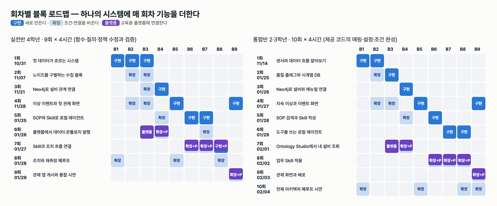
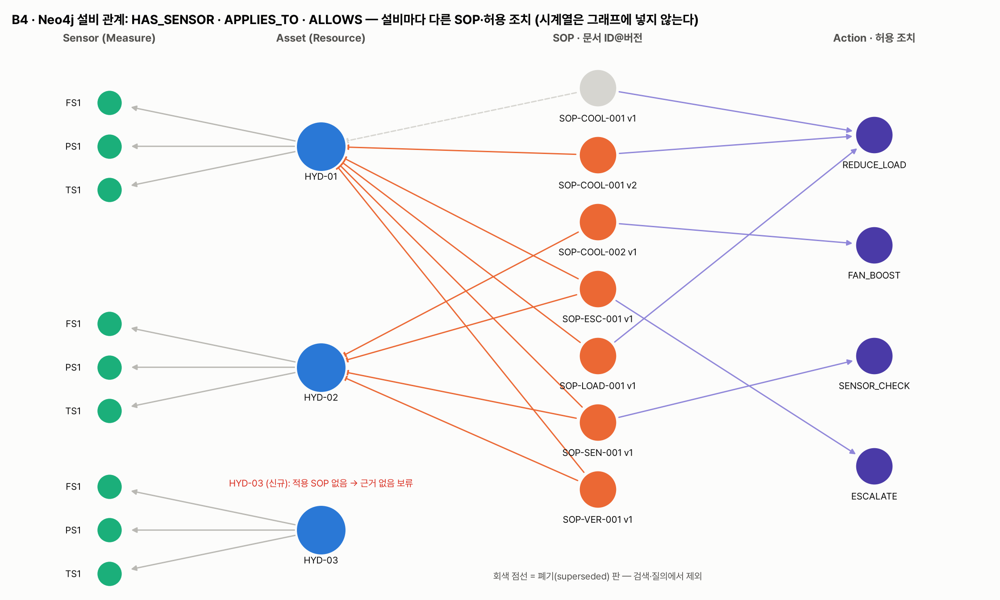
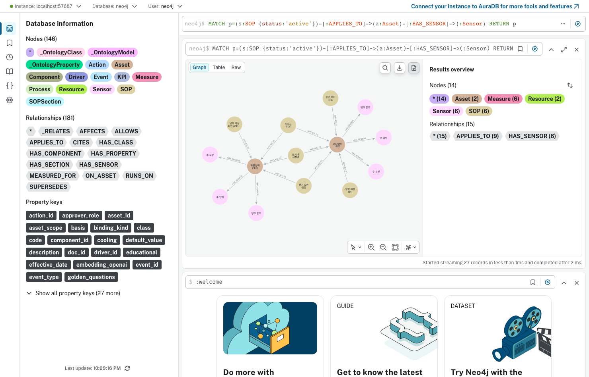
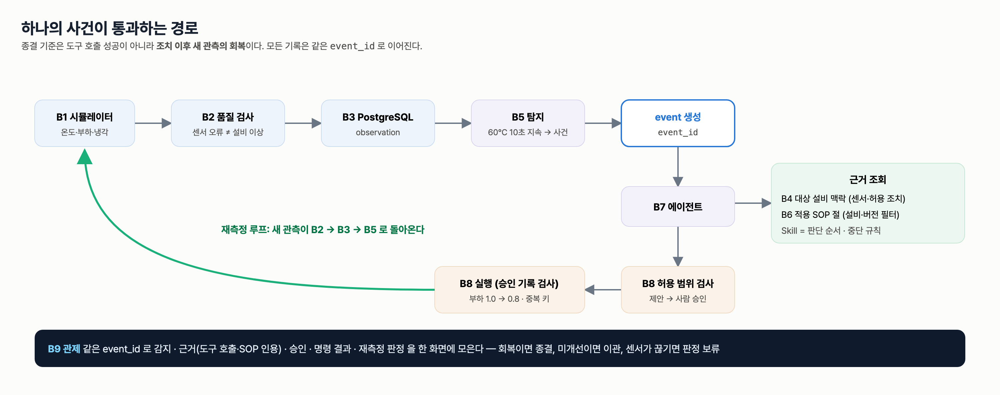

# 통합반 3회 · Neo4j로 설비와 매뉴얼 연결

| 날짜·시간 | 2027-01-26 (화) 09:00~13:00 | 모듈 | M1 · 원 일정 11번 |
|---|---|---|---|
| 블록 | 구현 B4 | 산출물 | B3+B4 관계가 있는 데이터 |
| 완료 확인 | 대상 설비의 센서와 SOP를 찾는 질의 실행 | | |



## 이번 회차에서 할 일

2회까지 만든 것은 "숫자 장부"다. PostgreSQL 에는 HYD-01 의 TS1 이 몇 °C 였는지는 있지만, HYD-01 에 어떤 센서가 달려 있는지, 냉각 이상이 나면 어떤 매뉴얼(SOP)을 따라야 하는지, 그 매뉴얼이 어떤 조치를 허용하는지는 없다. 오늘은 **B4 Neo4j 그래프**로 설비·센서·SOP·조치의 관계를 다룬다. 강사가 준비한 그래프 적재 문장의 ID 를 맞추고, 세 가지 Cypher 질의의 빈칸을 채워 "이 설비의 센서", "이 설비에 적용되는 현재 SOP 와 허용 조치", "이 사건이 인용한 SOP 절"을 찾는다. 마지막으로 그래프에서 찾은 센서에 PostgreSQL 의 최근 값을 붙여, 관계와 수치가 `asset_id` 로 이어지는 것을 확인한다.

### 학습 목표
- 세 가지 질문에 답하려면 어떤 노드와 관계가 필요한지 **짝지어 말한다**.
- 제공 MERGE 문장의 센서 ID·SOP 키 빈칸을 채우고, 새 노드가 생기지 않는 것(시드와 같은 값)을 **확인한다**.
- 설비→센서, 설비·사건 유형→현재 SOP·허용 조치, 사건→인용 절 Cypher 질의의 빈칸을 채워 **실행한다**.
- 그래프의 센서 목록과 PostgreSQL 최근 60초 값을 `asset_id`·센서 코드로 **결합한다**.

## 1. 시작 전 준비 (복습·환경 확인)

1. DB 두 개가 떠 있는지 확인한다(2회와 같은 명령).

```bash
cd lecture/system
docker compose ps --format "table {{.Name}}\t{{.Image}}\t{{.Status}}"
```

```
NAME              IMAGE                STATUS
hydops-neo4j      neo4j:5              Up About an hour
hydops-postgres   postgres:16-alpine   Up About an hour
```

2. 강사가 적재해 둔 그래프의 크기를 본다(읽기만 한다).

```bash
PYTHONPATH=. .venv/bin/python -c "from hydops.b4_ontology import graph; print(graph.graph_stats())"
```

```
{'nodes': {'Asset': 3, 'Resource': 3, 'Sensor': 9, 'Action': 4, 'Driver': 2, 'Process': 2, 'KPI': 2, 'SOP': 7, 'SOPSection': 42, 'Event': 6},
 'relationships': {'HAS_COMPONENT': 3, 'HAS_SENSOR': 9, 'AFFECTS': 6, 'RUNS_ON': 6, 'MEASURED_FOR': 6, 'APPLIES_TO': 10, 'ALLOWS': 6, 'HAS_SECTION': 42, 'SUPERSEDES': 1, 'ON_ASSET': 6, 'CITES': 15}}
```

(보기 좋게 줄을 나눴다.) Asset 3 · Sensor 9 · SOP 7 · SOPSection 42 · Action 4 와 HAS_SENSOR 9 · APPLIES_TO 10 · ALLOWS 6 · HAS_SECTION 42 · SUPERSEDES 1 은 강사 시드가 정한 값이라 모든 PC 에서 같다. `Event`, `ON_ASSET`, `CITES` 는 관제 화면에서 처리한 사건 수에 따라 달라진다.

3. 2회 복습: "센서 오류 구간에서는 설비 조치를 보류하고 SENSOR_CHECK 를 먼저 한다." 오늘은 이 규칙이 적힌 SOP-SEN-001 이 **어느 설비에 적용되는지**를 그래프에서 찾는다.

## 2. 핵심 개념

### 2.1 표와 그래프 — 무엇을 어디에 두나

PostgreSQL 이 "대출 기록 장부"라면 Neo4j 는 "도서관 안내도"다. 장부에는 매일 수만 줄이 쌓이지만, 안내도에는 "3층 → 과학 서가 → 물리학 책장"처럼 **무엇이 무엇과 이어져 있는지**만 그린다. 그래서 시스템은 시계열 관측 전체를 그래프 노드로 만들지 않고, 설비·센서·SOP·조치와 사건 참조만 그래프에 둔다(`hydops/b4_ontology/graph.py` 머리말). 수치는 PostgreSQL 에서 `asset_id` 로 찾는다.



| 노드 라벨 | 예 | 열쇠 속성 |
|---|---|---|
| `Asset` (설비) | HYD-01 유압설비 1호기 · 수랭식 냉각기 | `asset_id` |
| `Sensor` (센서) | HYD-01.TS1 탱크 온도 °C 1 Hz | `sensor_id` = 설비ID.센서코드 |
| `SOP` (매뉴얼 한 판) | SOP-COOL-001 2판 · active | `sop_key` = 문서ID@v판번호 |
| `SOPSection` (매뉴얼의 절) | SOP-COOL-001@v2#4 허용 조치 | `id` = sop_key#절번호 |
| `Action` (조치) | REDUCE_LOAD 0.6~1.0, 기본 0.8 | `action_id` |
| `Event` (사건 참조) | EVT-…-HYD-01-… | `event_id` |

| 관계 | 방향 | 뜻 |
|---|---|---|
| `HAS_SENSOR` | Asset → Sensor | 설비에 센서가 달려 있다 |
| `APPLIES_TO` | SOP → Asset | 매뉴얼이 이 설비에 적용된다 |
| `ALLOWS` | SOP → Action | 매뉴얼이 이 조치를 허용한다 |
| `HAS_SECTION` | SOP → SOPSection | 매뉴얼이 이 절을 가진다 |
| `SUPERSEDES` | SOP(새 판) → SOP(옛 판) | 새 판이 옛 판을 대체한다 |
| `ON_ASSET` | Event → Asset | 사건이 이 설비에서 났다 |
| `CITES` | Event → SOPSection | 사건 판단이 이 절을 근거로 인용했다 |

같은 센서 코드 TS1 이 세 설비에 하나씩 있으므로, 그래프의 센서 ID 는 1회 매핑 표에서 정한 **`HYD-01.TS1`** 모양이다. 반면 PostgreSQL `observation.sensor_id` 에는 `TS1` 만 들어 있고 설비는 `asset_id` 열이 구분한다. 활동 4 에서 이 차이를 직접 잇는다.

> **주의** 그래프에는 `(냉각 성능)-[:AFFECTS]->(온도 센서)` 같은 관계도 있다. 이 관계에는 `basis='document'`, `verified_causal=false` 가 붙어 있다. **관계를 그렸다고 실측 인과가 확인된 것은 아니다.** 근거 종류(문서·시뮬레이터 가정)를 함께 적어 두는 이유다.

### 2.2 세 가지 질문 (Golden Question)

시스템은 다음 세 질문에 답할 수 있어야 한다(`hydops/golden.py`).

1. HYD-01의 최근 온도는 유효한 센서 관측이며 지속 이상인가?
2. 이 설비에 적용되는 최신 냉각 이상 SOP와 허용 조치는 무엇인가?
3. 어떤 근거로 누가 승인했으며 조치 후 새 관측은 회복했는가?

오늘의 세 Cypher 질의는 이 질문의 **그래프 쪽 절반**을 맡는다. 질문 1 은 "HYD-01 의 온도 센서가 무엇인가"(그래프) + "그 센서의 최근 60초"(PostgreSQL), 질문 2 는 그래프만으로, 질문 3 은 "사건이 인용한 절"(그래프) + "승인·실행·재측정 기록"(PostgreSQL, 6회 이후)으로 답한다.

### 2.3 MERGE 와 매개변수

`MERGE` 는 "있으면 찾고, 없으면 만든다"이다. 출석부에 비유하면, 이름이 이미 있으면 체크만 하고 없으면 새 줄을 추가한다. 그래서 같은 MERGE 를 여러 번 실행해도 결과가 같다. 대신 **이름(ID)을 한 글자라도 틀리게 쓰면 새 줄이 생긴다.** 오늘 [빈칸 1] 이 바로 그 위험을 다룬다.

질의 안의 `$asset_id` 는 **매개변수**다. 질의 문장은 그대로 두고 값만 바꿔 넣는다. HYD-01 을 묻든 HYD-02 를 묻든 같은 질의를 쓰므로, 설비마다 질의를 복사할 필요가 없다.

> **주의** SOP 에는 판(version)이 있다. SOP-COOL-001 은 1판(`superseded`, 폐기)과 2판(`active`)이 모두 그래프에 남아 있다. 옛 판을 지우지 않는 것은 과거 사건이 어느 판을 근거로 했는지 추적하기 위해서다. 그래서 "현재 적용 SOP" 질의에는 **status 조건**이 반드시 필요하다.

## 3. 활동 1 — 세 가지 질문에 필요한 설비·센서·SOP 관계 맞추기 · 50분

### 목표
세 질문 각각에 어떤 노드와 관계를 따라가야 하는지 카드로 맞추고, Neo4j Browser 에서 실제 경로를 본다.

### 따라 하기
1. 팀별로 노드 카드(Asset·Sensor·SOP·SOPSection·Action·Event)와 화살표 카드(2.1 절의 관계 7개)를 받는다.
2. 질문마다 카드를 이어 경로를 만든다. 예: 질문 2 → `SOP -APPLIES_TO→ Asset`, `SOP -ALLOWS→ Action`.
3. 그림 F08 과 비교한다. HYD-03 에는 어떤 SOP 화살표도 들어오지 않는 것, SOP-COOL-001 v1 이 회색 점선인 것을 찾는다.
4. 브라우저에서 Neo4j Browser `http://localhost:57474` 에 접속한다(연결 `bolt://localhost:57687`, 사용자 `neo4j`, 비밀번호 `hydops-lecture`). 입력창에 다음 **읽기 질의**를 넣고 실행한다.

```cypher
MATCH p=(s:SOP {status:'active'})-[:APPLIES_TO]->(a:Asset)-[:HAS_SENSOR]->(:Sensor) RETURN p
```



### 확인 포인트
- Browser 아래쪽에 `Started streaming 27 records` 가 나온다. 27 = (HYD-01 에 적용되는 active SOP 5개 + HYD-02 의 4개) × 센서 3개. 오른쪽 요약은 Asset 2 · Sensor 6 · SOP 6 · APPLIES_TO 9 · HAS_SENSOR 6 이다.
- 결과에 HYD-03 이 없다. active SOP 가 하나도 적용되지 않기 때문이다.
- 팀 카드 정답 예:

| 질문 | 따라갈 경로 | 그래프 밖에서 필요한 것 |
|---|---|---|
| 1 최근 온도 | `Asset -HAS_SENSOR→ Sensor` (quantity=temperature) | PostgreSQL 최근 60초 값·품질 플래그 |
| 2 현재 SOP·허용 조치 | `SOP -APPLIES_TO→ Asset` + status·event_type 조건, `SOP -ALLOWS→ Action` | — |
| 3 근거·승인·회복 | `Event -ON_ASSET→ Asset`, `Event -CITES→ SOPSection ←HAS_SECTION- SOP` | 승인·실행·재측정 기록(PostgreSQL) |

### 흔한 실수
- 화살표 방향을 거꾸로 놓는다(`Asset -APPLIES_TO→ SOP`) → Cypher 에서 방향이 틀리면 결과가 비어 나온다. 주어가 SOP 다: "SOP 가 설비에 적용된다".
- Browser 에서 `MATCH (n) DETACH DELETE n` 같은 예제를 따라 친다 → 강사 시드가 모두 사라진다. 오늘 Browser 에는 **MATCH … RETURN 읽기 질의만** 넣는다.
- 질문 1 을 그래프만으로 답하려고 온도 값을 Sensor 노드 속성에서 찾는다 → 수치는 그래프에 없다.

## 4. 활동 2 — 제공 그래프 적재 문장의 ID 수정 · 50분

### 목표
강사 시드와 같은 적재 문장을 완성하고, 틀린 ID 가 새 노드를 만든다는 것을 안전하게 확인한다.

### 따라 하기
1. `labs/integrated/S03/graph_lab.py` 를 열어 **[빈칸 1]** 을 본다.

```cypher
MATCH (a:Asset {asset_id:$asset_id})
MERGE (s:Sensor {sensor_id: $asset_id + ____ + $code})
SET s:Measure, s.code=$code, s.quantity=$quantity, s.unit=$unit, s.hz=$hz, s.name=$name
MERGE (a)-[:HAS_SENSOR]->(s)
RETURN s.sensor_id AS merged
```

```python
SOP_KEY_COOL_V2 = "____"
```

   - 첫 빈칸: `HYD-01` 과 `TS1` 사이에 들어갈 **구분 문자**를 Cypher 문자열(작은따옴표)로 쓴다.
   - 둘째 빈칸: SOP-COOL-001 **2판**의 `sop_key`. 모양은 2.1 절 표에 있다.
   - 강사 원본은 `hydops/b4_ontology/graph.py` 의 `seed_graph()` 다. 같은 모양을 찾아 대조해도 된다.
2. 제공 함수 `merge_if_same_as_seed` 를 읽는다. MERGE 를 트랜잭션(되돌릴 수 있는 작업 묶음) 안에서 실행해 보고, **새로 만든 노드·관계가 0개이고 MATCH 로 찾은 대상이 있을 때만** 반영한다. 그렇지 않으면 되돌린다.

```python
result = tx.run(cypher, **params)
merged = [r["merged"] for r in result]
counters = result.consume().counters
created = {"merged": merged, "nodes_created": counters.nodes_created, "relationships_created": counters.relationships_created}
if merged and counters.nodes_created == 0 and counters.relationships_created == 0:
    tx.commit()
    return {**created, "committed": True}
tx.rollback()
return {**created, "committed": False}
```

3. 실행해 ① 부분을 본다(질의 빈칸이 남아 있으면 ② 이후는 비거나 오류가 난다).

```bash
cd lecture/system
PYTHONPATH=. .venv/bin/python ../labs/integrated/S03/graph_lab.py
```

### 확인 포인트
빈칸을 맞게 채운 실제 출력:

```
① 적재 문장 확인
   {'what': 'Sensor HYD-01/TS1', 'merged': ['HYD-01.TS1'], 'nodes_created': 0, 'relationships_created': 0, 'committed': True}
   {'what': 'Sensor HYD-01/PS1', 'merged': ['HYD-01.PS1'], 'nodes_created': 0, 'relationships_created': 0, 'committed': True}
   {'what': 'Sensor HYD-01/FS1', 'merged': ['HYD-01.FS1'], 'nodes_created': 0, 'relationships_created': 0, 'committed': True}
   {'what': 'SOP-COOL-001@v2 APPLIES_TO HYD-01', 'merged': ['SOP-COOL-001@v2 -> HYD-01'], 'nodes_created': 0, 'relationships_created': 0, 'committed': True}
```

- 만든 것 0개 = 강사 시드와 **완전히 같은 ID** 라는 뜻이다. MERGE 는 기존 노드를 찾기만 했다.

강사가 구분 문자를 `'-'` 로 잘못 넣은 경우를 시연한 실제 결과:

```
{'merged': ['HYD-01-TS1'], 'nodes_created': 1, 'relationships_created': 1, 'committed': False}
[{'n': 9}]
```

- `HYD-01-TS1` 이라는 **새 센서 노드 1개와 HAS_SENSOR 관계 1개**가 만들어질 뻔했고, 제공 함수가 되돌렸다. 되돌린 뒤 Sensor 수는 그대로 9다. 되돌리지 않았다면 HYD-01 에 온도 센서가 두 개(`HYD-01.TS1`, `HYD-01-TS1`)인 것처럼 보였을 것이다.

### 흔한 실수
- 빈칸을 그대로 두고 실행 → `CypherSyntaxError: Variable `____` not defined`. 파이썬의 `____ = None` 은 Cypher 문자열 안까지 들어가지 않는다.
- 구분 문자를 따옴표 없이 `.` 로 쓴다 → Cypher 문법 오류다. `'.'` 처럼 작은따옴표로 감싼다.
- SOP 키를 `SOP-COOL-001@2` 나 `SOP-COOL-001 v2` 로 쓴다 → MATCH 가 SOP 를 못 찾아 `merged: []`, `committed: False` 가 된다. 새 노드는 생기지 않지만 **아무것도 연결되지 않은 것**이므로 역시 실패다.
- "되돌렸으니 괜찮다"며 `graph.seed_graph()` 나 직접 MERGE 를 Browser 에서 다시 실행한다 → 공유 그래프다. ID 확인은 제공 함수로만 한다.

## 5. 활동 3 — 세 가지 Cypher 질의의 빈칸 채우기 · 50분

### 목표
세 질의의 관계 이름·상태 조건 빈칸을 채워, 설비별로 섞이지 않는 센서·SOP·인용 결과를 얻는다.

### 따라 하기
1. **[빈칸 2] 질문 1 — 설비의 센서**

```cypher
MATCH (a:Asset {asset_id:$asset_id})-[:____]->(s:Sensor)
RETURN s.sensor_id AS sensor_id, s.code AS code, s.quantity AS quantity, s.unit AS unit, s.hz AS hz
ORDER BY s.code
```

2. **[빈칸 3] 질문 2 — 현재 SOP 와 허용 조치**

```cypher
MATCH (sop:SOP)-[:____]->(a:Asset {asset_id:$asset_id})
WHERE sop.status = '____' AND sop.event_type = $event_type
OPTIONAL MATCH (sop)-[:____]->(act:Action)
RETURN sop.doc_id AS doc_id, sop.version AS version, sop.title AS title,
       collect(DISTINCT act.action_id) AS allowed_actions
ORDER BY doc_id
```

   `OPTIONAL MATCH` 는 "있으면 붙이고 없어도 SOP 줄은 남긴다"이다. 허용 조치가 없는 SOP-VER-001(재점검 절차)도 결과에 남기 위해서다.
3. **[빈칸 4] 질문 3 — 사건이 인용한 절**

```cypher
MATCH (e:Event {event_id:$event_id})-[:____]->(a:Asset)
OPTIONAL MATCH (e)-[:____]->(sec:SOPSection)<-[:____]-(sop:SOP)
RETURN e.event_id AS event_id, a.asset_id AS asset_id, e.event_type AS event_type, e.status AS status,
       collect(DISTINCT sop.doc_id + ' v' + toString(sop.version) + ' §' + sec.section_no) AS citations
```

   가운데 `(sec)<-[:____]-(sop)` 는 화살표가 왼쪽을 향한다. "SOP 가 절을 가진다"를 절 쪽에서 거꾸로 읽은 것이다.
4. 실행해 ②③④ 를 본다. 모든 질의는 제공 함수 `run_read` 로 **읽기 전용 세션**에서 돈다.

### 확인 포인트
실제 출력(④ 의 사건 ID 와 인용 절은 강사 환경에서 처리한 사건에 따라 다르다):

```
② 질문 1 · HYD-01 센서
   {'sensor_id': 'HYD-01.FS1', 'code': 'FS1', 'quantity': 'flow', 'unit': 'L/min', 'hz': 10}
   {'sensor_id': 'HYD-01.PS1', 'code': 'PS1', 'quantity': 'pressure', 'unit': 'bar', 'hz': 100}
   {'sensor_id': 'HYD-01.TS1', 'code': 'TS1', 'quantity': 'temperature', 'unit': '°C', 'hz': 1}
③ 질문 2 · 적용 SOP 와 허용 조치
   HYD-01 COOLING_ANOMALY: [('SOP-COOL-001', 2, ['REDUCE_LOAD']), ('SOP-ESC-001', 1, ['ESCALATE']), ('SOP-LOAD-001', 1, ['REDUCE_LOAD']), ('SOP-VER-001', 1, [])]
   HYD-02 COOLING_ANOMALY: [('SOP-COOL-002', 1, ['FAN_BOOST']), ('SOP-ESC-001', 1, ['ESCALATE']), ('SOP-VER-001', 1, [])]
   HYD-03 COOLING_ANOMALY: 없음
   HYD-01 SENSOR_FAULT: [('SOP-SEN-001', 1, ['SENSOR_CHECK'])]
④ 질문 3 · 사건 근거: EVT-20260914-131041-HYD-01-f81e
   [{'event_id': 'EVT-20260914-131041-HYD-01-f81e', 'asset_id': 'HYD-01', 'event_type': 'COOLING_ANOMALY', 'status': 'CLOSED', 'citations': ['SOP-LOAD-001 v1 §4', 'SOP-COOL-001 v2 §4']}]
```

- **설비별로 섞이지 않는다.** HYD-01 에는 수랭식 냉각기용 SOP-COOL-001(허용 REDUCE_LOAD), HYD-02 에는 공랭식 팬용 SOP-COOL-002(허용 FAN_BOOST)만 나온다. 같은 "냉각 이상"이라도 설비에 따라 허용 조치가 다르다.
- HYD-03 은 "없음"이다. 신규 설비라 SOP 가 등록되지 않았고, 뒤 회차에서 에이전트가 **근거 없음으로 보류**하는 사례가 된다(스크린숏 S06).
- SENSOR_FAULT 로 물으면 SOP-SEN-001 과 SENSOR_CHECK 만 나온다. 2회에서 배운 "센서 오류면 센서 점검"이 그래프에도 그대로 들어 있다.

status 조건을 지웠을 때의 실제 결과(강사 시연):

```
[('SOP-COOL-001', 2), ('SOP-COOL-001', 1), ('SOP-ESC-001', 1), ('SOP-LOAD-001', 1), ('SOP-VER-001', 1)]
```

- 폐기된 SOP-COOL-001 1판이 섞인다. 에이전트가 이것을 근거로 쓰면 **옛 매뉴얼로 조치**하게 된다.

### 흔한 실수
- 관계 이름 빈칸을 비운 채 실행해도 **오류가 나지 않고 빈 목록 `[]`** 이 나온다. `[:____]` 는 Cypher 에서 "____ 라는 이름의 관계"로 읽히기 때문이다. 결과가 비면 먼저 관계 이름과 방향을 의심한다.
- `sop.status = 'Active'` 처럼 대소문자를 바꾼다 → 그래프에 저장된 값은 소문자 `active` 다. 빈 결과가 나온다.
- 관계 이름을 `APPLY_TO`, `HAS_SENSORS` 처럼 비슷하게 쓴다 → 역시 빈 결과다. 2.1 절 표의 철자를 그대로 쓴다.
- ④ 가 `None` 으로 나온다 → 그래프에 인용이 연결된 사건이 아직 없는 환경이다. 강사가 관제 화면에서 사건을 하나 처리한 뒤 다시 실행한다(테스트는 이 경우 해당 항목을 건너뛴다).

## 6. 활동 4 — 관계 결과에 최근 센서 값을 연결 · 50분

### 목표
그래프에서 찾은 센서마다 PostgreSQL 의 최근 60초 값을 붙여, 관계와 수치를 한 표로 본다.

### 따라 하기
1. **[빈칸 5]** 를 채운다. 그래프 결과 `s` 에는 `sensor_id`('HYD-01.TS1')와 `code`('TS1')가 모두 있다. PostgreSQL 조회에 넘길 값은 어느 쪽인가?

```python
def sensors_with_recent_values(asset_id: str, run_id: str, seconds: int = 60) -> list[dict]:
    out = []
    for s in run_read(Q_ASSET_SENSORS, asset_id=asset_id):
        rows = store.recent_window(asset_id, seconds, sensor_id=s[____], run_id=run_id)
        ...
```

2. 실행한다. 제공 함수 `load_lab_cycle()` 이 UCI 사이클 #100 을 `LAB-S03-` run 으로 적재하고, 결합이 끝나면 `cleanup()` 이 그 행만 지운다.
3. 팀별로 결과 표의 한 줄을 골라 "그래프에서 온 칸"과 "PostgreSQL 에서 온 칸"을 색으로 나눠 표시한다.

### 확인 포인트
실제 출력(run_id 끝 8자리는 매번 다르다):

```
⑤ 관계 + 최근 값: LAB-S03-dca24ef8
   {'sensor_id': 'HYD-01.FS1', 'unit_graph': 'L/min', 'unit_db': 'L/min', 'n': 60, 'valid': 58, 'last_value': 7.884, 'origin_cycle_id': 100}
   {'sensor_id': 'HYD-01.PS1', 'unit_graph': 'bar', 'unit_db': 'bar', 'n': 60, 'valid': 60, 'last_value': 147.345, 'origin_cycle_id': 100}
   {'sensor_id': 'HYD-01.TS1', 'unit_graph': '°C', 'unit_db': '°C', 'n': 60, 'valid': 60, 'last_value': 53.395, 'origin_cycle_id': 100}
   정리 완료
```

| 칸 | 어디서 왔나 |
|---|---|
| `sensor_id`, `unit_graph` | Neo4j (`HAS_SENSOR` 로 찾은 Sensor 노드) |
| `unit_db`, `n`, `valid`, `last_value`, `origin_cycle_id` | PostgreSQL `observation` (내 run_id 의 최근 60초) |

- 세 센서 모두 `n: 60` — 1초 축약 60초가 모두 조회됐다.
- 그래프의 단위와 DB 의 단위가 같다. 두 저장소가 **같은 매핑 표**(1회)를 따르고 있다는 확인이다.
- TS1 의 마지막 값 53.395°C 는 사이클 #100 의 59초째 값이다(1회에 설명한 30초째 값 53.402 와 같은 사이클).
- FS1 의 `valid: 58` 은 1회에서 본 유량 켜짐 SPIKE 2개 때문이다. 센서 목록은 그래프가, 값의 믿음직함은 품질 플래그가 알려 준다.
- 이 결합이 질문 1("HYD-01 의 최근 온도는 유효한 센서 관측인가")의 뼈대다. 시스템의 `golden.q1` 도 그래프에서 `quantity == temperature` 인 센서를 찾은 뒤 그 코드로 시계열을 조회한다.



위 그림의 "근거 조회" 상자에서 B7 에이전트가 가장 먼저 부르는 것이 "B4 대상 설비 맥락(센서·허용 조치)"이다. 오늘 만든 질의 두 개(센서·적용 SOP)가 바로 그 맥락이며, 시스템에서는 `graph.asset_context` 가 같은 일을 한다(6회).

### 흔한 실수
- `s["sensor_id"]` 를 넘긴다 → PostgreSQL 에는 `HYD-01.TS1` 이라는 센서 값이 없어서 `n: 0` 이 된다. 오류가 나지 않으므로 결과를 꼭 읽는다.
- `run_id` 없이 `store.recent_window("HYD-01", 60, sensor_id="TS1")` 로 조회한다 → 관제 화면 시뮬레이터가 계속 쓰는 HYD-01 관측(더 최근 시각)이 나온다. 실습 결과와 운영 중인 데이터를 섞지 않도록 `run_id` 를 준다.
- "그래프에 HAS_SENSOR 가 있으니 센서가 정상이다"라고 말한다 → 관계는 "달려 있다"는 뜻일 뿐, 지금 값이 믿을 만한지는 품질 플래그로 판단한다.

## 7. 실습 과제

- 통합반: `labs/integrated/S03/` — `graph_lab.py`
  - [빈칸 1] `MERGE_SENSOR` 의 구분 문자, `SOP_KEY_COOL_V2` (2칸)
  - [빈칸 2] `Q_ASSET_SENSORS` 관계 이름 (1칸)
  - [빈칸 3] `Q_APPLICABLE_SOP` 관계 이름 2개, status 값 1개 (3칸)
  - [빈칸 4] `Q_EVENT_EVIDENCE` 관계 이름 3개 (3칸)
  - [빈칸 5] `sensors_with_recent_values` 의 조회 열쇠 (1칸)
  - 검사 내용: MERGE 가 시드와 같은 ID 라 만든 것이 0개인지, 세 설비의 센서 질의가 시스템 `graph.asset_sensors` 와 같은지, SOP 질의가 설비·사건 유형 6가지 조합에서 시스템 `graph.applicable_sops` 와 같고 폐기 판·다른 설비 SOP 가 섞이지 않는지, 사건 인용이 `graph.event_evidence` 와 같은지(인용된 사건이 없으면 건너뜀), 결합 결과가 센서마다 60행이고 TS1 마지막 값이 53.395 인지
  - 질의는 읽기 전용 세션으로만, MERGE 는 시드와 같은 값일 때만 반영한다. PostgreSQL 쓰기는 `LAB-S03-` run 으로만 하고 지운다.
- 확인 명령: `cd lecture/system && PYTHONPATH=. .venv/bin/python -m pytest ../labs/integrated/S03 -q`

```
.....                                                                    [100%]
5 passed
```

경험자 과제: `Q_APPLICABLE_SOP` 를 복사해 `OPTIONAL MATCH (sop)-[:HAS_SECTION]->(sec:SOPSection)` 를 더하고 `collect(DISTINCT sec.section_no)` 로 SOP 마다 절 번호 목록을 돌려받아 본다(실습 파일의 원래 질의는 그대로 둔다). SOP 문서는 모두 §1 적용 설비 ~ §6 재점검 기준의 여섯 절이다.

## 8. 완료 확인 체크리스트

- [ ] 세 질문 각각에 필요한 노드·관계 경로를 카드로 맞추고 설명했다.
- [ ] Neo4j Browser 에서 active SOP → Asset → Sensor 경로 질의를 실행해 27 records 를 확인했다.
- [ ] [빈칸 1] 적재 문장 확인에서 네 줄 모두 `nodes_created: 0`, `committed: True` 다.
- [ ] HYD-01 의 센서 세 개(`HYD-01.FS1`·`HYD-01.PS1`·`HYD-01.TS1`)를 질의로 찾았다.
- [ ] HYD-01 냉각 이상의 현재 SOP 에 SOP-COOL-001 **2판**만 있고 HYD-02 의 SOP-COOL-002 가 섞이지 않음을 확인했다.
- [ ] HYD-03 의 적용 SOP 가 없음을 확인하고 그 의미(근거 없음 보류)를 말했다.
- [ ] 그래프 센서 목록에 PostgreSQL 최근 60초 값을 붙인 표에서, 칸마다 출처를 구분했다.
- [ ] `pytest ../labs/integrated/S03 -q` 가 통과했다.

## 9. 회고 (10분)

1. PostgreSQL 에만 있었다면 질문 2 에 답하기 어려웠던 이유는 무엇인가?
2. MERGE 에서 ID 한 글자가 틀리면 어떤 일이 생기는가? 오늘 제공 함수는 그것을 어떻게 막았나?
3. 옛 판 SOP 를 그래프에서 지우지 않고 status 로 구분하는 이유는 무엇인가?

## 10. 실제 플랫폼 대응 (해당 회차만)

이번 회차는 해당하지 않는다. 오늘 쓴 Asset·Sensor·SOP·Action 노드와 관계는 7회에서 교육용 플랫폼(Lab Platform) Ontology Studio 의 클래스·관계 매핑(`templates/ontology_hydraulic.json`: 클래스 9, 관계 8)으로 다시 만난다. 실제 플랫폼 대응 기능은 Ontology Studio 클래스·관계 발행이다.

## 강사 노트

### 시간 배분 (09:00~13:00)

| 시간 | 내용 |
|---|---|
| 09:00~09:50 | 준비(10분) · 활동 1 관계 카드 맞추기 · Neo4j Browser 경로 |
| 09:50~10:40 | 활동 2 [빈칸 1] MERGE ID · 틀린 ID 되돌림 시연 |
| 10:40~11:10 | 휴식 30분 · 팀 역할 교대 |
| 11:10~12:00 | 활동 3 [빈칸 2~4] 세 질의 · status 조건 제거 시연 |
| 12:00~12:50 | 활동 4 [빈칸 5] 그래프+최근 값 결합 · 출처 색칠 |
| 12:50~13:00 | 회고 10분 |

### 사전 준비
- 그래프가 시드되어 있는지 `graph.graph_stats()` 로 확인한다(1절 출력과 시드 수가 같아야 한다). 비어 있을 때만 `PYTHONPATH=. .venv/bin/python -c "from hydops.b4_ontology import graph; print(graph.seed_graph())"` 를 실행한다. MERGE 라 여러 번 실행해도 같다. `graph.reset_graph()` 는 쓰지 않는다.
- 질문 3(④)을 위해 인용이 연결된 사건이 그래프에 하나 이상 있어야 한다. `scripts/servers.sh local 4` 후 관제 화면에서 HYD-01 "냉각 성능 저하"를 주입해 사건이 근거 확인(승인 대기) 단계까지 가면 `Event-CITES→SOPSection` 이 생긴다(`hydops/b8_action/service.py` 의 상태 전이가 인용을 그래프에 기록한다). 확인: `MATCH (e:Event)-[:CITES]->(:SOPSection) RETURN e.event_id LIMIT 1`.
- Neo4j Browser 접속 정보를 칠판에 적는다. 학생 계정도 같은 `neo4j` 계정이므로, 활동 1 시작 전에 "읽기 질의만" 규칙을 분명히 말한다.
- 정답 검증: `LAB_SOLUTION=1 PYTHONPATH=. .venv/bin/python -m pytest ../labs/integrated/S03 -q` → `5 passed`.

### 팀 역할 (데이터 / 관계·문서 / 에이전트·조치)

| 역할 | 전반(활동 1·2) | 후반(활동 3·4, 휴식 후 교대) |
|---|---|---|
| 데이터 담당 | 1절 그래프 크기 확인, [빈칸 1] 센서 ID | [빈칸 5] 결합, 칸별 출처 색칠 |
| 관계·문서 담당 | 관계 카드 맞추기, SOP 문서 frontmatter(`applies_to`·`allows`·`status`) 읽기 | [빈칸 3] status·관계 이름, 폐기 판 시연 해석 |
| 에이전트·조치 담당 | Neo4j Browser 경로 질의, 틀린 ID 시연 기록 | [빈칸 4] 사건 인용, HYD-03 보류 의미 설명 |

초보자는 빈칸 완성, 경험자는 7절 경험자 과제(SOP 절 목록)를 맡긴다.

### 장애 대응
- Neo4j 가 안 뜨는 경우: 활동 1 은 그림 F08·스크린숏 S07 과 SOP 문서 frontmatter 로 카드 맞추기를 계속한다. 활동 2~4 는 강사 PC 화면 공유로 출력을 함께 읽고, 복구 후 개인별로 테스트를 다시 돌린다.
- 학생이 Browser 에서 쓰기 질의를 실행해 이상한 노드가 생긴 경우: 그 노드만 ID 로 찾아 지운다(예: `MATCH (s:Sensor {sensor_id:'HYD-01-TS1'}) DETACH DELETE s`). 그래프 전체 초기화는 하지 않는다. 시드 수와 달라졌는지는 `graph.graph_stats()` 로 확인한다.
- ④ 테스트가 skip 으로 나오는 경우: 사전 준비의 사건 처리를 하지 않은 환경이다. 수업 진행에는 문제없으며, 사건 처리 후 다시 실행하면 통과로 바뀐다.

## 용어

| 용어 | 뜻 |
|---|---|
| 그래프 DB (Neo4j) | 노드와 관계로 "무엇이 무엇과 이어져 있는지"를 저장하는 DB |
| 노드 / 라벨 | 그래프의 점 / 점의 종류(Asset·Sensor·SOP…) |
| 관계 | 두 노드를 잇는 방향 있는 화살표(HAS_SENSOR·APPLIES_TO…) |
| Cypher | Neo4j 질의 언어. `MATCH` 로 찾고 `RETURN` 으로 돌려받는다 |
| `MERGE` | 있으면 찾고 없으면 만든다. ID 가 틀리면 새 노드가 생긴다 |
| `OPTIONAL MATCH` | 이어진 것이 없어도 앞의 결과 줄을 남기는 MATCH |
| 매개변수(`$asset_id`) | 질의 문장은 그대로 두고 값만 바꿔 넣는 자리 |
| `sop_key` | SOP 한 판의 열쇠. `문서ID@v판번호`(예: SOP-COOL-001@v2) |
| `status` active / superseded | 현재 유효한 판 / 새 판으로 대체된 폐기 판 |
| Golden Question | 시스템이 답할 수 있어야 하는 세 가지 확인 질문 |
| 읽기 전용 세션 | 쓰기 질의를 Neo4j 가 거부하는 연결 방식(`READ_ACCESS`) |
| 트랜잭션 되돌리기 | 실행해 본 변경을 반영하지 않고 취소하는 일(rollback) |
| 결합 열쇠 | 그래프와 시계열을 잇는 값. 여기서는 `asset_id` + 센서 코드 |
