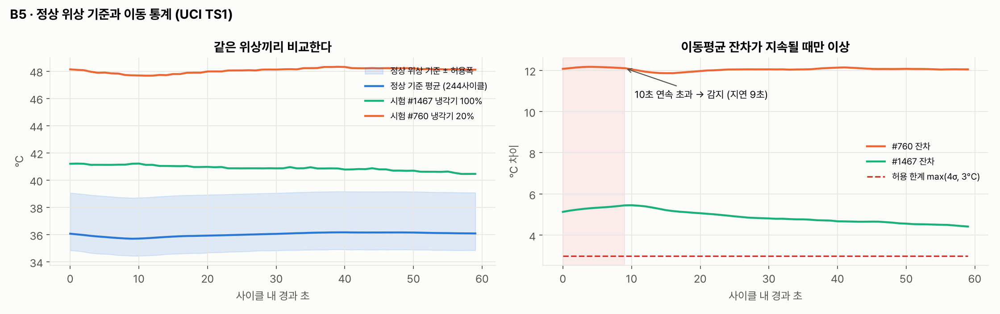
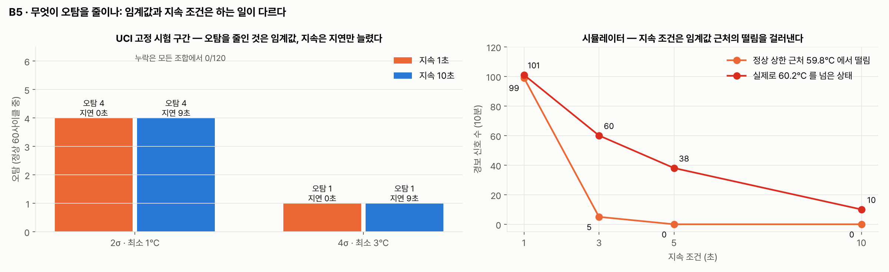
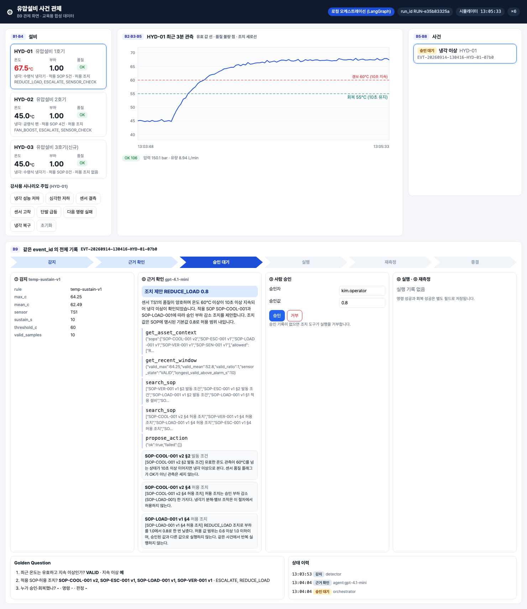

# 통합반 4회 · 지속 이상과 이벤트 화면

| 날짜·시간 | 2027-01-27 (수) 09:00~13:00 | 모듈 | M2 · 원 일정 13번 |
|---|---|---|---|
| 블록 | 구현 B5 · B9 / 확장 B2 · B3 | 산출물 | B5→B9 탐지 결과 표시 |
| 완료 확인 | 제품 불량과 설비 상태 라벨을 구분 | | |


## 이번 회차에서 할 일

지난 두 회차에서 센서 값에 품질 플래그를 붙여 PostgreSQL 에 저장했고(B2·B3), 설비·센서·SOP 관계를 그래프로 만들었다(B4). 오늘은 저장된 관측을 보고 **"지금 사건을 만들어야 하는가"를 판정하는 B5 감지**와, 그 사건을 사람에게 보여 주는 **B9 관제 화면**을 잇는다. 한 번 튀는 값과 계속 이어지는 이상을 어떻게 구분하는지, 그리고 센서가 고장 난 것·설비가 뜨거워진 것·제품 치수가 규격을 벗어난 것을 서로 다른 사건으로 기록하는 이유를 직접 확인한다. 회차가 끝나면 세 가지 사건 유형을 예시 데이터로 만들어 보고, 관제 화면의 사건 목록에서 각 사건이 어떤 이름으로 보이는지 설명할 수 있다.

### 학습 목표
- 정상 위상 기준(같은 경과 초끼리의 평균)과 이동평균 잔차가 무엇인지 그림으로 설명한다.
- 지속 조건·허용 한계를 바꿔 고정 시험 구간의 오탐(FP)·누락(FN)·감지 지연이 어떻게 달라지는지 표로 기록한다.
- 같은 시뮬레이터에서 센서 결측·고착(SENSOR_FAULT), 냉각 성능 저하(COOLING_ANOMALY), 합성 제품 검사값 이탈(PRODUCT_QUALITY)을 구분한다.
- UCI 냉각기 상태 라벨(설비 상태)과 제품 검사값(제품 품질)을 섞어 부르지 않는다.

## 1. 시작 전 준비 (복습·환경 확인)

모든 명령은 `lecture/system` 폴더에서 실행한다.

```bash
cd lecture/system
docker compose ps --format "table {{.Name}}\t{{.Status}}"
```

```
NAME              STATUS
hydops-neo4j      Up About an hour
hydops-postgres   Up About an hour
```

관제 서버가 떠 있는지 확인한다. 오늘은 **로컬 오케스트레이션** 모드를 쓴다(강사가 `scripts/servers.sh local 4` 로 띄운다).

```bash
curl -s http://localhost:8800/api/state | .venv/bin/python -c "import json,sys; d=json.load(sys.stdin); print(d['run_id'], d['mode'], d['speed'])"
```

2026-09-14 강사 환경에서 실행한 예 (값은 환경마다 다르다):

```
RUN-b5021e42b2 platform 6.0
```

두 번째 값이 `platform` 이면 사건 처리를 교육용 플랫폼이 맡는 모드다. 오늘 실습은 `local` 이어야 하므로 강사에게 알린다. 첫 번째 값 `run_id` 는 시뮬레이터 실행 한 번을 가리키는 번호다. 2회에서 배운 대로, 관측을 조회할 때 `run_id` 조건이 없으면 이전 실행의 관측이 섞일 수 있다.

## 2. 핵심 개념


그림의 윗줄이 오늘의 범위다. B1 시뮬레이터가 1초마다 값을 내면, B2 가 품질 플래그를 붙이고, B3 에 저장하고, **B5 가 조건을 만족할 때만 `event_id` 가 붙은 사건을 만든다.** 사건이 생긴 뒤의 근거 조회·승인·조치는 5·6회에서 다룬다.

### 2.1 두 가지 감지 방식

이 시스템에는 데이터 성격에 맞춘 감지 방식이 두 가지 있다. 둘 다 **규칙과 이동 통계**이고, 학습된 예측 모델이 아니다.

| 방식 | 코드 | 입력 | 판정 |
|---|---|---|---|
| 정상 위상 기준 | `hydops/b5_detect/detector.py` `detect_cycle_phase` | UCI 재생 데이터(60초 사이클) | 5초 이동평균 − 같은 경과 초의 정상 평균 > max(4σ, 3°C) 가 10초 연속 |
| 온도 지속 규칙 | `hydops/b5_detect/detector.py` `ThresholdDetector` | 시뮬레이터 스트림 | 품질 OK 인 온도 > 60°C 가 10초 연속 → `COOLING_ANOMALY`, GAP·STUCK → `SENSOR_FAULT` |

"위상"은 사이클이 시작한 뒤 몇 초째인가(`elapsed_s`)를 뜻한다. UCI 사이클은 60초 동안 운전 조건이 정해진 순서로 바뀌므로, 0초째 값은 0초째 정상 평균과, 30초째 값은 30초째 정상 평균과 비교해야 공정하다.

### 2.2 지속 조건과 중복 억제

```python
# lecture/system/hydops/b5_detect/detector.py (발췌)
if flag == OK and row["value"] is not None and row["value"] > self.th.alarm_temp_c:
    if st.above_run == 0:
        st.above_start = row["ts"]
        st.above_values = []
    st.above_run += 1
    st.above_values.append(row["value"])
    if st.above_run == self.th.alarm_sustain_s:
        ...  # COOLING_ANOMALY 신호 하나
elif flag == OK or flag == GAP:
    st.above_run = 0
# MISSING/SPIKE 단발은 지속 카운터를 유지 (세지도 초기화하지도 않음)
```

`above_run` 은 "기준을 넘은 유효 관측이 몇 초째 이어지는가"를 세는 카운터다. 정확히 `alarm_sustain_s`(10)에 도달한 순간에만 신호를 하나 낸다. 그 뒤로 계속 뜨거워도 신호가 반복되지 않고, 저장소의 `store.create_event` 는 **같은 설비·같은 유형의 열린 사건이 있으면 새 사건을 만들지 않는다**(`sql/01_schema.sql` 의 `ux_event_open` 인덱스). 이것이 이벤트 중복 억제다.

> **주의** 규칙 기반 감지를 "zero-shot 모델"이라고 부르지 않는다. 사전학습 예측 모델(Chronos-Bolt)은 5회에 짧게 비교만 한다. 사건을 만드는 필수 경로는 규칙과 이동 통계다.

### 2.3 세 가지 사건 유형

| 사건 유형 (`event.event_type`) | 어디서 오나 | 의미 | 흔한 끝 상태 |
|---|---|---|---|
| `SENSOR_FAULT` | B2 품질 플래그 GAP(결측 5초 이상)·STUCK(같은 값 8번째부터) | **측정**이 의심스럽다. 설비 조치를 보류한다 | `SENSOR_CHECK` |
| `COOLING_ANOMALY` | 품질 OK 인 온도가 기준을 넘은 채 지속 | **설비 상태**가 의심스럽다 | 승인·조치 흐름 (6회) |
| `PRODUCT_QUALITY` | 합성 로트 검사값(보어 직경)이 규격 49.98~50.02 mm 밖 | **제품**이 의심스럽다. 로트 보류 제안 | `HOLD_NO_EVIDENCE` |

> **주의** UCI 데이터의 `profile.cooler_pct`(냉각기 100%·20%·3%)는 **설비 상태 라벨**이다. 이 값을 "제품 불량"이라고 부르지 않는다. 제품 검사값은 `hydops/b1_data/inspection.py` 가 만든 **합성 데이터**이며 실제 제조 품질 데이터가 아니다.

## 3. 활동 1 — 이동 통계 그래프와 정상 위상 비교 · 50분

### 목표
정상 사이클 244개로 만든 위상 기준과, 시험 사이클 두 개(냉각기 100%·20%)의 잔차를 그림과 숫자로 비교한다.

### 따라 하기
1. 그림 F04 를 함께 읽는다.

   

   - 왼쪽: 파란 띠가 정상 위상 기준 ± 허용폭이다. 초록 선(#1467, 냉각기 100%)도 띠 위에 있고, 주황 선(#760, 냉각기 20%)은 훨씬 위에 있다.
   - 오른쪽: 잔차(이동평균 − 기준 평균)가 빨간 점선(허용 한계 max(4σ, 3°C))을 10초 연속 넘은 시점이 감지 시점이다.
2. 같은 숫자를 코드로 확인한다. `fixed_split()` 은 시드 2026 으로 기준 구간과 시험 구간을 **항상 같게** 나눈다.

```bash
PYTHONPATH=. .venv/bin/python - <<'EOF'
from hydops.b5_detect import evaluate
from hydops.b5_detect.detector import PhaseBaseline, detect_cycle_phase

ds, base, test = evaluate.fixed_split()
temps = ds.sensors["TS1"]["mean"]
bl = PhaseBaseline.fit(temps, base)
print("기준", len(base), "시험", len(test))
for cid in (1467, 760):
    r = detect_cycle_phase(temps[cid], bl)
    print(cid, "cooler", int(ds.profile.loc[cid, "cooler_pct"]),
          "이상", r["is_anomaly"], "첫 경보", r["first_alarm_s"], "최대 잔차", round(r["max_residual"], 2))
EOF
```

3. 팀별로 표에 옮겨 적는다: 사이클 번호, 냉각기 상태(설비 상태 라벨), 이상 판정, 첫 경보 초, 최대 잔차.

### 확인 포인트

```
기준 244 시험 180
1467 cooler 100 이상 True 첫 경보 9 최대 잔차 5.46
760 cooler 20 이상 True 첫 경보 9 최대 잔차 12.17
```

- #760(냉각기 20%)은 잔차 12.17°C 로 분명한 이상이다.
- #1467 은 냉각기 100% 인데도 이상으로 판정됐다. 이 사이클은 평가 결과표에서 `stable: False`(시스템이 아직 안정 상태에 이르지 않은 사이클)이다. 고정 시험 구간 180개 중 **유일한 오탐**이 바로 이 사이클이다.
- 첫 경보가 9초째인 것은 0초째부터 초과가 이어졌을 때 10번째 값(인덱스 9)에서 지속 조건을 채우기 때문이다.

### 흔한 실수
- 사이클 전체 평균 하나와 비교한다 → 위상마다 온도가 달라 정상 사이클도 경계에 걸린다. 같은 `elapsed_s` 끼리 비교한다.
- `cooler_pct` 를 감지 입력에 넣는다 → 정답 라벨은 **평가에만** 쓴다. 감지 함수는 온도 배열과 기준만 받는다.

## 4. 활동 2 — 지속 조건을 바꿔 오탐 관찰 · 50분

### 목표
지속 시간(`sustain_s`)과 허용 한계(`k_sigma`, `min_delta_c`)를 **하나씩** 바꿔, 무엇이 오탐을 늘리고 무엇이 지연을 늘리는지 구분한다.

### 따라 하기
1. UCI 고정 시험 구간에서 다섯 가지 설정을 평가한다.

```bash
PYTHONPATH=. .venv/bin/python - <<'EOF'
from hydops.b5_detect import evaluate

for p in ({}, {"sustain_s": 1, "smooth_s": 1}, {"sustain_s": 30},
          {"k_sigma": 2.0, "min_delta_c": 1.0, "sustain_s": 10, "smooth_s": 5},
          {"k_sigma": 2.0, "min_delta_c": 1.0, "sustain_s": 1, "smooth_s": 1}):
    r = evaluate.evaluate(**p)
    print(r["params"], "TP", r["tp"], "FP", r["fp"], "FN", r["fn"], "TN", r["tn"], "지연", r["mean_delay_s"])
EOF
```

2. 시뮬레이터 스트림에서도 지속 시간을 1·10·30초로 바꿔 본다. 비교를 위해 **품질 검사 없이 원시 값만 볼 때**의 경보 시점도 함께 센다.

```bash
PYTHONPATH=. .venv/bin/python - <<'EOF'
from hydops.b1_data.simulator import HydraulicSimulator
from hydops.b2_quality.checks import SensorQualityChecker
from hydops.b5_detect.detector import ThresholdDetector
from hydops.config import Thresholds

def run(inject, sustain):
    sim, chk = HydraulicSimulator("HYD-01", seed=42), SensorQualityChecker()
    det = ThresholdDetector(Thresholds(alarm_temp_c=60.0, alarm_sustain_s=sustain))
    out, raw_run, raw_alarm = [], 0, []
    for s in range(1, 151):
        if s == 31:
            if inject == "cooling":
                sim.inject_cooling_degradation(0.4)
            else:
                sim.inject_sensor_fault(inject, 20)
        for r in chk.check_many(sim.step()):
            if r["sensor_id"] == "TS1":   # 품질 검사 없이 원시 값만 본다면?
                raw_run = raw_run + 1 if (r["raw_value"] or 0) > 60 else 0
                if raw_run == sustain:
                    raw_alarm.append(s)
            out += [(s, g.event_type) for g in det.feed(r)]
    return out, raw_alarm

for inject in ("spike", "dropout", "cooling"):
    for sustain in (1, 10, 30):
        ev, raw = run(inject, sustain)
        print(f"{inject:8s} 지속 {sustain:2d}초 → 사건 {ev}  (원시 값만 볼 때 경보 {raw})")
EOF
```

### 확인 포인트

UCI 고정 시험 구간(정상 60 · 이상 120 사이클):

| 설정 | TP | FP | FN | 평균 지연 |
|---|---|---|---|---|
| 5초 평활·4σ·3°C·지속 10초 (기본) | 120 | 1 | 0 | 9.0초 |
| 4σ·3°C 그대로, 평활 1초·지속 1초 | 120 | 1 | 0 | 0.0초 |
| 4σ·3°C 그대로, 지속 30초 | 120 | 1 | 0 | 29.0초 |
| 2σ·1°C, 5초 평활·지속 10초 | 120 | 4 | 0 | 9.0초 |
| 2σ·1°C, 평활 1초·지속 1초 (지속 없음) | 120 | 4 | 0 | 0.0초 |



- 그림 F05 는 첫 줄과 마지막 줄을 비교한 것이다(오탐 1건 vs 4건, 지연 9.0초 vs 0.0초).
- 표를 한 줄씩 보면, **이 UCI 시험 구간에서는 오탐 수를 바꾼 것이 허용 한계(4σ·3°C → 2σ·1°C)** 이고, 지속 시간은 주로 **지연**을 바꿨다. UCI 한 사이클 안에서는 냉각기 상태가 바뀌지 않아 이상 사이클이 처음부터 끝까지 높기 때문이다.

시뮬레이터 스트림:

```
spike    지속  1초 → 사건 []  (원시 값만 볼 때 경보 [37, 44])
spike    지속 10초 → 사건 []  (원시 값만 볼 때 경보 [])
spike    지속 30초 → 사건 []  (원시 값만 볼 때 경보 [])
dropout  지속  1초 → 사건 [(35, 'SENSOR_FAULT')]  (원시 값만 볼 때 경보 [])
dropout  지속 10초 → 사건 [(35, 'SENSOR_FAULT')]  (원시 값만 볼 때 경보 [])
dropout  지속 30초 → 사건 [(35, 'SENSOR_FAULT')]  (원시 값만 볼 때 경보 [])
cooling  지속  1초 → 사건 [(43, 'COOLING_ANOMALY')]  (원시 값만 볼 때 경보 [43])
cooling  지속 10초 → 사건 [(52, 'COOLING_ANOMALY')]  (원시 값만 볼 때 경보 [52])
cooling  지속 30초 → 사건 [(72, 'COOLING_ANOMALY')]  (원시 값만 볼 때 경보 [72])
```

- 단발 급등(+30°C)은 원시 값만 보고 지속 1초로 판정하면 37초·44초에 **가짜 경보 두 번**이 난다. 실제 감지기는 급등 값에 SPIKE 플래그가 붙어 세지 않고, 지속 10초라면 원시 값 기준으로도 경보가 나지 않는다. 품질 검사와 지속 조건이 **두 겹**으로 막는다.
- 결측 주입은 지속 설정과 상관없이 5초째(t=35) `SENSOR_FAULT` 하나다. 센서 오류 경로는 온도 지속 조건과 따로 움직인다.
- 냉각 저하는 지속 시간이 길수록 늦게 알린다(43 → 52 → 72초).

### 흔한 실수
- 여러 값을 한꺼번에 바꾼다 → 무엇이 오탐을 줄였는지 알 수 없다. 한 번에 하나만 바꾼다.
- 결과가 좋아 보이는 설정을 찾은 뒤 시험 구간을 다시 뽑는다 → 시험 구간은 시드 2026 으로 **고정**한다. 설정을 고를 때 시험 구간을 보면 평가가 부풀려진다.

## 5. 활동 3 — 센서 오류·설비 이상·합성 제품 품질 이벤트 구분 · 50분

### 목표
최근 60초 요약(`recent_summary`)과 로트 검사값으로 사건 유형을 가려내는 규칙을 빈칸 채우기로 완성한다(실습 S04 `event_types.py`).

### 따라 하기
1. 시뮬레이터 요약에서 센서 상태와 지속 이상 여부를 읽는다. `recent_summary` 는 5·6회에서 에이전트의 `get_recent_window` 도구가 그대로 쓰는 요약이다. 실습 S04 의 점검 코드가 아래 다섯 상황을 만들어 비교한다.

| 상황 (시드 42, t=31 주입) | valid_ratio | 플래그 | longest_gap_s | 60°C 초과 연속 | sensor_state | 판정 |
|---|---|---|---|---|---|---|
| 정상 (t=31~90) | 1.0 | OK 60 | 0 | 0 | VALID | 정상 |
| 단발 급등 20초 (t=31~90) | 0.967 | OK 58 · SPIKE 2 | 0 | 0 | VALID | 정상 |
| 결측 20초 (t=1~60) | 0.667 | OK 40 · MISSING 4 · GAP 16 | 20 | 0 | SENSOR_FAULT | 센서 오류 |
| 고착 15초 (t=1~50) | 0.84 | OK 42 · STUCK 8 | 0 | 0 | SENSOR_FAULT | 센서 오류 |
| 냉각 0.4 (t=31~90) | 1.0 | OK 60 | 0 | 48 | VALID | 냉각 이상 |

> 주의 — 시스템의 `sensor_state` 는 60초 전체가 아니라 **최근 15초**로 현재 센서 상태를 정한다. 같은 고착 상황이라도 창을 t=1~60 으로 잡으면(고착이 끝나고 15초가 지남) `sensor_state` 는 `VALID`, `quality_issue_earlier_in_window` 는 `true` 가 된다. 이미 끝난 센서 문제가 그 뒤에 생긴 실제 냉각 이상을 막지 않게 하려는 규칙이다 — 영상 리허설에서 센서 결측 직후 냉각 이상을 넣었더니 에이전트가 센서 오류로 판단해 보류한 일이 있어 추가했다. 실습의 분류 함수는 60초 창 전체를 보는 단순한 규칙이므로, 고착이 최근 15초 안에 있는 t=1~50 창으로 비교한다.

2. 판정 순서를 정한다. **센서 오류를 먼저** 보고, 센서가 정상일 때만 온도 지속 여부를 본다.

```python
# lecture/labs/integrated/S04/event_types.py (빈칸 부분)
if q["longest_gap_s"] >= ____ or q["flags"].get("____", 0) > 0 or q["valid_ratio"] < ____:
    return ____
if ts1["longest_valid_above_alarm_s"] >= th.____:
    return ____
```

3. 합성 로트 검사값을 확인한다. `synth_lots` 는 4번째 로트 다음부터 치수가 조금씩 커지도록 만든다.

```bash
PYTHONPATH=. .venv/bin/python - <<'EOF'
from datetime import datetime, timezone
from hydops.b1_data.inspection import synth_lots

rows = synth_lots("HYD-01", datetime(2027, 1, 27, 9, tzinfo=timezone.utc))
lots = {}
for r in rows:
    lots.setdefault(r["lot_id"], []).append(r)
for lot, rs in lots.items():
    out = [r for r in rs if not (r["lsl"] <= r["value"] <= r["usl"])]
    print(lot, "최대", max(r["value"] for r in rs), "규격 이탈", len(out), "/", len(rs))
EOF
```

4. 라벨 구분표 `LABEL_KIND` 를 채운다: `profile.cooler_pct` → `EQUIPMENT_STATE`, `inspection.bore_diameter` → `PRODUCT_QUALITY`, `observation.quality_flag` → `SENSOR_QUALITY`.

### 확인 포인트

```
LOT-0127-01 최대 50.0082 규격 이탈 0 / 5
LOT-0127-02 최대 50.0133 규격 이탈 0 / 5
LOT-0127-03 최대 50.0009 규격 이탈 0 / 5
LOT-0127-04 최대 50.0038 규격 이탈 0 / 5
LOT-0127-05 최대 50.0182 규격 이탈 0 / 5
LOT-0127-06 최대 50.0317 규격 이탈 5 / 5
```

- 6번째 로트만 규격 상한 50.02 mm 를 넘는다. 5번째 로트(최대 50.0182)는 커지는 중이지만 규격 안이라 사건이 아니다.
- 제공 함수 `hydops/b5_detect/product.py` 의 `check_lots` 는 이런 로트를 `PRODUCT_QUALITY` 사건으로 저장하고 곧바로 `HOLD_NO_EVIDENCE`(로트 보류 제안 — 품질 담당 확인)로 둔다. 2026-09-14 강사 환경의 실제 기록은 다음과 같다(`GET /api/events/{event_id}` 발췌).

```json
{"event_type": "PRODUCT_QUALITY", "rule_version": "lot-spec-v1",
 "evidence": {"lot_id": "LOT-0914-06", "measure": "bore_diameter", "max": 50.0317, "usl": 50.02, "lsl": 49.98,
              "out_of_spec": 5, "samples": 5, "suggestion": "LOT_HOLD 제안 (합성 검사값, 설비 이상과 별도)", "is_synthetic": true},
 "status": "HOLD_NO_EVIDENCE", "status_reason": "로트 보류 제안 — 품질 담당 확인"}
```

### 흔한 실수
- 온도 조건을 먼저 검사한다 → 결측이 긴 구간에서 몇 개 남은 높은 값만으로 냉각 이상이 날 수 있다. 센서 오류 판정이 먼저다.
- "냉각기 20% 사이클 = 불량품"이라고 적는다 → 냉각기 상태는 설비 상태 라벨이고, 그 사이클에서 만든 제품이 불량인지는 이 데이터로 알 수 없다.
- 로트 이탈을 설비 사건(`COOLING_ANOMALY`)으로 기록한다 → 설비 조치 흐름(부하 감소)이 잘못 시작된다. 유형을 따로 둔다.

## 6. 활동 4 — 제공 화면에 경보를 붙이고 평가 · 50분

### 목표
관제 화면(B9)이 사건 유형·상태를 어떤 이름으로 보여 주는지 확인하고, 실습 S04 의 표시 매핑을 채워 점검을 통과한다.

### 따라 하기
1. 브라우저에서 `http://localhost:8800` 을 연다. 오른쪽 위 **사건** 목록이 B5 가 만든 사건이다.
2. 강사가 HYD-01 에 **센서 결측** 버튼을 누른다(강사용 시나리오 주입). 그래프에 빨간 점(품질 불량)이 찍히고 사건 목록에 "센서 오류"가 생긴다.

   

   - 범례에 `OK 58 · MISSING 4 · GAP 21` 이 보인다. MISSING 이 GAP 으로 바뀐 시점(5초째)에 사건이 생겼다.
   - 사건 상세의 ① 감지 칸: `rule quality-gap-stuck-v1`, `flag GAP`, `gap_hold_s 5`, `stuck_run 8`.
3. 강사가 **초기화** 뒤 **냉각 성능 저하** 버튼을 누른다. 시뮬레이터 시각으로 약 20초 뒤 "냉각 이상" 사건이 생긴다(활동 2 에서 t=31 주입 → t=52 감지).

   

   - ① 감지 칸: `rule temp-sustain-v1`, `threshold_c 60`, `sustain_s 10`, `valid_samples 10`, `mean_c 62.49`, `max_c 64.25`.
   - 그래프의 빨간 점선(경보 60°C, 10초 지속)과 초록 점선(회복 55°C)이 오늘 정한 기준이다. 승인 칸은 6회에서 다룬다.
4. 화면이 쓰는 API 를 직접 불러 본다(읽기만 한다).

```bash
curl -s "http://localhost:8800/api/events?limit=5" | .venv/bin/python -c "
import json,sys
for e in json.load(sys.stdin): print(e['event_type'], e['status'], e['asset_id'], e['event_id'])"
```

5. 화면의 표시 이름이 어디서 오는지 찾는다: `hydops/b9_dashboard/static/app.js` 의 `TYPE_KO`, `STATUS_KO`. 실습 S04 의 `EVENT_DISPLAY`, `TYPICAL_END_STATUS` 를 채우고 점검한다.

### 확인 포인트
- 사건 목록 한 줄 = `event_type` 한글 이름 + `status` 한글 이름 + `asset_id`. 2026-09-14 강사 환경의 전체 실행 사건(`all_runs=true`) 7건은 냉각 이상 5건(종결 2 · 거부 1 · 근거 없음 보류 1 · 이관 1), 센서 오류 1건(센서 점검), 제품 품질 1건(근거 없음 보류)이었다.
- `app.js` 의 매핑: `COOLING_ANOMALY: '냉각 이상'`, `SENSOR_FAULT: '센서 오류'`, `PRODUCT_QUALITY: '제품 품질(합성)'`. 제품 품질에는 **(합성)** 이 붙어 있다.
- 평가 기록: 활동 2 의 표(기본 설정 TP 120 · FP 1 · FN 0 · 지연 9.0초)를 팀 노트에 남긴다.

### 흔한 실수
- `/api/events` 에 사건이 안 보인다 → 기본값은 **현재 run_id** 의 사건만 돌려준다. 이전 실행 사건은 `?all_runs=true` 로 본다.
- 초기화 전에 열린 사건이 남아 새 사건이 안 생긴다고 생각한다 → 초기화하면 이전 실행의 열린 사건은 `RUN_ENDED` 로 닫힌다(회복으로 기록하지 않는다).

## 7. 실습 과제

- 폴더: `labs/integrated/S04/`
- 빈칸 위치
  - `detect_config.py`: `SPLIT_SEED`, `STRICT`·`LOOSE` 설정 네 값씩, 스트림 기준 `Thresholds(alarm_temp_c, alarm_sustain_s)`
  - `event_types.py`: `classify_sensor_window` 의 센서 오류 조건 세 개와 반환 유형, 온도 지속 조건 / `classify_lot` 의 규격 필드와 사건 필드 / `LABEL_KIND` / `EVENT_DISPLAY` / `TYPICAL_END_STATUS`
- 검증 내용: 고정 시험 구간 결과(TP 120 · FP 1 / FP 4), 시뮬레이터 스트림 사건 시점(결측 t=35, 냉각 t=52, 단발 급등 사건 없음), 다섯 상황 유형 판정이 `recent_summary` 의 `sensor_state` 와 일치, 로트 LOT-0127-06 만 제품 품질 사건, `app.js` 매핑과 일치
- 확인 명령: `cd lecture/system && PYTHONPATH=. .venv/bin/python -m pytest ../labs/integrated/S04 -q` → 모두 채우면 `16 passed`
- 경험자 과제: `STREAM` 을 SOP-COOL-002(HYD-02) 의 발동 조건(58°C · 15초)으로 바꾼 설정을 하나 더 만들고 냉각 0.4 주입 시 감지 시점을 기록한다.

## 8. 완료 확인 체크리스트
- [ ] 정상 위상 기준과 이동평균 잔차를 그림 F04 로 설명했다.
- [ ] 설정 다섯 가지의 TP·FP·FN·지연 표를 기록하고, 이 시험 구간에서 오탐을 바꾼 것이 허용 한계였음을 말했다.
- [ ] 결측·고착은 `SENSOR_FAULT`, 유효 온도 지속은 `COOLING_ANOMALY`, 로트 규격 이탈은 `PRODUCT_QUALITY` 로 구분했다.
- [ ] `cooler_pct` 는 설비 상태 라벨이고 제품 불량이 아니라고 설명했다.
- [ ] 관제 화면에서 사건 유형·상태 이름을 읽고, S04 점검이 통과했다.

## 9. 회고 (10분)
1. #1467 은 냉각기 100% 인데 왜 이상으로 판정됐을까? 이 사이클을 기준 구간에 넣으면 무엇이 달라질까?
2. 지속 시간을 30초로 늘리면 오탐은 그대로인데 지연은 29초가 된다. 현장에서 어느 쪽을 택할지 누가 정해야 할까?
3. 제품 로트 보류 제안을 설비 담당자가 아닌 품질 담당이 확인해야 하는 이유는 무엇인가?

## 10. 실제 플랫폼 대응 (미리보기)
이번 회차는 로컬 관제 화면만 쓴다. 같은 화면 구성은 9회에 교육용 플랫폼(Lab Platform)의 앱 게시로 다시 다룬다.

| 교육용 기능 (이번 회차) | 실제 플랫폼 대응 | 다른 점 |
|---|---|---|
| B9 관제 화면 `hydops/b9_dashboard/static` (Vue 3) | 아이나루 앱 게시 (9회 교육용 플랫폼 Apps 로 연습) | 로컬 화면은 게시·권한 절차가 없다 |
| B5 사건 생성 → 로컬 LangGraph 처리 | 사건 처리를 Process GPT 프로세스가 맡는다 (8회 교육용 플랫폼 Process 로 연습, `scripts/servers.sh platform 4`) | 로컬 모드에서는 같은 서버 안의 LangGraph 가 처리한다 |

## 강사 노트

**시간 배분**

| 시간 | 내용 |
|---|---|
| 09:00~09:50 | 활동 1 — F04 읽기, 위상 기준 코드 실행 |
| 09:50~10:40 | 활동 2 — 설정 다섯 가지 평가, 시뮬레이터 지속 비교 |
| 10:40~11:10 | 휴식 30분 |
| 11:10~12:00 | 활동 3 — 사건 유형 구분, 로트 검사값, S04 빈칸 |
| 12:00~12:50 | 활동 4 — 관제 화면 시연, API 읽기, S04 점검 |
| 12:50~13:00 | 회고 |

**사전 준비**
- `scripts/servers.sh local 4` 로 로컬 모드 기동 → `up: hydops(local, x4) :8800, lab-platform :8910` 출력 확인. 플랫폼 모드로 떠 있으면 사건이 교육용 플랫폼 프로세스로 넘어가 화면의 승인 칸 동작이 달라진다.
- 학생 PC 에서 `PYTHONPATH=. .venv/bin/python -m pytest ../labs/integrated/S04 -q` 가 실행되는지(시작본은 실패가 정상) 확인한다. S04 점검은 DB·서버 없이 UCI 축약본(`data/reduced/hydraulic_1s.npz`)과 메모리 시뮬레이터만 쓴다.
- 제품 품질 사건을 화면에 보여 주려면 강사가 현재 `run_id` 로 `store.insert_inspections(run_id, rows)` 와 `check_lots(run_id, rows)` 를 한 번 실행한다(학생 PC 에서 실행하지 않는다 — 공유 DB 에 쓴다).

**팀 역할**: 데이터 담당은 활동 2 표, 관계·문서 담당은 활동 3 라벨 구분표, 에이전트·조치 담당은 활동 4 화면 매핑을 맡고 활동 3 시작 시 역할을 교대한다. 초보자는 빈칸 템플릿 완성, 경험자는 §7 경험자 과제를 한다.

**장애 대응**
- 관제 서버가 응답하지 않으면 활동 4 는 스크린샷 S02·S03 과 `app.js` 매핑 읽기로 진행하고, S04 점검(서버 불필요)으로 완료를 확인한다. 화면 시연은 다음 회차 시작 때 보충한다.
- 활동 2 에서 학생이 "지속 조건이 오탐을 줄인다"고만 적으면 표의 2·4번째 줄을 가리켜 허용 한계와 지속 시간을 따로 보게 한다.

## 용어
- **위상(elapsed_s)**: 사이클 시작 뒤 경과 초. 같은 위상끼리 비교한다.
- **정상 위상 기준**: 기준 구간 정상 사이클 244개의 위상별 평균·표준편차(`PhaseBaseline`).
- **잔차**: 이동평균 값 − 같은 위상의 기준 평균.
- **지속 조건**: 기준 초과가 정해진 초 수만큼 연속일 때만 이상으로 보는 조건.
- **고정 시험 구간**: 시드 2026 으로 뽑은 180 사이클(상태별 60). 설정을 고른 뒤에도 바꾸지 않는다.
- **오탐(FP)·누락(FN)**: 정상을 이상으로, 이상을 정상으로 판정한 수.
- **중복 억제**: 같은 설비·유형의 열린 사건이 있으면 새 사건을 만들지 않는 규칙.
- **SENSOR_FAULT / COOLING_ANOMALY / PRODUCT_QUALITY**: 센서 오류 / 냉각 이상(설비) / 제품 품질(합성 검사값) 사건 유형.
- **설비 상태 라벨**: UCI `profile.cooler_pct` 같은 설비의 상태 정답. 제품 불량 표시가 아니다.
- **LOT_HOLD**: 규격을 벗어난 로트를 보류하자는 제안.
