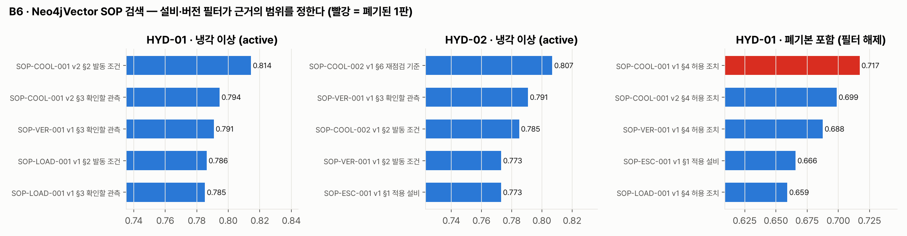
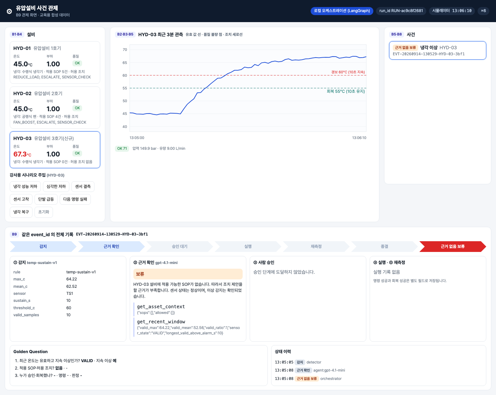
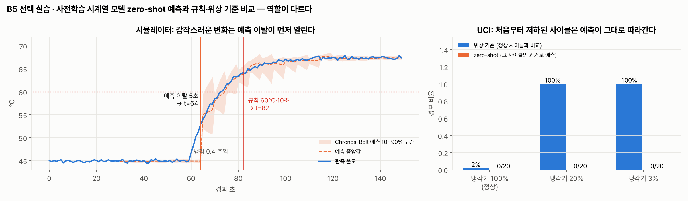

# 통합반 5회 · SOP 검색과 Skill 작성

| 날짜·시간 | 2027-01-28 (목) 09:00~13:00 | 모듈 | M3 · 원 일정 15번 |
|---|---|---|---|
| 블록 | 구현 B6 / 확장 B4 | 산출물 | B4→B6 문서 근거와 작업 지침 |
| 완료 확인 | 예측·이상감지·작업 지침의 역할을 설명 | | |


## 이번 회차에서 할 일

4회에서 B5 가 "냉각 이상", "센서 오류" 같은 사건을 만들었다. 사건이 생기면 누군가는 **무엇을 해도 되는지**를 문서에서 확인해야 한다. 오늘은 조치 매뉴얼(SOP)을 절 단위로 검색하는 B6 와, 에이전트가 따를 **판단 순서와 중단 규칙**을 적은 `SKILL.md` 를 다룬다. 검색은 3회에서 만든 설비 관계(B4)를 이용해 다른 설비의 SOP 나 폐기된 옛 판이 섞이지 않게 거른다. 마지막으로 근거가 없는 설비(HYD-03)에서는 제안을 보류하는 것을 확인하고, 사전학습 시계열 모델의 zero-shot 예측을 짧게 보면서 예측·이상감지·작업 지침이 각각 무슨 일을 하는지 정리한다. 회차가 끝나면 빈칸을 채운 `SKILL.md` 가 점검기를 통과하고, 검색 필터 두 줄의 의미를 설명할 수 있다.

### 학습 목표
- SOP 문서 7개 파일(5종 업무, 냉각 이상 확인은 1호기 1·2판과 2호기 판)의 적용 설비·유효 상태·허용 조치를 표로 읽는다.
- 검색 필터 `asset_scope $like |HYD-01|` 와 `status $eq active` 가 각각 무엇을 거르는지 검색 결과로 확인한다.
- 제공 `SKILL.md` 의 판단 순서·인용 규칙·중단 규칙 빈칸을 채우고 점검기를 통과시킨다.
- 근거가 없으면 `HOLD` 가 되는 두 경로(적용 SOP 없음, 검색되지 않은 인용)를 설명한다.
- zero-shot 예측(FORECAST)·규칙 감지(DETECT)·SOP(EVIDENCE)·Skill(GUIDE)의 역할을 구분한다.

## 1. 시작 전 준비 (복습·환경 확인)

```bash
cd lecture/system
docker compose ps --format "table {{.Name}}\t{{.Status}}"
ls -1 hydops/b6_sop/docs
```

```
NAME              STATUS
hydops-neo4j      Up About an hour
hydops-postgres   Up About an hour
SOP-COOL-001_v1.md
SOP-COOL-001_v2.md
SOP-COOL-002_v1.md
SOP-ESC-001_v1.md
SOP-LOAD-001_v1.md
SOP-SEN-001_v1.md
SOP-VER-001_v1.md
```

3회에서 그래프에 넣은 SOP 가 문서 파일과 같은지 파일의 머리말(frontmatter)을 읽어 확인한다.

```bash
PYTHONPATH=. .venv/bin/python - <<'EOF'
from hydops.b4_ontology import graph

for d in graph.load_sop_docs():
    print(d["sop_key"], d["status"], d["applies_to"], d["event_type"], d["allows"], len(d["sections"]), "절")
EOF
```

```
SOP-COOL-001@v1 superseded ['HYD-01'] COOLING_ANOMALY ['REDUCE_LOAD'] 6 절
SOP-COOL-001@v2 active ['HYD-01'] COOLING_ANOMALY ['REDUCE_LOAD'] 6 절
SOP-COOL-002@v1 active ['HYD-02'] COOLING_ANOMALY ['FAN_BOOST'] 6 절
SOP-ESC-001@v1 active ['HYD-01', 'HYD-02'] COOLING_ANOMALY ['ESCALATE'] 6 절
SOP-LOAD-001@v1 active ['HYD-01'] COOLING_ANOMALY ['REDUCE_LOAD'] 6 절
SOP-SEN-001@v1 active ['HYD-01', 'HYD-02'] SENSOR_FAULT ['SENSOR_CHECK'] 6 절
SOP-VER-001@v1 active ['HYD-01', 'HYD-02'] COOLING_ANOMALY [] 6 절
```

HYD-03 은 어느 문서의 `applies_to` 에도 없다. 3호기는 새로 들어온 설비라 SOP 가 아직 등록되지 않았다는 **교육용 가정**이다.

## 2. 핵심 개념


### 2.1 네 가지 역할

| 역할 | 이 시스템에서 | 하는 일 | 하지 않는 일 |
|---|---|---|---|
| 예측 (FORECAST) | `hydops/b5_detect/zeroshot.py` Chronos-Bolt tiny (선택 비교) | 지금까지의 온도로 다음 몇 초를 예측한다 | 사건을 만들지 않는다 |
| 이상감지 (DETECT) | `hydops/b5_detect/detector.py` 60°C·10초 규칙, 위상 기준 | 지금 사건을 만들지 판정한다 | 조치를 고르지 않는다 |
| 근거 (EVIDENCE) | `hydops/b6_sop/docs/*.md` SOP 절 | 무엇이 허용되고 누가 승인하는지 적는다 | 판단 순서를 정하지 않는다 |
| 작업 지침 (GUIDE) | `skills/hydraulic-cooling-response/SKILL.md` | 어떤 순서로 도구를 부르고 언제 멈출지 적는다 | 근거로 인용되지 않는다 |
| 도구 (TOOL) | `hydops/b7_agent/tools.py` 네 함수 | 실제로 조회하고 검사한다 | 스스로 승인하지 않는다 |

> **주의** `SKILL.md` 에 승인 규칙을 적었다고 승인 검사가 생기지 않는다. 승인·값 범위·중복 실행 검사는 조치 도구의 **코드**(`hydops/b8_action/executor.py`)가 한다. Skill 은 지침이고, SOP 가 근거다.

### 2.2 SOP 검색은 학습이 아니다

SOP 검색은 모델을 새로 학습시키는 일이 아니다. 각 절(`SOPSection` 노드)에 임베딩 벡터를 넣어 두고, 실행할 때 질문과 가까운 절을 찾아 **근거로 붙이는** RAG 다. 검색은 두 겹으로 거른다.

```python
# lecture/system/hydops/b6_sop/search.py (발췌)
flt: dict = {"asset_scope": {"$like": f"|{asset_id}|"}}
if not include_superseded:
    flt["status"] = {"$eq": "active"}
docs = vector_store().similarity_search_with_score(query, k=k * 3, filter=flt)

# 그래프 확인: 실제 APPLIES_TO 관계가 있고 사건 유형이 맞는 SOP 만 근거로 인정
applicable = {(s["doc_id"], s["version"]) for s in graph.applicable_sops(asset_id, event_type)}
```

1. **메타데이터 필터** — 절마다 저장된 `asset_scope`(예: `|HYD-01|HYD-02|`)와 `status`(active/superseded)로 먼저 거른다.
2. **그래프 확인** — 3회의 `Q_APPLICABLE_SOP` 질의로 `(SOP)-[:APPLIES_TO]->(Asset)` 관계가 있고 사건 유형이 맞는 문서만 남긴다.

`$like` 는 Neo4j 에서 `CONTAINS`(포함) 검사로 바뀐다(`neo4j_graphrag/filters.py` 의 `LikeOperator`). 설비 ID 양쪽에 `|` 를 붙이는 이유는, 나중에 `HYD-010` 같은 설비가 생겨도 `|HYD-01|` 이 `|HYD-010|` 안에 들어 있지 않게 하려는 것이다.

## 3. 활동 1 — SOP 다섯 문서와 검색 결과 읽기 · 50분

### 목표
업무 5종(센서 오류 점검 · 냉각 이상 확인 · 승인 부하 감소 · 조치 후 재점검 · 미개선 이관)의 절 구조를 읽고, 실제 검색 결과가 어느 절을 돌려주는지 확인한다.

### 따라 하기
1. 팀별로 한 문서씩 맡아 여섯 절(§1 적용 설비 · §2 발동 조건 · §3 확인할 관측 · §4 허용 조치 · §5 승인 주체 · §6 재점검 기준)을 한 줄씩 요약한다. 냉각 이상 확인은 1호기용 `SOP-COOL-001`(1판 폐기·2판 유효)과 2호기용 `SOP-COOL-002` 로 나뉜다.
2. 관제 서버의 SOP 조회 API 로 옛 판과 새 판을 비교한다(읽기만 한다).

```bash
curl -s http://localhost:8800/api/sop/SOP-COOL-001 | .venv/bin/python -c "
import json,sys
for r in json.load(sys.stdin):
    if r['section'] in ('2','4'): print(r['version'], r['status'], r['section'], r['text'])"
```

3. 설비별로 검색한다. 이 명령은 OpenAI 임베딩을 쓰므로 강사 PC(키가 있는 환경)에서 실행해 화면으로 함께 본다.

```bash
PYTHONPATH=. .venv/bin/python - <<'EOF'
from hydops.b6_sop.search import search_sop

cases = [("HYD-01", None, False), ("HYD-02", None, False), ("HYD-03", None, False),
         ("HYD-01", "부하를 얼마로 낮추나 허용 조치", False), ("HYD-01", "부하를 얼마로 낮추나 허용 조치", True)]
for asset_id, query, sup in cases:
    r = search_sop(asset_id, "COOLING_ANOMALY", query, k=5, include_superseded=sup)
    print(asset_id, query or "(기본 질의)", r["filter"])
    for h in r["hits"]:
        print(f"   {h['doc_id']} v{h['version']} §{h['section']} {h['heading']}  {h['score']}")
EOF
```

### 확인 포인트

옛 판과 새 판 (2026-09-14 실행):

```
1 superseded 2 [SOP-COOL-001 v1 §2 발동 조건] 온도가 65°C를 넘으면 발동한다. (2판에서 60°C 10초 지속 조건으로 개정되었다.)
1 superseded 4 [SOP-COOL-001 v1 §4 허용 조치] 부하를 0.7로 낮춘다.
2 active 2 [SOP-COOL-001 v2 §2 발동 조건] 유효한 온도 관측이 60°C를 넘는 상태가 10초 이상 이어지면 냉각 이상으로 본다. 센서 품질 플래그가 OK가 아닌 관측은 세지 않는다.
2 active 4 [SOP-COOL-001 v2 §4 허용 조치] 허용 조치는 승인 부하 감소(SOP-LOAD-001) 한 가지다. 냉각기 분해·밸브 조작은 이 절차에서 허용하지 않는다.
```

검색 결과 (강사 환경, OpenAI `text-embedding-3-small`):

```
HYD-01 (기본 질의) {'asset_scope': {'$like': '|HYD-01|'}, 'status': {'$eq': 'active'}}
   SOP-COOL-001 v2 §2 발동 조건  0.8144
   SOP-COOL-001 v2 §3 확인할 관측  0.7945
   SOP-VER-001 v1 §3 확인할 관측  0.7908
   SOP-LOAD-001 v1 §2 발동 조건  0.7863
   SOP-LOAD-001 v1 §3 확인할 관측  0.7852
HYD-02 (기본 질의) {'asset_scope': {'$like': '|HYD-02|'}, 'status': {'$eq': 'active'}}
   SOP-COOL-002 v1 §6 재점검 기준  0.8069
   SOP-VER-001 v1 §3 확인할 관측  0.7908
   SOP-COOL-002 v1 §2 발동 조건  0.7849
   SOP-VER-001 v1 §2 발동 조건  0.7731
   SOP-ESC-001 v1 §1 적용 설비  0.773
HYD-03 (기본 질의) {'asset_scope': {'$like': '|HYD-03|'}, 'status': {'$eq': 'active'}}
HYD-01 부하를 얼마로 낮추나 허용 조치 {'asset_scope': {'$like': '|HYD-01|'}, 'status': {'$eq': 'active'}}
   SOP-COOL-001 v2 §4 허용 조치  0.6987
   SOP-VER-001 v1 §4 허용 조치  0.6875
   SOP-ESC-001 v1 §1 적용 설비  0.6657
   SOP-LOAD-001 v1 §4 허용 조치  0.6591
   SOP-LOAD-001 v1 §3 확인할 관측  0.6471
HYD-01 부하를 얼마로 낮추나 허용 조치 {'asset_scope': {'$like': '|HYD-01|'}}
   SOP-COOL-001 v1 §4 허용 조치  0.717
   SOP-COOL-001 v2 §4 허용 조치  0.6987
   SOP-VER-001 v1 §4 허용 조치  0.6875
   SOP-ESC-001 v1 §1 적용 설비  0.6657
   SOP-LOAD-001 v1 §4 허용 조치  0.6591
```



- HYD-01 기본 질의 결과에는 **허용 조치(§4) 절이 없다.** 그래서 Skill 의 판단 순서 3단계가 "허용 조치 절이 없으면 한 번 더 검색한다"고 적는다. 질의를 "허용 조치"로 바꾸자 §4 절들이 나왔다.
- HYD-02 결과에는 1호기 문서(SOP-COOL-001, SOP-LOAD-001)가 하나도 없다.
- HYD-03 은 결과가 비어 있다.
- 필터를 풀면(마지막 묶음) 폐기된 1판의 §4 "부하를 0.7로 낮춘다"가 **점수 1위**로 올라온다. 옛 판이 질문과 더 비슷하게 쓰여 있어도, 유효하지 않은 문서는 근거가 될 수 없다.

### 흔한 실수
- 점수가 가장 높은 절을 무조건 근거로 쓴다 → 점수는 문장이 비슷한 정도일 뿐, 유효 판인지·적용 설비인지는 알려 주지 않는다.
- 학생 PC 에서 `HYDOPS_AGENT_MODE=offline` 으로 같은 검색을 돌리고 점수가 다르다고 놀란다 → 오프라인 모드는 해시 임베딩(`HashEmbeddings`)을 쓰므로 순위가 다르다. 필터와 그래프 확인은 같다.

## 4. 활동 2 — 설비·버전 검색 필터 수정 · 50분

### 목표
실습 S05 `evidence.py` 의 `build_sop_filter` 빈칸을 채워, 실제 `search_sop` 가 만드는 필터와 같게 만든다.

### 따라 하기
1. 빈칸을 확인한다.

```python
# lecture/labs/integrated/S05/evidence.py (빈칸 부분)
def build_sop_filter(asset_id: str, include_superseded: bool = False) -> dict:
    flt = {"asset_scope": {"____": f"|{____}|"}}
    if not include_superseded:
        flt["____"] = {"$eq": "____"}
    return flt
```

2. 활동 1 출력의 `filter` 줄을 보고 채운다. 연산자 이름·설비 변수·필드 이름·유효 상태 값 네 가지다.
3. 점검을 돌린다. 이 점검은 Neo4j·OpenAI 없이 **실제 `search_sop` 코드**를 실행하되, 벡터 저장소와 그래프 조회만 SOP 마크다운에서 만든 메모리 사본으로 바꿔 끼운다.

```bash
PYTHONPATH=. .venv/bin/python -m pytest ../labs/integrated/S05 -q -k filter
```

4. 필터만으로 부족한 점을 찾는다. S05 의 `test_graph_check_removes_other_event_type` 을 읽는다. HYD-01 필터만 적용하면 센서 오류 SOP(`SOP-SEN-001`, 적용 설비 HYD-01·HYD-02)도 냉각 이상 검색 후보에 들어오지만, 그래프 확인(`event_type` 이 맞는 SOP 만)이 걸러낸다.

### 확인 포인트
- 채우기 전: `test_filter_equals_system_filter` 4건과 `test_filter_keeps_asset_and_version_apart` 가 실패한다.
- 채운 뒤: `build_sop_filter("HYD-01")` → `{'asset_scope': {'$like': '|HYD-01|'}, 'status': {'$eq': 'active'}}`, `build_sop_filter("HYD-01", True)` → `{'asset_scope': {'$like': '|HYD-01|'}}` 로 활동 1 출력과 같다.
- 메모리 사본 기준: HYD-01 필터 결과에 `SOP-COOL-001 v1` 과 `SOP-COOL-002` 가 없고, HYD-03 필터 결과는 0건이다.

### 흔한 실수
- `|` 를 빼고 `"HYD-01"` 만 넣는다 → 지금은 결과가 같아 보여도 설비 ID 가 늘면 다른 설비 문서가 섞인다.
- `status` 조건을 `include_superseded` 와 상관없이 항상 넣는다 → 개정 이력을 비교하는 강사용 조회(필터 해제)가 불가능해진다.

## 5. 활동 3 — 제공 SKILL.md의 조건·순서·중단 규칙 채우기 · 50분

### 목표
`labs/integrated/S05/skills/hydraulic-cooling-response/SKILL.md` 의 빈칸 14곳을 채우고, 실제 에이전트 로더로 읽어 점검기를 통과시킨다.

### 따라 하기
1. 구조를 읽는다. 머리말(`name`·`description`·`version`·`tools`) 아래에 `## 판단 순서`(7단계) · `## 인용 규칙` · `## 중단 규칙` · `## 결과 형식` 이 있다.
2. 채우기 전 점검기를 돌린다.

```bash
PYTHONPATH=. .venv/bin/python ../labs/integrated/S05/skill_checker.py
```

```
- 빈칸 ____ 이 14곳 남아 있다
- frontmatter tools 는 ['get_asset_context', 'get_recent_window', 'search_sop', 'propose_action'] 네 개여야 한다: ['get_asset_context', 'get_recent_window', '____', 'propose_action']
- 판단 순서 1단계에서 `get_recent_window` 을 불러야 한다
- 판단 순서 2단계에서 `get_asset_context` 을 불러야 한다
- 판단 순서 3단계에서 `search_sop` 을 불러야 한다
- 판단 순서 4단계에서 `propose_action` 을 불러야 한다
- 1단계: sensor_state 가 SENSOR_FAULT 이면 결정은 SENSOR_CHECK 여야 한다
- 5단계: 에이전트는 승인하지 않는다는 문장이 있어야 한다
- 인용 규칙: doc_id·version·section 세 가지를 인용해야 한다
- 인용 규칙: Skill 은 지침, SOP 는 근거라는 구분이 있어야 한다
- 중단 규칙: 적용 SOP·검색 결과가 없으면 결정은 HOLD 여야 한다
- 중단 규칙: 조치 값은 get_asset_context 의 default_value 를 써야 한다
- 중단 규칙: SENSOR_FAULT 사건의 결정은 SENSOR_CHECK 여야 한다
```

3. 빈칸을 순서대로 채운다. 판단은 **센서 품질 → 대상 설비 → SOP 검색 → 제안 검사** 순서다. 센서가 이상하면 설비 조치를 멈추고(`SENSOR_CHECK`), 근거가 없으면 멈춘다(`HOLD`). 조치 값은 추측하지 않고 `get_asset_context` 가 돌려주는 `default_value`(HYD-01 `REDUCE_LOAD` 는 0.8)를 쓴다.
4. 다시 점검기를 돌린다. 실제 로더 `hydops/b7_agent/skill_loader.py` 의 `build_system_prompt` 가 본문을 `[할당된 스킬 가이드]` 아래에 붙여 에이전트 시스템 프롬프트를 만든다. 제공 원본은 본문 1,614자, 프롬프트 전체 1,746자이고 로더 상한은 6,000자다.

### 확인 포인트
- 모두 채우면 점검기가 `통과` 를 출력한다.
- `PYTHONPATH=. .venv/bin/python -m pytest ../labs/integrated/S05 -q -k skill` 에서 `test_student_skill_passes_checker` 가 통과한다.
- 제공 원본 `skills/hydraulic-cooling-response/SKILL.md` 도 같은 점검기를 통과한다(`test_provided_system_skill_passes_checker`).

### 흔한 실수
- **절 번호를 박아 넣는다.** 시스템을 만들 때 실제로 "부하 감소 SOP §4 를 인용하라"고 적었더니, LLM 이 이번 검색에 나오지 않은 절을 인용했고 코드의 근거 검증이 `HOLD` 로 막았다(안전장치는 작동했지만 제안은 실패). Skill 에는 절 번호 대신 "검색 결과에 있는 절만 인용"을 쓴다. 점검기는 `SOP-LOAD-001 §4` 같은 문장을 찾아 경고한다(`test_checker_catches_pinned_section`).
- 판단 순서에서 SOP 검색을 센서 품질 확인보다 앞에 둔다 → 센서가 끊겼는데 설비 조치 근거를 먼저 찾게 된다.
- 결과 형식에 없는 결정 이름(예: `APPROVE`)을 쓴다 → `Proposal.decision` 은 PROPOSE / HOLD / SENSOR_CHECK / ESCALATE 넷뿐이다.

## 6. 활동 4 — 근거 없는 질문 보류 확인과 제로샷 예측 짧은 시연 · 50분

### 목표
근거가 없을 때 제안이 `HOLD` 로 멈추는 두 경로를 확인하고, zero-shot 예측과 규칙 감지를 비교해 역할을 정리한다.

### 따라 하기
1. **적용 SOP 가 없는 설비.** 관제 화면 스크린샷 S06 을 본다. HYD-03 에 냉각 저하를 주입해 사건이 생겼지만, 에이전트는 조치를 제안하지 않았다.

   

   같은 사건의 실제 기록(2026-09-14, gpt-4.1-mini, `GET /api/events/{event_id}` 발췌):

```json
{"decision": "HOLD", "action_id": null, "citations": [],
 "rationale": "HYD-03 설비에 적용 가능한 SOP가 없습니다. 따라서 조치 제안을 할 근거가 부족합니다. 센서 상태는 정상이며, 이상 감지는 확인되었습니다."}
tool_trace: get_asset_context → {"sops": [], "allowed": []}
            get_recent_window → {"valid_max": 64.22, "valid_ratio": 1.0, "sensor_state": "VALID", "longest_valid_above_alarm_s": 10}
status: HOLD_NO_EVIDENCE (근거 없음)
```

2. **검색되지 않은 인용.** 인용이 이번 검색 결과에 없으면 코드가 제안을 보류시킨다.

```bash
PYTHONPATH=. .venv/bin/python - <<'EOF'
from hydops.b7_agent.agent import Proposal, verify_citations

trace = [{"tool": "search_sop", "result": {"hits": [
    {"doc_id": "SOP-COOL-001", "version": 2, "section": "2"},
    {"doc_id": "SOP-LOAD-001", "version": 1, "section": "2"}]}}]
for cits in ([{"doc_id": "SOP-COOL-001", "version": 2, "section": "2"}],
             [{"doc_id": "SOP-LOAD-001", "version": 1, "section": "4"}],
             []):
    p = Proposal(decision="PROPOSE", action_id="REDUCE_LOAD", value=0.8, citations=cits, rationale="시험")
    final, problems = verify_citations(p, trace)
    print(final.decision, problems, final.rationale)
EOF
```

3. S05 `evidence.py` 의 `retrieved_keys`, `decide_after_citation_check` 빈칸을 채우고 7가지 사례(지어낸 문서, 버전이 다른 절, 인용 없음, 센서 점검 인용 등)가 실제 `verify_citations` 와 같은 결정을 내는지 점검한다.
4. **zero-shot 예측 짧은 시연** (강사 PC, 모델은 미리 내려받아 둔다).

```bash
PYTHONPATH=. .venv/bin/python -m hydops.b5_detect.zeroshot
```

5. S05 `roles.py` 의 역할 표를 채운다.

### 확인 포인트

검색되지 않은 인용:

```
PROPOSE [] 시험
HOLD ['SOP-LOAD-001@v1#4'] 근거 검증 실패로 보류: 검색되지 않은 인용 ['SOP-LOAD-001@v1#4']
HOLD [] 근거 검증 실패로 보류: 검색되지 않은 인용 없음
```

`SOP-LOAD-001 v1 §4` 는 실제 문서에 있는 절이지만 **이번 검색 결과에 없었기 때문에** 보류다. 인용이 하나도 없는 제안도 보류다.

zero-shot 시연 (2026-09-14 실행, 약 4초):

```
simulator {'inject_s': 60, 'rule_alarm_s': 82, 'zeroshot_alarm_s': 64}
uci {"100": {"cycles": 20, "alarms": 0}, "20": {"cycles": 20, "alarms": 0}, "3": {"cycles": 20, "alarms": 0}}
```



- 시뮬레이터에서 냉각 0.4 를 t=60 에 주입했을 때, 관측이 예측 90% 상한을 5초 연속 넘은 시점은 t=64, 규칙(60°C·10초)은 t=82 다. **갑작스러운 변화**는 예측 이탈이 먼저 알린다.
- UCI 시험 구간의 상태별 20사이클에서는 zero-shot 경보가 0·0·0 이다. 한 사이클 안에서 냉각기 상태가 바뀌지 않아, 사이클 앞 30초로 뒤를 예측하면 예측이 **그 사이클의 높은 온도를 그대로 따라가기** 때문이다. 같은 사이클을 정상 사이클과 비교하는 위상 기준은 2%·100%·100% 를 알렸다.
- 그래서 예측은 "평소와 다른 변화"를 일찍 보는 **보조 신호**이고, 사건을 만드는 필수 경로는 규칙·위상 기준(DETECT)이다. 무엇을 해도 되는지는 SOP(EVIDENCE)가, 어떤 순서로 확인하고 언제 멈추는지는 Skill(GUIDE)이 정한다.

### 흔한 실수
- zero-shot 이 t=64 로 빨랐으니 규칙을 없애자고 결론 낸다 → UCI 결과(0건)처럼 처음부터 나빠진 상태는 놓친다. 예측 이탈을 이상 점수로 바꾸는 기준과 지속 조건도 따로 설계해야 한다.
- 모델을 "학습시켰다"고 쓴다 → 추가 학습 없이 기존 체크포인트로 예측만 했다(zero-shot).

## 7. 실습 과제

- 폴더: `labs/integrated/S05/`
- 빈칸 위치
  - `evidence.py`: `build_sop_filter` 의 연산자·설비 ID·필드·상태 값 / `retrieved_keys` 의 절 필드·도구 이름 / `decide_after_citation_check` 의 보류 결정
  - `skills/hydraulic-cooling-response/SKILL.md`: 빈칸 14곳 (도구 이름 5, 센서 오류 결정 2, 승인, 인용 필드, 지침·근거, HOLD, default_value, SENSOR_CHECK)
  - `roles.py`: 역할 5개, 사건 경로, Skill 인용 가능 여부
- 제공(수정하지 않음): `skill_checker.py`
- 확인 명령: `cd lecture/system && PYTHONPATH=. .venv/bin/python -m pytest ../labs/integrated/S05 -q` → 모두 채우면 `18 passed`
- 경험자 과제: HYD-02 용 Skill 판단 순서에 "허용 조치가 FAN_BOOST 이면 값은 1.0~1.5 범위 안의 기본값 1.3" 을 **절 번호 없이** 한 문장으로 추가하고 점검기를 다시 통과시킨다.

## 8. 완료 확인 체크리스트
- [ ] SOP 7개 파일의 적용 설비·유효 상태·허용 조치 표를 작성했다.
- [ ] 두 필터(`asset_scope $like`, `status $eq active`)와 그래프 확인이 각각 무엇을 거르는지 검색 결과로 설명했다.
- [ ] `SKILL.md` 빈칸을 채워 점검기 `통과` 를 받았다.
- [ ] HYD-03(적용 SOP 없음)과 검색되지 않은 인용이 모두 `HOLD` 가 되는 것을 확인했다.
- [ ] 예측(zero-shot)·이상감지(규칙·위상 기준)·근거(SOP)·작업 지침(Skill)의 역할을 한 문장씩 설명했다.

## 9. 회고 (10분)
1. 필터를 풀었을 때 폐기된 1판이 점수 1위였다. 점수만 보는 검색이 현장에서 어떤 사고로 이어질 수 있을까?
2. Skill 에 "SOP-LOAD-001 §4 를 인용하라"고 쓰는 것이 왜 편해 보이고, 왜 실패했을까?
3. zero-shot 예측이 먼저 알린 경보를 사람에게 보여 준다면, 사건으로 만들지 않고 어떤 식으로 보여 주는 것이 좋을까?

## 10. 실제 플랫폼 대응 (미리보기)
Skill 을 업무 에이전트에 할당하는 일은 8회에 교육용 플랫폼(Lab Platform)에서 한다.

| 교육용 기능 (이번 회차) | 실제 플랫폼 대응 | 다른 점 |
|---|---|---|
| `skills/.../SKILL.md` + `build_system_prompt` | Process GPT 업무 에이전트에 Skill 할당 (교육용 플랫폼 `POST /agents/skills`) | 로컬은 파일을 직접 읽는다 |
| `search_sop` 등 도구 4종 (LangChain `@tool`) | 업무 에이전트가 쓰는 MCP 도구 (교육용 플랫폼 `POST /agents/mcp-servers` 로 `http://localhost:8800/mcp/` 등록) | 로컬은 같은 함수를 파이썬에서 바로 부른다 |

## 강사 노트

**시간 배분**

| 시간 | 내용 |
|---|---|
| 09:00~09:50 | 활동 1 — SOP 문서 분담 읽기, 옛 판·새 판 비교, 검색 결과 화면 공유 |
| 09:50~10:40 | 활동 2 — 필터 빈칸, 그래프 확인 읽기 |
| 10:40~11:10 | 휴식 30분 |
| 11:10~12:00 | 활동 3 — SKILL.md 빈칸, 점검기 |
| 12:00~12:50 | 활동 4 — HOLD 두 경로, zero-shot 시연(10분), 역할 표 |
| 12:50~13:00 | 회고 |

**사전 준비**
- 검색 시연: 강사 PC 는 OpenAI 키가 있는 환경(`hydops/config.py` 가 `.env` 를 읽는다)에서 `search.index_sections()` 가 끝나 있어야 한다. 2026-09-14 확인 시 Neo4j 에는 `sop_section_openai` 벡터 인덱스(절 42개)만 있고 오프라인 인덱스는 없었다. 학생 PC 에서 `HYDOPS_AGENT_MODE=offline` 으로 `search_sop` 를 직접 돌리게 하려면, 강사가 수업 전에 오프라인 모드로 `search.index_sections()` 를 한 번 실행해 둔다(공유 Neo4j 에 `embedding_offline` 속성과 인덱스를 추가한다).
- S05 점검은 Neo4j·OpenAI 없이 돈다(메모리 사본). 시작본은 `15 failed, 3 passed` 가 정상이다.
- zero-shot: `amazon/chronos-bolt-tiny` 체크포인트가 캐시에 있어야 한다. 네트워크가 막힌 교실이면 `HF_HUB_OFFLINE=1` 을 앞에 붙인다. 시연이 안 되면 그림 F10 과 §6 출력으로 진행한다(선택 실습이므로 완료 판정에 영향 없음).

**팀 역할**: 관계·문서 담당이 활동 1·2 를, 에이전트·조치 담당이 활동 3 을 이끌고, 데이터 담당이 활동 4 zero-shot 비교 표를 정리한다. 활동 3 시작 시 교대한다.

**장애 대응**: OpenAI 호출이 실패하면 활동 1 은 §3 확인 포인트의 출력과 그림 F09 로 진행한다. 관제 서버가 없으면 `/api/sop` 대신 `hydops/b6_sop/docs/SOP-COOL-001_v1.md`·`_v2.md` 파일을 직접 비교한다.

## 용어
- **SOP 절(SOPSection)**: SOP 문서의 `## n. 제목` 한 절. 검색·인용의 단위(`doc_id`·`version`·`section`).
- **active / superseded**: 유효한 판 / 폐기된 판.
- **asset_scope**: 절이 적용되는 설비 목록을 `|HYD-01|HYD-02|` 모양으로 적은 메타데이터.
- **RAG**: 실행할 때 문서를 검색해 근거로 붙이는 방식. 모델을 새로 학습시키지 않는다.
- **그래프 확인**: `(SOP)-[:APPLIES_TO]->(Asset)` 관계와 사건 유형이 맞는 문서만 남기는 두 번째 거름.
- **Skill(SKILL.md)**: 에이전트가 따를 판단 순서·인용 규칙·중단 규칙. 근거가 아니다.
- **근거 검증(verify_citations)**: 인용이 이번 실행의 검색 결과에 실제로 있었는지 코드로 확인하고, 없으면 HOLD.
- **HOLD_NO_EVIDENCE**: 근거 없음 보류 상태.
- **zero-shot 예측**: 추가 학습 없이 사전학습 체크포인트로 다음 구간을 예측하는 것.
