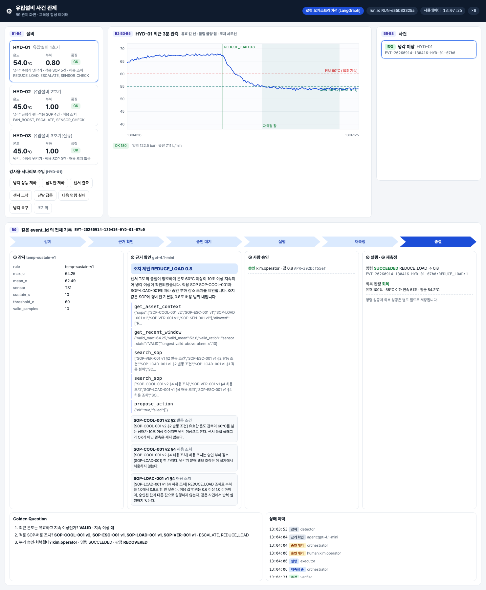
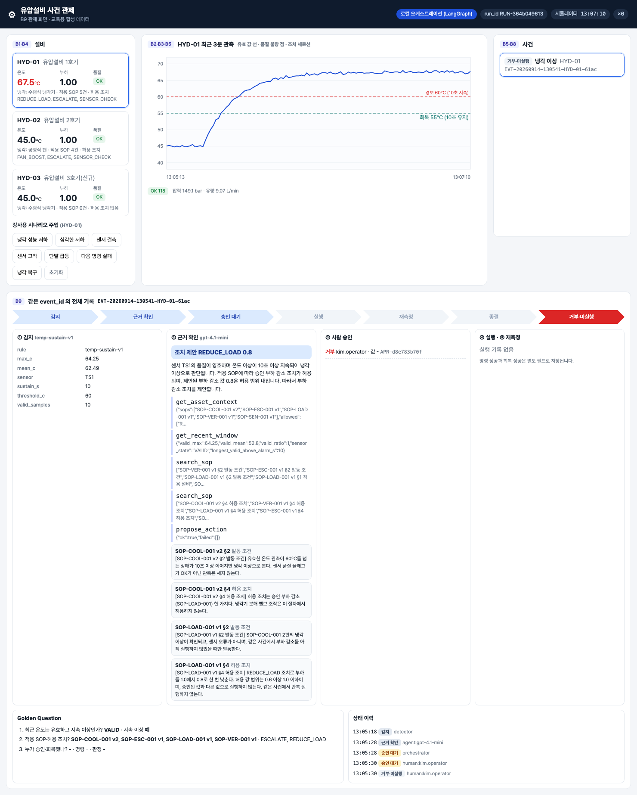

# 통합반 6회 · 도구를 쓰는 로컬 에이전트

| 날짜·시간 | 2027-01-29 (금) 09:00~13:00 | 모듈 | M3 · 원 일정 17번 |
|---|---|---|---|
| 블록 | 구현 B7 · B8 | 산출물 | B7→B8 로컬 조치 흐름 |
| 완료 확인 | 도구와 Skill이 다른 역할임을 설명하고 승인 전 미실행 | | |


## 이번 회차에서 할 일

5회에서 SOP 검색(근거)과 `SKILL.md`(판단 순서·중단 규칙)를 준비했다. 오늘은 이 둘을 실제로 **쓰는** 쪽을 연결한다. B7 에이전트는 네 가지 LangChain 도구로 최근 상태를 조회하고, 설비 맥락과 SOP 를 찾고, 조치 제안이 허용 범위 안인지 검사한다. B8 은 사람이 관제 화면의 **모의 승인 버튼**을 누른 뒤에만 부하 감소를 시뮬레이터에 실행하고, 새 관측으로 회복을 다시 잰다. 거부·명령 실패·허용 범위 이탈·데이터 부족 같은 갈래는 제공 상태표를 채우면서 실제 코드 결과와 맞춰 본다. 회차가 끝나면 "도구는 조회·검사·실행을 하는 함수이고, Skill 은 그 순서를 알려 주는 글"이라는 차이와, 승인 기록이 없으면 어떤 경로로도 실행되지 않는다는 것을 기록으로 보여 줄 수 있다.

### 학습 목표
- 도구 네 개의 입력 인자와 돌려주는 결과를 실제 출력으로 읽는다.
- 사건 → `get_recent_window` → `get_asset_context` → `search_sop` → `propose_action` 연결의 빈칸을 채워, 제공 오프라인 에이전트와 같은 결정을 만든다.
- 승인·거부 버튼이 보내는 요청과, 승인 뒤 `REDUCE_LOAD` 가 `sim.apply_load` 로 이어지는 경로를 코드에서 찾는다.
- 거부·명령 실패·허용 범위 이탈·승인 기록 없음·중복 승인·데이터 부족의 다음 상태와 실행 기록 수를 상태표로 채운다.

## 1. 시작 전 준비 (복습·환경 확인)

```bash
cd lecture/system
docker compose ps --format "table {{.Name}}\t{{.Status}}"
curl -s http://localhost:8800/api/state | .venv/bin/python -c "import json,sys; d=json.load(sys.stdin); print(d['run_id'], d['mode'], d['speed'])"
```

```
NAME              STATUS
hydops-neo4j      Up About an hour
hydops-postgres   Up About an hour
RUN-b5021e42b2 platform 6.0
```

위 출력은 2026-09-14 강사 환경 예시다. 오늘의 모의 승인 버튼은 **`local` 모드에서만** 동작한다. `platform` 모드에서 승인 API 를 부르면 서버가 HTTP 409 와 "platform 모드에서는 교육용 플랫폼의 승인 태스크에서 결정한다"를 돌려준다(`hydops/b9_dashboard/app.py` 의 `decision`). 강사가 `scripts/servers.sh local 4` 로 다시 띄운다.

지난 회차 점검이 통과하는지 확인한다.

```bash
PYTHONPATH=. .venv/bin/python ../labs/integrated/S05/skill_checker.py ../labs/integrated/S05/skills
```

```
통과
```

(자기 S05 를 끝내지 못했으면 제공 원본 `skills` 폴더로 같은 명령을 돌려 `통과` 를 확인하고 진행한다.)

## 2. 핵심 개념


### 2.1 도구와 Skill 은 다르다

| | 도구 (`hydops/b7_agent/tools.py`) | Skill (`skills/hydraulic-cooling-response/SKILL.md`) |
|---|---|---|
| 정체 | 타입이 있는 파이썬 함수 (`@tool`) | 마크다운 글 |
| 하는 일 | DB·그래프를 조회하고, 허용 범위를 검사한다 | 어떤 도구를 어떤 순서로 부르고 언제 멈출지 알려 준다 |
| 에이전트에 들어가는 방법 | 함수 목록으로 등록 (`build_tools`) | 시스템 프롬프트의 `[할당된 스킬 가이드]` 절 (`build_system_prompt`) |
| 틀리면 | 검사 결과(`checks`)가 실패로 돌아온다 | 에이전트가 순서를 틀리거나 근거 없는 인용을 만든다 → 코드의 근거 검증이 막는다 |

같은 함수 본체를 LangChain 도구·MCP 서버(`http://localhost:8800/mcp/`, 6종)·교육용 플랫폼이 함께 쓴다. 에이전트용 네 도구에는 **실행 도구가 없다.** 실행(`execute_sim_action`)과 재측정(`verify_recovery`)은 사람 승인 뒤 오케스트레이션이 부른다.

### 2.2 승인은 도구가 아니다

```python
# lecture/system/hydops/b8_action/executor.py (발췌)
apr = store.get_approval(approval_id) if approval_id else None
if apr is None:
    reject("APPROVAL_NOT_FOUND", f"approval_id={approval_id} (claims={llm_claims})")
if apr["decision"] != "APPROVED":
    reject("APPROVAL_REJECTED", apr["decision"])
...
commands = {"REDUCE_LOAD": sim.apply_load, "FAN_BOOST": sim.apply_fan_boost}
result = commands[action_id](value) if action_id in commands else {"ok": False, "error": f"unsupported action {action_id}"}
status = "SUCCEEDED" if result.get("ok") else "FAILED"
```

실행 도구는 **승인 테이블에 기록이 있는지**를 코드로 확인한다. 대화나 도구 인자에 `approved=True` 라고 적혀 있어도(`llm_claims`) 기록만 하고 승인으로 인정하지 않는다.

> **주의** 명령 성공(`action_log.command_status = SUCCEEDED`)은 회복이 아니다. 회복은 조치 30초 뒤 60초 창의 새 관측으로 따로 판정한다(`verification.outcome`).

## 3. 활동 1 — 제공 LangChain 도구 입력과 결과 읽기 · 50분

### 목표
네 도구의 이름·인자·설명과 실제 결과를 읽고, 에이전트가 원시 센서 배열 대신 **요약**을 받는다는 것을 확인한다.

### 따라 하기
1. 도구 목록과 인자를 출력한다(DB 를 쓰지 않는다).

```bash
PYTHONPATH=. .venv/bin/python - <<'EOF'
from hydops.b7_agent.tools import build_tools

for t in build_tools():
    args = {k: v.get("type", v.get("anyOf")) for k, v in t.args.items()}
    print(t.name, args)
    print("   ", t.description)
EOF
```

2. 강사 환경에서 실제로 기록된 도구 결과를 함께 읽는다. 아래는 2026-09-14 로컬 모드 HYD-01 냉각 이상 사건(gpt-4.1-mini, 뒤에 거부된 사건 `EVT-20260914-130541-HYD-01-61ac`)의 `tool_trace` 와, `get_asset_context` 본체(`graph.asset_context`)를 직접 부른 결과다.

| 도구 | 입력 | 결과 (발췌) |
|---|---|---|
| `get_recent_window` | `asset_id=HYD-01, seconds=60` | `valid_max 64.25 · valid_mean 52.8 · valid_ratio 1.0 · sensor_state VALID · longest_valid_above_alarm_s 10` |
| `get_asset_context` | `asset_id=HYD-01` | 적용 SOP `SOP-COOL-001 v2, SOP-ESC-001 v1, SOP-LOAD-001 v1, SOP-VER-001 v1, SOP-SEN-001 v1` / 허용 조치 `REDUCE_LOAD(0.6~1.0, 기본 0.8, 승인 필요)`, `ESCALATE`, `SENSOR_CHECK` |
| `search_sop` | `asset_id=HYD-01, event_type=COOLING_ANOMALY, query=허용 조치` | `SOP-COOL-001 v2 §4 허용 조치`, `SOP-VER-001 v1 §4`, `SOP-LOAD-001 v1 §4`, `SOP-ESC-001 v1 §4`, `SOP-ESC-001 v1 §1` |
| `propose_action` | `event_id, REDUCE_LOAD, 0.8, [SOP-COOL-001 v2 §4, SOP-LOAD-001 v1 §4]` | `{"ok": true, "failed": []}` |

3. 이미 종결된 다른 사건(`EVT-20260914-131041-HYD-01-f81e`, 승인·실행·회복까지 끝난 사건)에 `propose_action` 본체를 다시 불러 본다(읽기만 하는 검사다). 강사 PC 에서 실행한다.

```bash
PYTHONPATH=. .venv/bin/python - <<'EOF'
import json
from hydops.b8_action import executor
r = executor.propose_action("EVT-20260914-131041-HYD-01-f81e", "REDUCE_LOAD", 0.4, [])
print(r["ok"]); [print(" ", c["check"], c["ok"], c["detail"]) for c in r["checks"]]
EOF
```

### 확인 포인트

도구 목록:

```
get_asset_context {'asset_id': 'string'}
    설비의 센서 목록, 적용 SOP(문서 ID·버전), 허용 조치와 값 범위를 조회한다.
get_recent_window {'asset_id': 'string', 'seconds': 'integer'}
    설비의 최근 구간 관측 요약(센서별 단위·품질 플래그·유효 통계·지속 이상 여부)을 조회한다. 원시 배열은 주지 않는다.
search_sop {'asset_id': 'string', 'event_type': 'string', 'query': 'string'}
    설비에 적용되는 최신(active) SOP 절을 검색한다. event_type 은 COOLING_ANOMALY 또는 SENSOR_FAULT.
propose_action {'event_id': 'string', 'action_id': 'string', 'value': [{'type': 'number'}, {'type': 'null'}], 'citations': 'array'}
    조치 제안의 허용 범위를 검사한다 (허용 조치·값 범위·근거·중복 실행). 실행하지 않는다.
```

종결된 사건에 값 0.4·인용 없음으로 다시 검사 (2026-09-14 실행):

```
False
  event_exists True EVT-20260914-131041-HYD-01-f81e
  event_open False CLOSED
  action_allowed_by_sop True REDUCE_LOAD for HYD-01
  value_in_range False 0.4 in [0.6, 1.0]
  has_citation False 0 citations
  not_already_executed False 1 prior executions
```

- 검사 여섯 개가 **각각** 결과를 돌려준다. 사건이 이미 닫혔고(event_open), 0.4 는 허용 범위 밖이고(value_in_range), 인용이 없고(has_citation), 이미 한 번 실행했다(not_already_executed).
- `propose_action` 은 이름과 달리 **실행하지 않는다.** 검사 결과만 돌려준다.

### 흔한 실수
- `get_recent_window` 결과에 원시 값 배열이 없다고 도구가 고장 났다고 생각한다 → 일부러 코드가 계산한 요약만 준다(`recent_summary`). LLM 에게 원시 배열로 고장을 추정하게 하지 않는다.
- `propose_action` 의 `ok: true` 를 승인으로 읽는다 → 허용 범위 검사를 통과했다는 뜻일 뿐, 승인은 사람이 기록한다.

## 4. 활동 2 — 이벤트→상태 조회→SOP 검색 연결 · 50분

### 목표
실습 S06 `lab_agent.py` 의 빈칸을 채워, 사건 하나를 받아 도구를 Skill 순서대로 부르는 함수를 완성한다. 결과는 제공 `run_offline_agent` 와 같아야 한다.

### 따라 하기
1. 빈칸을 읽는다. `tools` 는 이름 → 함수 사전이다.

```python
# lecture/labs/integrated/S06/lab_agent.py (빈칸 부분)
win = tools["____"](asset_id=a, seconds=60)                     # ① 센서 품질
ts = win["sensors"].get("TS1", {})
if et == "SENSOR_FAULT" or ts.get("sensor_state") == "____":
    sop = tools["search_sop"](asset_id=a, event_type="____")
    ...
    return proposal("____", "SENSOR_CHECK", None, cits, ...)
ctx = tools["____"](asset_id=a)                                  # ② 대상 설비
sop = tools["____"](asset_id=a, event_type=____)                 # ③ SOP 검색
if not sop["hits"] or not equipment:
    return proposal("____", rationale="적용 SOP 근거나 허용 조치가 없어 보류한다.")
chk = tools["____"](event_id=ev["event_id"], action_id=act["action_id"], value=act["____"], citations=cits)  # ④ 제안 검사
```

2. 5회 `SKILL.md` 의 판단 순서 1~4단계와 한 줄씩 짝을 짓는다.
3. 점검한다. S06 점검은 공유 DB 를 쓰지 않는다. 실제 `run_offline_agent`·`verify_citations`·`executor.propose_action` 코드를 `lab_fakes.py` 의 메모리 저장소(SOP 마크다운과 `graph.ACTIONS` 로 만든 사본)에 연결해, 다섯 사건(HYD-01 냉각 · HYD-01 결측 · HYD-02 냉각 · HYD-03 냉각 · 이미 실행된 HYD-01 사건)을 두 에이전트에 똑같이 넣는다.

```bash
HYDOPS_AGENT_MODE=offline PYTHONPATH=. .venv/bin/python -m pytest ../labs/integrated/S06 -q -k "lab_agent or sensor_state"
```

### 확인 포인트

| 사건 | 결정 | 조치 · 값 | 도구 호출 순서 |
|---|---|---|---|
| HYD-01 냉각 이상 | PROPOSE | REDUCE_LOAD · 0.8 | get_recent_window → get_asset_context → search_sop → propose_action |
| HYD-01 센서 결측 | SENSOR_CHECK | SENSOR_CHECK · 없음 | get_recent_window → search_sop(SENSOR_FAULT) |
| HYD-02 냉각 이상 | PROPOSE | FAN_BOOST · 1.3 | 위와 같은 네 단계 |
| HYD-03 냉각 이상 | HOLD | 없음 | get_recent_window → get_asset_context → search_sop |
| HYD-01 이미 실행된 사건 | ESCALATE | REDUCE_LOAD · 0.8 | 네 단계, `not_already_executed` 실패 |

- 모두 채우면 이 묶음 6건이 통과한다(`6 passed, 18 deselected`). 결정·조치·값·인용·도구 순서가 제공 에이전트와 같고, 인용은 `verify_citations` 를 통과하며, 어느 경우에도 시뮬레이터 부하는 1.0 그대로다(**승인 전 미실행**).
- 실제 LLM(gpt-4.1-mini)은 순서가 조금 다를 수 있다. 2026-09-14 강사 환경의 기록에서 종결 사건은 get_recent_window → get_asset_context → search_sop("허용 조치") → propose_action, 거부 사건은 get_asset_context → get_recent_window → search_sop("발동 조건") → search_sop("허용 조치") → propose_action 이었다. 순서가 흔들려도 코드의 근거 검증과 허용 범위 검사는 똑같이 적용된다.

### 흔한 실수
- ①에서 `event_type` 만 보고 `sensor_state` 를 안 본다 → 냉각 이상 사건인데 센서가 끊긴 경우를 놓친다.
- ④의 값에 0.8 을 직접 쓴다 → HYD-02 의 `FAN_BOOST` 기본값은 1.3 이다. 값은 `act["default_value"]` 에서 읽는다(시스템 개발 중 실제로 오프라인 에이전트가 REDUCE_LOAD 만 찾아 HYD-02 를 보류한 문제가 있었고, 허용 조치를 그래프에서 읽도록 고쳤다).
- 도구 사전에 실행 함수를 추가한다 → 에이전트가 승인 전에 실행할 길이 생긴다. 점검이 도구 이름을 네 개로 제한한다.

## 5. 활동 3 — 모의 승인 버튼과 부하 감소 도구 연결 · 50분

### 목표
관제 화면의 승인·거부 버튼이 보내는 요청과, 승인 뒤 부하 감소가 시뮬레이터에 적용되는 경로를 따라가고, S06 `approval_wiring.py` 빈칸을 채운다.

### 따라 하기
1. 강사가 로컬 모드 화면에서 HYD-01 **냉각 성능 저하**를 주입한다. 사건이 `승인 대기` 가 되면 ③ 사람 승인 칸에 승인자·승인값 입력과 **승인 / 거부** 버튼이 나타난다.

   

2. 버튼이 부르는 코드를 찾는다.

```javascript
// lecture/system/hydops/b9_dashboard/static/app.js (발췌)
async decide(decision) {
  await post('/api/events/' + this.selectedId + '/decision', { approver: this.approver, decision, value: decision === 'APPROVED' ? this.approveValue : null });
  this.refresh();
},
```

```python
# lecture/system/hydops/b9_dashboard/app.py (발췌)
@app.post("/api/events/{event_id}/decision")
def decision(event_id: str, body: dict = Body(...)):
    """로컬 모드의 사람 승인 (모의 승인 버튼)."""
    if plant.mode != "local":
        raise HTTPException(409, "platform 모드에서는 교육용 플랫폼의 승인 태스크에서 결정한다")
    return plant.orc.decide(event_id, body.get("approver", "operator"), body["decision"], body.get("value"), body.get("comment"))
```

3. 흐름을 적는다: 버튼 → `Orchestrator.decide` → `service.record_decision`(승인 테이블 기록, 거부면 `REJECTED`) → LangGraph `execute` 노드 → `service.execute` → `executor.execute_sim_action`(승인 기록 검사) → `sim.apply_load(0.8)` → `action_log` 기록 → `EXECUTED` → `VERIFYING`.
4. 강사가 **승인**을 누른다(승인값 0.8). 30초 대기 뒤 60초 재측정 창이 끝나면 사건이 종결된다.

   

5. S06 `approval_wiring.py` 의 `DECISION_PATH`, `BUTTON_TO_DECISION`, `ACTION_TO_METHOD`, `decision_body` 빈칸을 채우고 점검한다.

```bash
HYDOPS_AGENT_MODE=offline PYTHONPATH=. .venv/bin/python -m pytest ../labs/integrated/S06 -q -k "route or body or action_to or button"
```

### 확인 포인트
- 스크린샷 S04: 부하 `0.80`, 그래프의 초록 세로선 `REDUCE_LOAD 0.8` 뒤 음영이 재측정 창이다. ④ 칸에 `명령 SUCCEEDED REDUCE_LOAD → 0.8` 과 중복 방지 키 `EVT-20260914-130416-HYD-01-07b0:REDUCE_LOAD:1`, ⑤ 칸에 `회복 판정 회복 · 유효 100% · 55°C 이하 연속 51초 · 평균 54.2°C` 가 **따로** 보인다.
- 상태 이력: 감지(detector) → 근거 확인(agent) → 승인 대기(orchestrator) → 승인 대기(human:kim.operator) → 실행(executor) → 재측정 중(orchestrator) → 종결(verifier). 사람의 결정은 상태를 바꾸기 전에 `human:` 행으로 먼저 남는다.
- S06 점검(모두 채우면 `5 passed, 19 deselected`): 승인 버튼 본문은 `{"approver": "kim.operator", "decision": "APPROVED", "value": 0.8}`, 거부 버튼 본문은 `value: None`. 메모리 저장소로 실제 `service` 를 돌렸을 때 승인 → 부하 0.8·`VERIFYING`, 거부 → 부하 1.0·`REJECTED`.

### 흔한 실수
- 승인값을 제안값과 다르게 입력하고 실행이 안 된다고 생각한다 → 실행 도구는 승인 기록의 `approved_value` 로 실행한다. 허용 범위(0.6~1.0) 밖이면 `VALUE_OUT_OF_RANGE` 로 거부하고 이관한다.
- `propose_action` 의 `ok: true` 뒤에 바로 `apply_load` 를 부르는 코드를 만든다 → 승인 기록 검사를 건너뛴다. 실행은 `execute_sim_action` 한 곳에서만 한다.

## 6. 활동 4 — 거부·실패·재조회 흐름을 제공 상태표로 확인 · 50분

### 목표
S06 `state_table.py` 의 11개 상황 중 10개 빈칸(상태·실행 기록 수·거부 코드)을 채우고, 실제 `service` 함수로 끝까지 돌린 결과와 일치시킨다.

### 따라 하기
1. 거부 사례를 화면 기록으로 읽는다.

   

   같은 사건의 실제 기록(2026-09-14, 로컬 모드):

```
history: DETECTED(detector) → EVIDENCE_READY(agent:gpt-4.1-mini) → PENDING_APPROVAL(orchestrator)
         → PENDING_APPROVAL(human:kim.operator, decision REJECTED) → REJECTED(human:kim.operator)
approvals: kim.operator REJECTED REDUCE_LOAD value None
actions:   []      verifications: []
```

2. 미개선 사례의 실제 기록도 읽는다(심각한 저하, 로컬 모드).

```
actions:       REDUCE_LOAD 0.8 SUCCEEDED  EVT-20260914-130444-HYD-01-64c4:REDUCE_LOAD:1
verifications: NOT_IMPROVED  valid_ratio 1.0 · longest_below_s 0 · mean_c 68.71 · last_c 68.64
status:        ESCALATED (조치 후 미개선 — 담당자 이관)
```

3. 상태표 빈칸을 채운다. 후보는 파일 머리 주석에 있다. `proposed` 행은 예시로 채워져 있다.

| 상황 | 무엇을 했나 | 채울 칸 |
|---|---|---|
| rejected | 거부 버튼 | status · action_logs · error |
| approved_executed | 승인 0.8, 명령 성공 직후 | 〃 |
| recovered | 냉각 0.4, 재측정 창 끝 | 〃 |
| not_improved | 냉각 0.25, 재측정 창 끝 | 〃 |
| command_failed | 다음 명령 실패 주입 후 승인 | 〃 |
| out_of_range | 승인값 0.4 | 〃 |
| no_approval_record | 승인 기록 없이 `approved=True` 로 실행 요청 | 〃 |
| duplicate_decision | 실행 뒤 승인 한 번 더 | 〃 |
| insufficient_first | 재측정 창 대부분 결측 | 〃 |
| insufficient_then_recovered | 다음 창에서 다시 재측정 | 〃 |

4. 점검한다. 각 상황을 메모리 저장소 위에서 실제 `service.gather_evidence` → `record_decision` → `execute` → `verify` 로 끝까지 돌리고, 사건 상태·`action_log` 수·거부 코드를 상태표와 비교한다.

```bash
HYDOPS_AGENT_MODE=offline PYTHONPATH=. .venv/bin/python -m pytest ../labs/integrated/S06 -q
```

### 확인 포인트
- 채우기 전 시작본: `20 failed, 4 passed`. 모두 채우면 `24 passed`.
- 정답 상태표의 핵심:
  - 거부 → `REJECTED`, 실행 기록 0.
  - 명령 실패 → `ESCALATED`, 실행 기록 **1**(`FAILED` 로 남는다). 허용 범위 이탈 → `ESCALATED`, 실행 기록 **0**(시뮬레이터에 명령이 가기 전에 `VALUE_OUT_OF_RANGE` 로 거부).
  - 승인 기록 없음 → 상태 **그대로** `PENDING_APPROVAL`, `APPROVAL_NOT_FOUND`. 사건을 이관하지 않고 거부만 기록한다.
  - 중복 승인 → 상태 그대로 `VERIFYING`, `NOT_WAITING_FOR_APPROVAL`, 실행 기록은 1 그대로.
  - 미개선 → `ESCALATED`, 실행 기록 1(`SUCCEEDED`) — 명령 성공과 회복 실패가 함께 남는다.
  - 데이터 부족 → 첫 창 `VERIFY_HOLD`(다음 창을 기다린다, 재조회) → 다음 창에서 회복하면 `CLOSED`.
- 관제 화면은 1초마다 `/api/state`·`/api/series`·`/api/events` 와 선택한 사건의 `/api/events/{event_id}` 를 **다시 조회**한다(`app.js` 의 `refresh`). 승인 버튼을 누른 뒤 화면의 상태가 바뀌는 것은 이 재조회 덕분이다.

### 흔한 실수
- 명령 실패와 허용 범위 이탈의 실행 기록 수를 똑같이 적는다 → 실패는 명령을 보냈다가 실패한 기록이 남고, 범위 이탈은 명령을 보내기 전에 막힌다.
- `VERIFY_HOLD` 를 회복으로 적는다 → 데이터가 부족해 **판정을 미룬** 상태다. 센서가 계속 끊기면 두 번째 창 뒤에도 `VERIFY_HOLD` 로 남고 센서 점검이 필요하다고 기록된다.
- 프로세스가 끝났으니 설비가 회복했다고 쓴다 → 회복은 `verification.outcome = RECOVERED` 일 때만이다.

## 7. 실습 과제

- 폴더: `labs/integrated/S06/`
- 빈칸 위치
  - `lab_agent.py`: 도구 이름 4곳, 센서 오류 상태·검색 유형·결정, 사건 유형 변수, HOLD 결정, 조치 값 필드
  - `approval_wiring.py`: 승인 경로 끝부분, 버튼 → 결정 값 2개, 조치 → 시뮬레이터 메서드 2개, 거부 시 값
  - `state_table.py`: 10개 행 × (status, action_logs, error)
- 제공(수정하지 않음): `lab_fakes.py` — 메모리 저장소·그래프 사본·도구 사전. 공유 DB 에 쓰지 않는다(run_id `LAB-S06`).
- 확인 명령: `cd lecture/system && HYDOPS_AGENT_MODE=offline PYTHONPATH=. .venv/bin/python -m pytest ../labs/integrated/S06 -q` → 모두 채우면 `24 passed`
- 경험자 과제: `state_table.py` 에 HYD-02 팬 증속 승인(값 1.3) 후 재측정 행을 하나 더 설계하고, `test_check.py` 의 `run_scenario` 를 참고해 자기 점검 함수를 만든다(제출물은 표와 설명).

## 8. 완료 확인 체크리스트
- [ ] 도구 네 개의 입력·결과를 표로 적고, 도구(함수)와 Skill(순서·중단 규칙 글)의 차이를 한 문장으로 설명했다.
- [ ] `lab_agent.py` 가 다섯 사건에서 제공 오프라인 에이전트와 같은 결정·도구 순서를 냈다.
- [ ] 승인 버튼 → `record_decision` → `execute_sim_action` → `sim.apply_load` 경로를 코드 위치와 함께 설명했다.
- [ ] 에이전트 실행만으로는 시뮬레이터 부하가 1.0 그대로이고 `action_log` 가 0건임을 확인했다(승인 전 미실행).
- [ ] 상태표 10개 행을 채워 S06 점검 `24 passed` 를 받았다.

## 9. 회고 (10분)
1. `approved=True` 를 도구 인자에 넣으면 실행되게 만들었다면, 어떤 대화 한 줄로 사고가 날 수 있을까?
2. 명령 실패는 실행 기록이 1건, 허용 범위 이탈은 0건이다. 감사(audit) 입장에서 이 차이는 왜 중요할까?
3. 실제 LLM 은 도구 순서가 사건마다 조금 달랐다. 그래도 안전하다고 말할 수 있는 근거는 코드의 어느 부분인가?

## 10. 실제 플랫폼 대응 (미리보기)
같은 승인·조치 흐름을 8회에 교육용 플랫폼(Lab Platform)의 프로세스로 옮긴다.

| 교육용 기능 (이번 회차) | 실제 플랫폼 대응 | 다른 점 |
|---|---|---|
| 관제 화면 모의 승인 버튼 → `Orchestrator.decide` | Process GPT 워크리스트의 조치 승인 태스크 (교육용 플랫폼 `POST /process/workitems/{id}/complete`) | 로컬은 누구나 버튼을 누를 수 있다. 플랫폼은 태스크 담당자(설비 담당자)가 완료한다 |
| LangGraph `interrupt` + PostgresSaver(thread_id=event_id) | Process GPT 프로세스 인스턴스 (인스턴스 키 `def:event_id:회차`) | 로컬은 같은 서버 안에서 재개한다 |
| LangChain 도구 4종 | 업무 에이전트의 MCP 도구 (`http://localhost:8800/mcp/`) | 같은 함수 본체를 쓴다 |

## 강사 노트

**시간 배분**

| 시간 | 내용 |
|---|---|
| 09:00~09:50 | 활동 1 — 도구 목록, 실제 도구 결과 표, `propose_action` 검사 읽기 |
| 09:50~10:40 | 활동 2 — `lab_agent.py` 빈칸, 다섯 사건 점검 |
| 10:40~11:10 | 휴식 30분 |
| 11:10~12:00 | 활동 3 — 승인 버튼 시연(냉각 저하 → 승인 → 종결), `approval_wiring.py` |
| 12:00~12:50 | 활동 4 — 거부·미개선 기록 읽기, 상태표, 전체 점검 |
| 12:50~13:00 | 회고 |

**사전 준비**
- `scripts/servers.sh local 4` 로 로컬 모드 기동. 시연 순서: 초기화 → 냉각 성능 저하 → 승인(0.8) → 종결 확인 → 초기화 → 냉각 성능 저하 → 거부 → 초기화 → 심각한 저하 → 승인 → 이관. 승인 뒤 종결까지 시뮬레이터 시각으로 90초가 필요하다(대기 30초 + 창 60초, 속도 ×4 이면 약 23초).
- 강사 PC 에 OpenAI 키가 없으면 관제 서버는 오프라인 에이전트로 제안한다. 이때 오프라인 모드 SOP 검색 인덱스가 필요하므로 수업 전에 오프라인 모드로 `search.index_sections()` 를 실행해 둔다(5회 강사 노트 참고).
- 활동 1 의 `propose_action` 재검사 명령은 강사 환경의 사건 ID 를 쓴다. 다른 환경에서는 `/api/events?all_runs=true` 로 종결된 사건 ID 를 찾아 바꾼다.
- S06 점검은 DB·Neo4j·서버 없이 돈다. 학생 PC 에서 서버 장애가 있어도 활동 2·4 점검은 계속할 수 있다.

**팀 역할**: 에이전트·조치 담당이 활동 2 를, 데이터 담당이 활동 3 화면 기록 읽기를, 관계·문서 담당이 활동 4 상태표를 이끈다. 활동 3 시작 시 교대하고, 상태표는 세 사람이 행을 나눠 채운다.

**장애 대응**: 관제 서버가 platform 모드로만 뜨거나 응답하지 않으면 활동 3 시연은 스크린샷 S03·S04·S08 과 §6 의 실제 기록으로 대신하고, S06 점검의 `test_button_flow_runs_real_service` 로 승인·거부 경로를 확인한다. 화면 시연은 7회 시작 전에 보충한다.

## 용어
- **도구(tool)**: 에이전트가 호출하는 타입 있는 함수. 조회·검사를 한다.
- **Skill**: 도구를 부르는 순서·인용 규칙·중단 규칙을 적은 지침 글.
- **제안 검사(propose_action)**: 허용 조치·값 범위·인용·중복 실행을 검사만 하는 도구. 실행하지 않는다.
- **승인 기록(approval)**: 사람이 승인·거부한 결과를 저장한 행. 실행 도구는 이 기록만 승인으로 인정한다.
- **실행 기록(action_log)**: 시뮬레이터에 보낸 명령과 결과(SUCCEEDED/FAILED). 중복 방지 키 `event_id:action_id:회차`.
- **재측정(verification)**: 조치 30초 뒤 60초 창의 새 관측으로 RECOVERED / NOT_IMPROVED / INSUFFICIENT_DATA 를 판정한 기록.
- **REJECTED / ESCALATED / VERIFY_HOLD**: 거부·미실행 종료 / 담당자 이관 / 데이터 부족으로 재측정 보류.
- **재조회**: 화면이 1초마다 API 를 다시 불러 최신 상태를 보여 주는 것, 또는 데이터 부족 뒤 다음 창에서 다시 재측정하는 것.
- **모의 승인 버튼**: 로컬 모드 관제 화면의 승인·거부 버튼. 실제 권한 관리는 없다.
