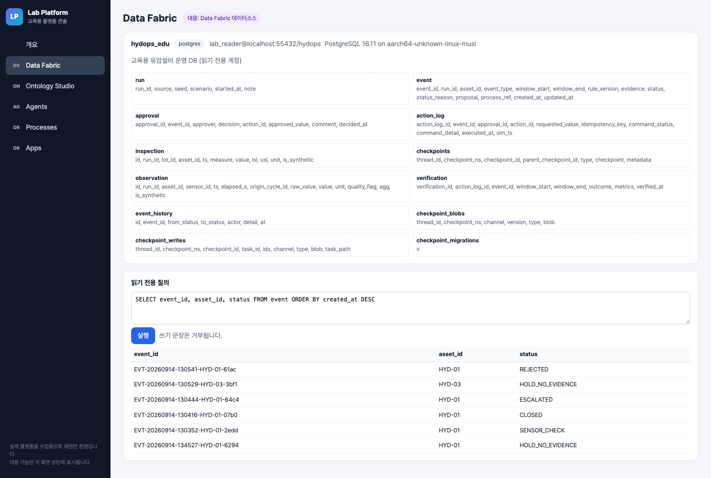
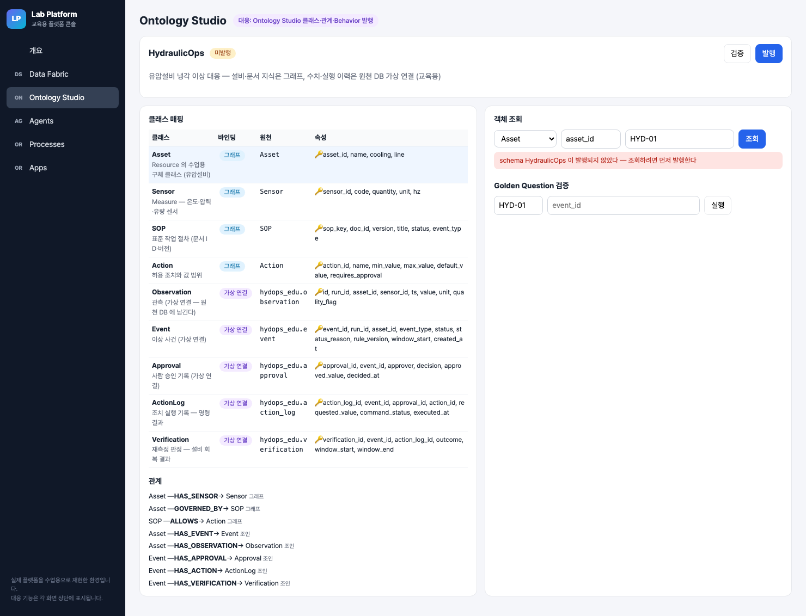
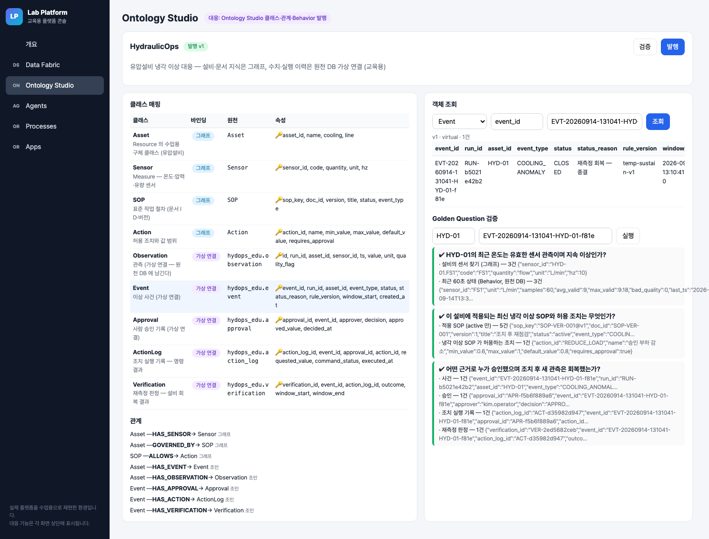

# 통합반 7회 · Ontology Studio에서 내 설비 조회

| 날짜·시간 | 2027-02-01 (월) 09:00~13:00 | 모듈 | M3 · 원 일정 18번 |
|---|---|---|---|
| 블록 | 확장 B4 / 플랫폼 B3, B4 | 산출물 | 플랫폼에 연결된 설비 맥락 |
| 완료 확인 | 발행과 데이터 존재를 구분하고 실제 조회 결과 확인 | | |


## 이번 회차에서 할 일

1~6회에는 우리 노트북 안에서 PostgreSQL(B3)과 Neo4j(B4)를 직접 조회했다. 이번 회차부터 네 번은 같은 데이터를 **교육용 플랫폼(Lab Platform)** 에서 연다. 오늘은 그중 첫 두 계층, Data Sources(Data Fabric)와 Ontology(Ontology Studio)를 다룬다. 새 코드를 짜지 않는다. 강사가 준비한 데이터소스와 클래스 매핑을 읽고, 매핑 JSON 의 빈칸을 채우고, 스키마를 한 번 발행한 뒤 HYD-01 의 센서·SOP·사건을 조회한다. 끝나면 "발행이 됐다"와 "데이터가 있다"가 서로 다른 사실이라는 것을 실제 조회 결과로 설명할 수 있다.

### 학습 목표
- 교육용 플랫폼 콘솔에서 데이터소스 `hydops_edu` 의 테이블과 컬럼을 찾아 말할 수 있다.
- 클래스 하나의 바인딩(그래프 라벨 또는 데이터소스·테이블·컬럼 매핑)과 키 속성을 채울 수 있다.
- 발행 전 조회(409), 발행 후 데이터 있음, 발행 후 데이터 없음(count 0)을 구분해 기록할 수 있다.
- 같은 설비 HYD-01 을 로컬 관제 API 와 교육용 플랫폼에서 조회해 센서·SOP 가 같은지 대조할 수 있다.

## 1. 시작 전 준비 (복습·환경 확인)

6회에 만든 로컬 흐름(B7→B8)이 쓰던 데이터가 그대로 있는지 먼저 확인한다. 서버는 강사가 띄워 둔다(`scripts/servers.sh platform 4`). 우리는 주소가 살아 있는지만 본다.

```bash
cd lecture/system
curl -s http://localhost:8910/health
curl -s http://localhost:8800/api/state | head -c 60
```

예상 출력 (2026-09-14 실행):

```
{"ok":true}
{"run_id":"RUN-b5021e42b2","mode":"platform","speed":6.0,
```

`mode` 가 `platform` 이면 관제 API(:8800)는 사건만 만들고, 사건 처리는 교육용 플랫폼의 프로세스가 맡는다. `run_id` 값은 강사가 시뮬레이터를 초기화할 때마다 바뀐다.

복습 질문 두 개를 짝과 주고받는다.
1. 3회에 만든 관계 `Asset —HAS_SENSOR→ Sensor` 는 어디(PostgreSQL / Neo4j)에 저장돼 있나?
2. 관측값(observation)은 왜 그래프에 옮기지 않고 PostgreSQL 에 남겼나?

## 2. 핵심 개념


교육용 플랫폼은 실제 uEngine 플랫폼을 참고해 수업용으로 가볍게 재현한 환경이다. 뒤에서 네 계층을 다루지만 오늘은 위 두 칸만 쓴다.

| 개념 | 한 줄 설명 | 오늘 보는 곳 |
|---|---|---|
| 데이터소스 | 원천 DB 에 붙는 연결 정보. 수업용은 SELECT 만 되는 `lab_reader` 계정이다 | Data Fabric 화면 |
| 메타데이터 | 데이터소스에서 읽어 온 테이블·컬럼 목록. 매핑이 맞는지 검사하는 기준이다 | Data Fabric 화면 |
| 클래스 | 업무에서 부르는 이름(Asset, Event…)과 속성 목록. 속성 하나가 키다 | Ontology Studio 클래스 매핑 표 |
| 바인딩 | 클래스가 실제 데이터를 어디서 읽는지. `graph`(Neo4j 라벨) 또는 `virtual`(데이터소스·테이블·컬럼 매핑) | 표의 "바인딩" 열 |
| 관계 | 클래스 사이 연결. 그래프 관계를 따라가거나(`graph`), 같은 속성 값으로 조인한다(`join`) | 표 아래 "관계" 목록 |
| 발행 | 검증을 통과한 스키마를 조회 가능한 상태로 올리는 일. 버전이 1씩 오른다 | 발행 버튼 |

제공 스키마 `HydraulicOps` 는 클래스 9개와 관계 8개로 되어 있다. 설비·센서·문서·조치(Asset·Sensor·SOP·Action)는 **그래프**, 관측·사건·승인·실행·재측정(Observation·Event·Approval·ActionLog·Verification)은 **원천 DB 가상 연결**이다. 수치와 실행 이력을 그래프로 복사하지 않고 원천 DB 에 남겨 두는 설계다.

> **주의 — 발행 ≠ 데이터 존재.** Neo4j 에 노드를 넣었다고 플랫폼 클래스가 저절로 생기지 않는다. 클래스 매핑과 **발행**이 있어야 조회가 된다. 반대로 발행이 끝나도 조건에 맞는 행이 없으면 결과는 0개다. 조회 결과를 볼 때 "거부됨(발행 전)"과 "0개(발행 후 데이터 없음)"를 섞어 쓰지 않는다.

> **주의 — 관계를 그렸다고 인과가 확인된 것은 아니다.** `Asset —HAS_EVENT→ Event` 는 같은 `asset_id` 값으로 이어 붙인 조인이다. "이 설비가 사건의 원인이다"라는 실측 결과가 아니다.

## 3. 활동 1 — 플랫폼 데이터소스와 기존 클래스 찾기 · 50분

### 목표
강사가 사전 등록한 데이터소스 `hydops_edu` 의 테이블 목록과, 가져오기만 되어 있고 아직 발행하지 않은 스키마 `HydraulicOps` 를 찾는다.

### 따라 하기
1. 브라우저에서 `http://localhost:8910/console/` 을 열고 왼쪽 메뉴 **Data Fabric** 을 누른다.
2. 카드 제목 옆 `lab_reader@localhost:55432/hydops` 를 확인한다. 쓰기 권한이 없는 계정이다.
3. 같은 내용을 API 로도 읽는다.

```bash
curl -s http://localhost:8910/fabric/datasources/hydops_edu | python3 -m json.tool | head -12
```

4. 아래쪽 **읽기 전용 질의** 칸에 기본 문장 `SELECT event_id, asset_id, status FROM event ORDER BY created_at DESC` 를 두고 **실행** 을 누른다.
5. 메뉴 **Ontology Studio** 로 가서 스키마 이름 옆 배지(미발행 / 발행 v1)와 클래스 매핑 표를 본다.



### 확인 포인트
2026-09-14 실행 결과(비밀번호는 `******` 로 가려진다):

```
"name": "hydops_edu", "engine": "postgres",
"parameters": {"host": "localhost", "port": 55432, "user": "lab_reader", "database": "hydops", "password": "******"},
"server_version": "PostgreSQL 16.11 on aarch64-unknown-linux-musl"
```

메타데이터 테이블은 12개다: `run, event, approval, action_log, inspection, checkpoints, observation, verification, event_history, checkpoint_blobs, checkpoint_writes, checkpoint_migrations`. 이 중 `checkpoint` 로 시작하는 네 개는 로컬 LangGraph 체크포인트용이라 오늘 매핑에 쓰지 않는다. 데이터 담당은 `event` 테이블의 컬럼 14개를 표로 옮겨 적는다.

| 테이블 | 오늘 쓰는 컬럼 | 클래스 |
|---|---|---|
| event | event_id, run_id, asset_id, event_type, status, status_reason, rule_version, window_start, created_at | Event |
| verification | verification_id, event_id, action_log_id, outcome, window_start, window_end, verified_at(정렬) | Verification |
| observation | id, run_id, asset_id, sensor_id, ts, value, unit, quality_flag | Observation |

### 흔한 실수
- **질의 칸에 `DELETE`·`UPDATE` 를 넣어 보는 것.** Data Fabric 질의는 읽기 전용 트랜잭션으로 열리고, 쓰기 단어가 있으면 코드(`fabric.py` `query`)가 400 "Data Fabric 질의는 읽기 전용이다" 로 거부한다. 공유 DB 이므로 시험 삼아 넣지 않는다.
- `checkpoints` 테이블을 사건 기록으로 착각하는 것. 사건은 `event`, 상태 이력은 `event_history` 다.

## 4. 활동 2 — 준비된 클래스·관계 매핑 확인 · 50분

### 목표
제공 매핑의 일부를 `labs/integrated/S07/my_binding.json` 에 옮겨 빈칸을 채우고, 컬럼 이름이 메타데이터에 실제로 있는지 검사한다.

### 따라 하기
1. 관계·문서 담당은 콘솔 클래스 매핑 표에서 Asset·Event·Verification 세 줄을 읽는다. 원본 파일은 `system/labplatform/templates/ontology_hydraulic.json` 이다.

```json
{"name": "Event", "description": "이상 사건 (가상 연결)", "properties": [
  {"name": "event_id", "type": "string", "key": true}, {"name": "run_id", "type": "string"}, {"name": "asset_id", "type": "string"}, ...],
 "binding": {"kind": "virtual", "datasource": "hydops_edu", "table": "event", "order_by": "created_at", "column_map": [
   {"property": "event_id", "column": "event_id"}, {"property": "run_id", "column": "run_id"}, ...]}}
```

2. `my_binding.json` 의 `____` 를 채운다. 빈칸은 스키마 이름, 키 속성, 그래프 라벨, 데이터소스·테이블, 컬럼, 조인 속성이다.
3. 채운 뒤 검사한다.

```bash
cd lecture/system
PYTHONPATH=. .venv/bin/python -m pytest ../labs/integrated/S07 -q -k "blanks or template or fabric"
```

4. 콘솔 Ontology Studio 의 **검증** 버튼을 누르거나 같은 검증을 GET 으로 부른다.

```bash
curl -s http://localhost:8910/studio/schemas/HydraulicOps/validate
```

### 확인 포인트
검증 결과(2026-09-14):

```json
{"ok":true,"problems":[],"bindings":[{"class":"Asset","kind":"graph","label":"Asset","nodes":3},
 {"class":"Sensor","kind":"graph","label":"Sensor","nodes":9},{"class":"SOP","kind":"graph","label":"SOP","nodes":7},
 {"class":"Action","kind":"graph","label":"Action","nodes":4},{"class":"Observation","kind":"virtual","table":"observation"}, ...]}
```

그래프 클래스는 노드 수가 함께 나온다. Sensor 가 9개인 것은 설비 3대 × 센서 3종(TS1·PS1·FS1)이기 때문이다. SOP 7개는 SOP-COOL-001 의 v1(폐기)·v2 를 따로 센 값이다. 검증은 가상 연결 컬럼이 메타데이터에 있는지만 보고 행 수는 세지 않는다 — 여기서부터 이미 "매핑이 맞다"와 "데이터가 있다"가 분리돼 있다.

### 흔한 실수
- 키를 두 개 표시하는 것. 검증은 "키 속성이 정확히 하나여야 한다"로 막는다.
- 조인 관계 `HAS_EVENT` 의 `from_property`/`to_property` 를 `event_id` 로 적는 것. Asset 에는 `event_id` 가 없다. 두 클래스가 **공유하는** 속성 `asset_id` 로 잇는다.
- `order_by` 를 속성 이름으로 착각하는 것. Verification 의 `verified_at` 은 속성 목록에는 없지만 테이블 컬럼이므로 정렬에 쓸 수 있다.

## 5. 활동 3 — 수업용 스키마 발행과 객체 조회 · 50분

### 목표
발행 전 조회가 거부되는 것을 먼저 보고, 발행한 뒤 같은 조회가 데이터를 돌려주는 것을 확인한다.

### 따라 하기
1. **발행 전.** 객체 조회 칸에서 `Asset` · `asset_id` · `HYD-01` 을 넣고 **조회** 를 누른다.



화면에 `schema HydraulicOps 이 발행되지 않았다 — 조회하려면 먼저 발행한다` 가 뜬다. 코드(`studio.py` `_published`)는 이때 HTTP **409** 를 돌려준다. 데이터가 없는 것이 아니라 **조회 자체가 거부된 것**이다.

2. **발행.** 강사 신호에 맞춰 팀당 한 명이 **발행** 버튼을 한 번 누른다. 발행은 검증을 다시 돌리고, 통과하면 Neo4j 에 `_OntologyModel`·`_OntologyClass`·`_OntologyProperty` 노드를 만들고 버전을 올린다. 응답에는 스키마 이름, `published_version`, 클래스 9, 관계 8, 그리고 위 검증과 같은 `bindings` 가 들어 있다. 다시 누르면 v2 가 된다 — 여러 번 누르지 않는다.
3. **발행 후 조회.** 사건 하나를 조회하고 Golden Question 을 실행한다.



4. 이제 GET 으로 관계를 조회해 세 가지 경우를 구분한다. `studio_lookup.py` 의 빈칸을 채우고 실행한다.

```bash
PYTHONPATH=. .venv/bin/python ../labs/integrated/S07/studio_lookup.py
```

### 확인 포인트
2026-09-14 실행 결과:

```
Asset:HYD-01 -HAS_SENSOR-> HAS_DATA           count=3 note=None
Asset:HYD-01 -HAS_EVENT-> HAS_DATA           count=6 note=None
Asset:HYD-02 -HAS_EVENT-> PUBLISHED_NO_DATA  count=0 note=발행은 되었지만 조건에 맞는 데이터가 없다 (발행 ≠ 데이터 존재)
Asset:HYD-03 -GOVERNED_BY-> PUBLISHED_NO_DATA  count=0 note=None
HYD-01 센서 대조: True
```

| 경우 | 기록된 모습 | 판정 |
|---|---|---|
| 발행 전 조회 | HTTP 409, 거부 문구 (S12) | NOT_PUBLISHED |
| 발행 후, 행 있음 | HYD-01 HAS_SENSOR count 3 (S13 에서는 Event 1건) | HAS_DATA |
| 발행 후, 가상 연결 행 없음 | HYD-02 HAS_EVENT count 0 + note | PUBLISHED_NO_DATA |
| 발행 후, 그래프 관계 없음 | HYD-03 GOVERNED_BY count 0, **note 없음** | PUBLISHED_NO_DATA |

HYD-01 사건 6건에는 제품 품질 사건(PRODUCT_QUALITY) 1건도 섞여 있다. 설비 상태 사건과 합성 제품 검사 사건은 다른 유형이므로 표에 옮길 때 `event_type` 을 함께 적는다.

Golden Question 은 발행 후 세 질문 모두 답했다(S13 과 `out/e2e_platform_report.json` 의 `golden_answered: [true, true, true]`). 첫 질문의 Behavior `Asset.recent_state` 는 원천 DB 에서 최근 60초 센서별 통계를 읽는다. 기록 시점 HYD-01 TS1 은 `samples 60, avg_valid 53.97, max_valid 54.59, bad_quality 0` 이었다. 이 값은 시뮬레이터가 돌면서 계속 바뀐다.

### 흔한 실수
- **note 가 없으니 데이터가 있다고 읽는 것.** note 는 가상 연결 조회에만 붙는다. 그래프 관계인 HYD-03 GOVERNED_BY 는 note 없이 count 0 이다. 판정은 `count` 로 한다.
- 0개 결과를 보고 "발행이 안 됐다"고 적는 것. 발행 전이면 409 로 거부된다. 0개는 발행 **후**의 결과다.
- HYD-03 이 0개인 것을 오류로 고치려는 것. HYD-03 은 SOP 가 없는 신규 설비로 설계됐다(`graph.py` `ASSETS`). 근거가 없으니 조치를 제안하지 않는 것이 맞다.

## 6. 활동 4 — 같은 설비를 로컬·플랫폼 화면에서 대조 · 50분

### 목표
HYD-01 의 센서·적용 SOP·허용 조치를 로컬 관제 API(:8800)와 교육용 플랫폼(:8910)에서 각각 조회해 같은지 표로 비교한다.

### 따라 하기
1. 로컬: `curl -s http://localhost:8800/api/assets` (관제 화면이 쓰는 `graph.asset_context`)
2. 플랫폼: `curl -s http://localhost:8910/studio/schemas/HydraulicOps/objects/Asset/HYD-01/related/GOVERNED_BY`
3. 같은 방법으로 `HAS_SENSOR`, 그리고 `SOP/SOP-COOL-001@v2/related/ALLOWS` 를 조회한다.
4. 에이전트·조치 담당은 HYD-02 로 같은 표를 하나 더 만든다.

### 확인 포인트
2026-09-14 실행 결과를 정리하면:

| 항목 | 로컬 `/api/assets` | 교육용 플랫폼 조회 | 같은가 |
|---|---|---|---|
| HYD-01 센서 | HYD-01.FS1, HYD-01.PS1, HYD-01.TS1 | HAS_SENSOR 3건 (같은 ID) | 같음 |
| HYD-01 적용 SOP | SOP-COOL-001 v2, SOP-ESC-001 v1, SOP-LOAD-001 v1, SOP-VER-001 v1, SOP-SEN-001 v1 | GOVERNED_BY 5건 (같은 문서·버전, active 만) | 같음 |
| HYD-01 허용 조치 | REDUCE_LOAD, ESCALATE, SENSOR_CHECK | SOP-COOL-001@v2 ALLOWS → REDUCE_LOAD(0.6~1.0, 기본 0.8) | 냉각 이상 SOP 기준으로 같음 |
| HYD-02 적용 SOP | SOP-COOL-002 v1 외 3건 | GOVERNED_BY 4건 | 같음 |
| HYD-02 허용 조치 | FAN_BOOST, ESCALATE, SENSOR_CHECK | SOP-COOL-002@v1 ALLOWS → FAN_BOOST(1.0~1.5, 기본 1.3) | 같음 |
| HYD-03 | SOP 0, 허용 조치 0 | GOVERNED_BY count 0 | 같음(둘 다 없음) |

두 조회가 같은 Neo4j 그래프를 읽기 때문에 결과가 같다. 다른 점은 **읽는 길**이다. 로컬은 Python 함수가 Cypher 를 직접 실행하고, 교육용 플랫폼은 발행된 클래스·관계 정의를 거쳐 조회한다. 그래서 플랫폼 쪽은 발행 전에 거부된다.


### 흔한 실수
- HYD-02 에 SOP-COOL-001 이 없다고 오류로 보는 것. HYD-02 는 공랭식이라 SOP-COOL-002 가 적용되고 허용 조치도 FAN_BOOST 다. 다른 설비의 SOP 가 섞이지 않는 것이 3회 완료 확인과 같은 기준이다.
- 폐기된 SOP-COOL-001 v1 이 GOVERNED_BY 에 안 나온다고 매핑을 고치는 것. 관계 정의에 `where: {status: active}` 가 있다.

## 7. 실습 과제
- 폴더: `labs/integrated/S07/` (`TASK.md` 참고)
- 빈칸 위치
  - `my_binding.json`: 스키마 이름, Asset·Event 키 속성, Asset 라벨, Event 데이터소스·테이블·컬럼 2개, Verification 테이블·컬럼 2개, HAS_EVENT 조인 속성 2개, HAS_VERIFICATION 대상 속성
  - `studio_lookup.py`: 플랫폼 주소, 스키마 이름, 발행 전 HTTP 상태 코드, 관계 조회 주소 조각, `count` 필드, `sensor_id` 필드
- 검증 방법: 제공 템플릿과 같은지(정적), 컬럼이 `GET /fabric/datasources/hydops_edu` 메타데이터에 있는지, 세 가지 조회 결과를 맞게 구분하는지, HYD-01 센서가 로컬·플랫폼에서 같은지(GET). 테스트는 발행하지 않는다.
- 확인 명령: `cd lecture/system && PYTHONPATH=. .venv/bin/python -m pytest ../labs/integrated/S07 -q` (정답본 7 passed)
- 경험자 과제: HYD-02 로 `same_sensors` 를 돌리고, `Event —HAS_APPROVAL→ Approval` 이 0건인 사건(예: SENSOR_CHECK 사건)을 찾아 note 를 기록한다.

## 8. 완료 확인 체크리스트
- [ ] 데이터소스 `hydops_edu` 의 계정이 읽기 전용(`lab_reader`)임을 화면에서 확인했다.
- [ ] `my_binding.json` 의 컬럼이 모두 메타데이터에 있다(테스트 통과).
- [ ] 발행 전 조회의 409 거부 문구를 기록했다.
- [ ] 발행 후 HYD-01 HAS_SENSOR 가 3건임을 기록했다.
- [ ] 발행 후 count 0 인 조회를 하나 이상 찾아 "발행됐지만 데이터 없음"으로 적었다.
- [ ] HYD-01 센서·적용 SOP 를 로컬과 플랫폼에서 대조한 표를 제출했다.

## 9. 회고 (10분)
1. 발행 전 409 와 발행 후 count 0 을 보고서에 같은 말로 쓰면 어떤 오해가 생기나?
2. 관측값을 그래프로 복사하지 않고 가상 연결로 둔 설계의 장점과 불편한 점은 무엇인가?
3. 오늘 역할(데이터 / 관계·문서 / 에이전트·조치)에서 가장 헷갈린 매핑 한 줄은 무엇이었나?

## 10. 실제 플랫폼 대응

| 교육용 플랫폼 기능 | 실제 플랫폼 기능 | 다른 점 |
|---|---|---|
| Data Fabric `POST /fabric/datasources`, `extract-metadata`, 읽기 전용 질의 | Data Fabric 데이터소스 | 교육용은 `postgres` 엔진 하나만 받고, 메타데이터를 JSON 문서 한 테이블(`labplatform.doc`)에 저장한다 |
| Ontology Studio 클래스·관계·바인딩(graph / virtual) | Ontology Studio 업무 클래스·가상 연결 | 교육용 바인딩 종류는 두 가지, 관계는 그래프 관계와 속성 조인 두 가지뿐이다 |
| `GET .../validate`, `POST .../publish` (Neo4j `_OntologyModel` 노드, 버전 +1) | Ontology Studio 발행 | 교육용은 검증 항목이 키 개수·컬럼 존재·라벨 노드 수로 단순하다 |
| `objects/{c}/fetch`, `related/{rel}`, Behavior `recent_state`, Golden Question | Ontology Studio 객체 조회·Behavior | 교육용 Behavior 는 SQL 템플릿 하나를 파라미터로 실행한다 |
| Process GPT · 아이나루 | (8·9회에서 다룬다) | — |

## 강사 노트

**시간 배분**

| 시각 | 내용 |
|---|---|
| 09:00~09:50 | 활동 1 — 데이터소스·기존 클래스 찾기 |
| 09:50~10:00 | 휴식 |
| 10:00~10:50 | 활동 2 — 매핑 확인, S07 빈칸 채우기 (역할 교대: 데이터 담당 ↔ 관계·문서 담당) |
| 10:50~11:00 | 휴식 |
| 11:00~11:50 | 활동 3 — 발행 전 조회 → 발행 → 세 가지 경우 구분 |
| 11:50~12:00 | 휴식 |
| 12:00~12:50 | 활동 4 — 로컬·플랫폼 대조표 |
| 12:50~13:00 | 회고 |

**사전 준비**
- `scripts/servers.sh platform 4` 후 `PYTHONPATH=. .venv/bin/python scripts/bootstrap_platform.py --upto ontology`. 이 단계는 데이터소스 등록·메타데이터 추출·스키마 가져오기까지만 하고 발행하지 않는다. 가져오기(`import`)는 `published_version` 을 비우므로 리허설에서 발행했던 환경도 S12 상태(409)로 돌아간다.
- 시뮬레이터에 사건이 한 건도 없으면 활동 3의 Event 조회가 0건이다. 수업 전 관제 화면(:8800)에서 "냉각 성능 저하"를 한 번 주입해 사건을 만든다.
- 팀별 발행 순서를 정한다. 같은 스키마를 여러 팀이 누르면 버전만 올라간다.

**장애 대응**
플랫폼(:8910)이 응답하지 않으면 로컬 조회(`/api/assets`, 3회 Cypher)로 활동 4 표를 먼저 채우게 한다. 이때는 플랫폼 실습 완료로 기록하지 않고, 복구 후 활동 3(발행·조회)을 별도로 보충한다.

## 용어

| 용어 | 뜻 |
|---|---|
| 교육용 플랫폼(Lab Platform) | 실제 플랫폼을 참고해 수업용으로 재현한 환경. 주소 `http://localhost:8910/console/` |
| 데이터소스 | 원천 DB 연결 정보. 수업용 이름 `hydops_edu` |
| 바인딩 | 클래스가 데이터를 읽는 곳. graph(라벨) / virtual(테이블·컬럼 매핑) |
| 키 속성 | 객체 하나를 가리키는 속성. 클래스마다 정확히 하나 |
| 발행 | 검증을 통과한 스키마를 조회 가능하게 올리는 일. 버전이 붙는다 |
| 가상 연결 | 데이터를 복사하지 않고 원천 DB 를 조회 시점에 읽는 연결 |
| Golden Question | 온톨로지가 답해야 할 세 질문. 발행 후 실제 조회로 답을 확인한다 |
| count / note | 조회 결과 개수 / 가상 연결에서 0건일 때 붙는 안내 문구 |
