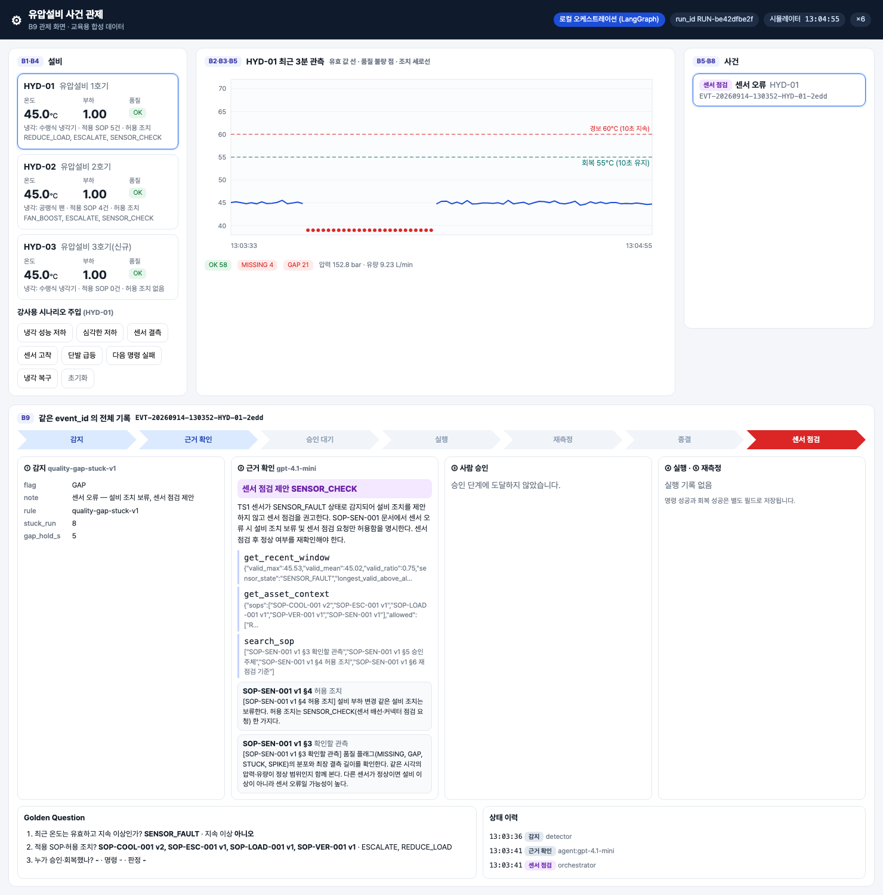

# 통합반 10회 · 전체 아키텍처 폐루프 시연

| 날짜·시간 | 2027-02-04 (목) 09:00~13:00 | 모듈 | M4 · 원 일정 21번 |
|---|---|---|---|
| 블록 | 확장 B1, B5, B8, B9 | 산출물 | B1~B9 연결과 플랫폼 폐루프 |
| 완료 확인 | 같은 event_id의 감지·근거·조치·재측정 기록 제출 | | |


## 이번 회차에서 할 일

마지막 회차다. 1~9회에 채운 빈칸이 하나의 시스템으로 돌아가는지 **시연하고 기록으로 증명한다.** 설비 이상 사건 하나를 근거 확인 → 사람 승인 → 조치 → 재측정까지 교육용 플랫폼(Lab Platform)에서 끝까지 진행하고, 회복·미개선·중복 요청의 기록 차이와 네 가지 합격 목표를 제출 검사기로 확인한다. 끝으로 팀원마다 완성 아키텍처에서 자기 블록을 설명한다.

### 학습 목표
- 정상·센서 오류·설비 이상 세 상황을 시연하고, 각 상황의 사건 상태와 기록 차이를 설명할 수 있다.
- 한 사건의 SOP 인용·승인·실행 기록을 같은 event_id 로 찾아 제출 기록을 만들 수 있다.
- 명령 성공과 재측정 회복을 다른 필드로 구분해 회복·미개선을 판정할 수 있다.
- 제출 검사기의 네 규칙을 채워 실제 사건 기록 전체가 합격 목표를 지키는지 확인할 수 있다.

## 1. 시작 전 준비 (복습·환경 확인)

```bash
cd lecture/system
curl -s http://localhost:8800/api/state | python3 -c "import sys,json;s=json.load(sys.stdin);print(s['mode'],{a:(v['temp_c'],v['load'],v['cooling_eff']) for a,v in s['sim'].items()})"
PYTHONPATH=. .venv/bin/python ../labs/integrated/S10/solution/check_submission.py --all
```

두 번째 명령은 강사가 **정답본** 검사기로 현재 기록을 보여 주는 것이다(학생은 활동 3에서 자기 검사기를 채운다). 2026-09-14 실행 결과:

```
platform {'HYD-01': (54.00000000000004, 0.8, 0.4), 'HYD-02': (45.0, 1.0, 1.0), 'HYD-03': (45.0, 1.0, 1.0)}
EVT-20260914-131041-HYD-01-f81e CLOSED            ✔근거 없는 조치 0건 ✔승인 없는 실행 0건 ✔중복 실행 0건 ✔재측정 없는 회복 판정 0건
EVT-20260914-130541-HYD-01-61ac REJECTED          ✔근거 없는 조치 0건 ✔승인 없는 실행 0건 ✔중복 실행 0건 ✔재측정 없는 회복 판정 0건
EVT-20260914-130529-HYD-03-3bf1 HOLD_NO_EVIDENCE  ✔근거 없는 조치 0건 ✔승인 없는 실행 0건 ✔중복 실행 0건 ✔재측정 없는 회복 판정 0건
EVT-20260914-130444-HYD-01-64c4 ESCALATED         ✔근거 없는 조치 0건 ✔승인 없는 실행 0건 ✔중복 실행 0건 ✔재측정 없는 회복 판정 0건
EVT-20260914-130416-HYD-01-07b0 CLOSED            ✔근거 없는 조치 0건 ✔승인 없는 실행 0건 ✔중복 실행 0건 ✔재측정 없는 회복 판정 0건
EVT-20260914-130352-HYD-01-2edd SENSOR_CHECK      ✔근거 없는 조치 0건 ✔승인 없는 실행 0건 ✔중복 실행 0건 ✔재측정 없는 회복 판정 0건
EVT-20260914-134527-HYD-01-6294 HOLD_NO_EVIDENCE  ✔근거 없는 조치 0건 ✔승인 없는 실행 0건 ✔중복 실행 0건 ✔재측정 없는 회복 판정 0건
```

HYD-01 은 냉각 0.4 에서 부하 0.8 로 조치된 뒤 54°C 부근에 머물러 있고, HYD-02·HYD-03 은 부하 1.0·냉각 1.0 의 정상 운전 45°C 다. 이 값들은 교육용 시뮬레이터의 가정값이다(README §4).

## 2. 핵심 개념


사건 하나가 네 계층을 지나며 남기는 기록은 모두 같은 `event_id` 로 이어진다.

| 계층 | 블록 | 이 사건에서 남는 기록 | 교육용 플랫폼 |
|---|---|---|---|
| Data Sources | B1 시뮬레이터 · B2 품질 · B3 PostgreSQL | observation (값·단위·품질 플래그) | Data Fabric |
| Ontology | B4 설비 관계 · B6 SOP·Skill | 적용 SOP·허용 조치, 인용한 SOP 절 | Ontology Studio |
| Agents | B5 탐지 · B7 에이전트 | event (근거 요약·규칙 버전), proposal (도구 호출·인용) | Agents |
| Orchestration | B8 승인·조치·재측정 · B9 관제 | approval, action_log (중복 방지 키), verification | Process · Apps |


네 가지 합격 목표를 **기록으로 확인할 수 있는 조건**으로 바꾸면 다음과 같다. 이 표가 S10 제출 검사기의 규칙이다.

| 합격 목표 | 기록 조건 | 코드가 지키는 곳 |
|---|---|---|
| 근거 없는 조치 0건 | 실행 기록이 있으면 제안 인용 ≥ 1, 인용 검증 문제 0, 인용한 절 본문이 그래프에 있음 | `verify_citations`(검색되지 않은 인용 → HOLD), `propose_action` 의 `has_citation` |
| 승인 없는 실행 0건 | 실행 기록마다 같은 사건의 APPROVED 승인, 승인 시각 ≤ 실행 시각, 승인값 = 실행값 | `execute_sim_action` 의 APPROVAL_NOT_FOUND·APPROVAL_REJECTED·VALUE_MISMATCH |
| 중복 실행 0건 | `idempotency_key` 중복 없음, 성공한 조치 ≤ 1 | 키 `event_id:action_id:attempt`(UNIQUE), REPEAT_SUPPRESSED, 인스턴스 키, 태스크 재완료 409 |
| 재측정 없는 회복 판정 0건 | CLOSED 이면 조치 이후 창의 RECOVERED 재측정 ≥ 1, CLOSED 전이 행위자가 `verifier` | `service.verify` 만 CLOSED 로 바꾼다 |

> **주의 — 이 목표는 교육용 시험 사례의 목표다.** 실제 공장 운영 성능을 보증하는 수치가 아니다. 60°C·10초 경보, 부하 0.8, 55°C·10초 회복도 모두 교육용 가정값이다.

> **주의 — 금지된 혼동 세 가지.** 명령 성공(`command_status: SUCCEEDED`)을 회복이라 부르지 않는다. 프로세스 완료(`COMPLETED`)를 설비 회복이라 부르지 않는다. 센서 오류(`SENSOR_FAULT`)를 설비 고장이라 부르지 않는다.

### 최종 평가 (실라버스)

| 평가 영역 | 배점 | 제출 증거 |
|---|---|---|
| 데이터와 온톨로지 | 25 | 출처·단위·품질과 세 가지 관계 질의 |
| 탐지와 근거 | 25 | 고정 평가 구간의 오탐·누락, SOP 인용 |
| 승인 조치와 재측정 | 30 | 정상 회복·거부·미개선·데이터 부족 기록 |
| 플랫폼 연결과 설명 | 20 | 앱 URL, 프로세스 ID, 동일 사건의 전체 이력 |

탐지 성능은 사건 단위 누락·오탐과 감지 지연으로 평가한다. 합격 목표는 모델 정확도 수치 하나보다 **근거 없는 조치 0건, 승인 없는 실행 0건, 중복 실행 0건, 재측정 없는 회복 판정 0건**이다. 참고: 고정 시험 구간 B5 평가(지속 10초)는 FP 1 · FN 0, 오탐률 1.7%, 평균 지연 9.0초였다.

## 3. 활동 1 — 정상·센서 오류·설비 이상 시연 · 50분

### 목표
관제 화면(:8800)에서 세 상황을 차례로 만들고, 사건이 생기는지·어떤 유형으로 생기는지·어디서 멈추는지 기록한다.

### 따라 하기
1. **정상.** HYD-02 를 선택해 온도 추이를 30초 이상 본다. 사건 목록에 HYD-02 사건이 새로 생기지 않는지 확인한다.
2. **센서 오류.** HYD-01 에서 **센서 결측** 버튼을 누른다. 강사가 Agents 화면 Watch 카드의 **한 번 실행** 으로 업무를 시작한다.
3. **설비 이상.** 센서 오류 사건이 보류로 끝난 뒤, HYD-01 에서 **냉각 성능 저하** 를 누르고 Watch 를 한 번 더 실행한다.
4. 데이터 담당이 세 상황의 사건을 표로 적는다. 사건 ID 는 앱 URL(`http://localhost:8910/apps/hydops-ops/`)의 사건 목록에서 복사한다.



### 확인 포인트
2026-09-14 기록된 사건으로 채운 예시:

| 상황 | 사건 | 감지 근거(evidence) | 최종 상태 | 조치 기록 |
|---|---|---|---|---|
| 정상 (HYD-02) | 없음 | 최근 60초 TS1 평균 44.96°C, 품질 불량 0 (기록 시점 `Asset.recent_state`) | — | — |
| 센서 오류 | EVT-20260914-130352-HYD-01-2edd `SENSOR_FAULT` | `flag GAP`, `rule quality-gap-stuck-v1`, `gap_hold_s 5` | SENSOR_CHECK | 0건 |
| 설비 이상 | EVT-20260914-131041-HYD-01-f81e `COOLING_ANOMALY` | `max_c 63.91`, `mean_c 62.09`, `sustain_s 10`, `threshold_c 60.0`, `valid_samples 10` | (활동 2·3 에서 진행) | — |
| 근거 없는 설비 | EVT-20260914-130529-HYD-03-3bf1 `COOLING_ANOMALY` | `max_c 64.22`, `sustain_s 10` | HOLD_NO_EVIDENCE | 0건 |

센서 오류 사건의 제안은 `SENSOR_CHECK` 이고 인용은 `SOP-SEN-001 v1 §4`, `§3` 이었다. 도구 호출은 `get_recent_window → get_asset_context → search_sop` 세 번으로 끝나 `propose_action` 을 부르지 않았다. 플랫폼 인스턴스로 처리된 센서 오류 사례(`out/e2e_platform_report.json`)는 마지막 단계가 "보류·센서 점검"이었다.

### 흔한 실수
- 센서 결측 사건을 "설비 고장"으로 발표하는 것. 온도가 높은 게 아니라 값이 들어오지 않은 것이다. 설비 조치는 보류하고 센서 점검을 요청한다.
- 단발 급등을 설비 이상으로 보는 것. 규칙은 **유효 관측** 60°C 초과가 10초 지속될 때만 사건을 만든다.

## 4. 활동 2 — 근거 확인과 승인 조치 · 50분

### 목표
설비 이상 사건의 도구 호출·SOP 인용을 원문과 대조하고, 워크리스트에서 승인해 조치 기록을 만든다.

### 따라 하기
1. 사건 상세를 GET 으로 읽는다.

```bash
curl -s http://localhost:8800/api/events/EVT-20260914-131041-HYD-01-f81e | python3 -c "
import sys,json; d=json.load(sys.stdin); p=d['event']['proposal']
print([t['tool'] for t in p['tool_trace']]); print(p['proposal']['decision'], p['proposal']['action_id'], p['proposal']['value'])
[print(c['doc_id'], 'v%s' % c['version'], '§'+c['section'], c['text']) for c in d['citation_texts']]"
```

2. 관계·문서 담당이 인용 절 본문을 읽고, 제안값이 본문의 허용 범위 안인지 확인한다.
3. Processes 워크리스트의 조치 승인 태스크에서 읽기 전용 칸(사건 ID·설비 ID·실행 ID·제안 조치·제안값·근거 참조)을 사건 상세와 대조한 뒤, 에이전트·조치 담당이 APPROVED · 0.8 로 제출한다.
4. 제출 뒤 사건 상세의 `approvals`·`actions` 를 다시 읽는다.

### 확인 포인트
2026-09-14 실행 결과:

```
['get_recent_window', 'get_asset_context', 'search_sop', 'propose_action']
PROPOSE REDUCE_LOAD 0.8
SOP-COOL-001 v2 §4 [SOP-COOL-001 v2 §4 허용 조치] 허용 조치는 승인 부하 감소(SOP-LOAD-001) 한 가지다. 냉각기 분해·밸브 조작은 이 절차에서 허용하지 않는다.
SOP-LOAD-001 v1 §4 [SOP-LOAD-001 v1 §4 허용 조치] REDUCE_LOAD 조치로 부하를 1.0에서 0.8로 한 번 낮춘다. 허용 값 범위는 0.6 이상 1.0 이하이며, 승인된 값과 다른 값으로 실행하지 않는다. 같은 사건에서 반복 실행하지 않는다.
```

승인 제출 뒤 기록:

| 기록 | 값 |
|---|---|
| approval | `APR-f5b6f889a6` · kim.operator · APPROVED · 0.8 · 13:10:32.555 |
| action_log | `ACT-d35982d947` · REDUCE_LOAD · 0.8 · SUCCEEDED · 13:10:32.664 · 키 `EVT-20260914-131041-HYD-01-f81e:REDUCE_LOAD:1` |
| 인스턴스 | `PI-75788b6a` · 승인 조치 실행 단계 DONE |

승인 시각이 실행 시각보다 앞서고, 실행값이 승인값과 같다 — "승인 없는 실행 0건" 조건을 이 두 줄로 확인한다.

**토론 거리(경험자).** 같은 사건의 `tool_trace` 에서 `get_recent_window` 요약은 `valid_max 45.55`, `longest_valid_above_alarm_s 0`, `sensor_state VALID` 였다. 사건 근거 요약(`max_c 63.91`, `sustain_s 10`)과 값이 다르다. MCP 도구 `get_recent_window(asset_id, seconds)` 는 `run_id`·기준 시각 없이 호출되고, `store.recent_window` 는 이때 그 설비의 마지막 관측 시각을 기준으로 창을 잡는다. 에이전트가 제안을 낸 근거는 SOP 인용이었고 인용 검증 문제는 0개였다. "도구 요약과 사건 근거가 같은 창을 가리키는가"는 검사기 네 규칙에 들어 있지 않다. 이 차이를 제출 기록 §6 에 한 줄로 적고, 어떤 검사를 더하면 잡을 수 있을지 토론한다.

### 흔한 실수
- 승인 폼의 제안값을 보고 인용을 읽지 않고 제출하는 것. 근거 확인은 "인용이 있다"가 아니라 "인용한 절 본문이 제안을 허용한다"를 보는 일이다.
- 승인값을 0.4 로 바꿔 보는 것을 "빨리 식히려는 조치"로 설명하는 것. 허용 범위 0.6~1.0 을 벗어나 코드가 `VALUE_OUT_OF_RANGE` 로 거부하고 이관한다(`out/e2e_platform_report.json` "허용 범위 이탈": ESCALATED, 실행 기록 0).
- 관제 화면(:8800)의 승인 버튼으로 결정하려는 것. platform 모드에서는 409 "교육용 플랫폼의 승인 태스크에서 결정한다"로 거부된다.

## 5. 활동 3 — 재측정 회복·미개선·중복 요청 검증 · 50분

### 목표
재측정 결과가 회복·미개선으로 갈리는 것과, 같은 요청을 다시 보내도 실행이 늘지 않는 것을 기록으로 확인하고 제출 검사기를 완성한다.

### 따라 하기
1. **회복.** 활동 2 사건의 인스턴스가 "조치 후 재점검"을 지나 끝날 때까지 앱에서 기다린 뒤 `verifications` 를 읽는다.
2. **미개선.** 강사가 새 실행에서 HYD-01 에 **심각한 저하** 를 주입하고 같은 절차로 승인한다. 결과를 표에 적는다.
3. **중복 요청.** 앱에서 이미 업무가 있는 사건의 **업무 열기** 를 누르고 문구를 확인한다. 이미 제출한 승인 태스크 주소로 한 번 더 제출하면 어떤 응답이 오는지는 기록 보고서에서 읽는다(공유 환경에서는 다시 보내지 않는다).
4. `labs/integrated/S10/check_submission.py` 의 규칙 빈칸을 채우고 검사한다.

```bash
PYTHONPATH=. .venv/bin/python -m pytest ../labs/integrated/S10 -q
PYTHONPATH=. .venv/bin/python ../labs/integrated/S10/check_submission.py --all
```


### 확인 포인트
기록된 사례 비교(사건 상세 GET · `out/e2e_platform_report.json`, 2026-09-14):

| 사례 | 사건 / 인스턴스 | 명령 결과 | 재측정 | 사건 상태 · 업무 결과 |
|---|---|---|---|---|
| 정상 회복 (플랫폼) | …-f81e / PI-75788b6a | SUCCEEDED | RECOVERED · 55°C 이하 최장 연속 56초 · 유효 비율 1.0 | CLOSED · 종결 |
| 조치 후 미개선 (로컬) | …-64c4 / 없음 | SUCCEEDED | NOT_IMPROVED · 최장 연속 0초 · 유효 비율 1.0 | ESCALATED |
| 조치 후 미개선 (플랫폼 리허설) | 보고서 사례 3 | SUCCEEDED | NOT_IMPROVED | ESCALATED · 이관 |
| 승인 거부 | …-61ac | 실행 없음 | 없음 | REJECTED · 미실행 종료 |
| 허용 범위 이탈 0.4 | 보고서 사례 4 | 실행 없음 | 없음 | ESCALATED · 이관 |
| 데이터 부족 | F07 그림(유효 25%) | — | INSUFFICIENT_DATA | VERIFY_HOLD · 재측정 보류 |

미개선 사례는 명령이 성공했는데도 회복하지 않았다. **명령 성공과 설비 회복이 다른 필드인 이유**가 이 한 줄이다.

중복 요청 기록(보고서 정상 회복 사례):

```json
"duplicate_start": {"duplicate": true, "instance_id": "PI-cd8bfac7", "key": "cooling_response:EVT-20260914-124908-HYD-01-c47b:1"},
"second_completion_http": 409
```

앱에서는 같은 동작이 "이미 시작된 업무 … 를 엽니다 (중복 시작 없음)" 문구로 보인다. 실행 기록 쪽에서는 사건마다 중복 방지 키가 하나뿐이다(`…:REDUCE_LOAD:1`).


### 흔한 실수
- 미개선 사건을 보고 "조치가 실패했다"고 적는 것. 명령은 성공했다. 실패한 것은 **회복**이다. 명령 실패는 `command_status FAILED` 로 따로 남는다.
- 데이터 부족을 미개선으로 합치는 것. 유효 관측이 70% 미만이면 회복도 미개선도 판정하지 않고 다음 창에서 한 번 더 잰다.
- 검사기 규칙 4를 "status 가 CLOSED 면 통과"로 채우는 것. CLOSED 는 판정 결과이지 증거가 아니다. 증거는 조치 **이후** 창의 RECOVERED 기록이다.

## 6. 활동 4 — 완성 아키텍처 설명과 개인 역할 발표 · 50분

### 목표
팀원 한 명씩 완성 아키텍처 그림에서 자기 블록을 짚고, 제출한 사건 기록 한 줄이 그 블록에서 어떻게 생겼는지 설명한다.

### 따라 하기
1. 팀별로 제출 사건 하나를 정해 제출 기록 초안을 만든다.

```bash
PYTHONPATH=. .venv/bin/python ../labs/integrated/S10/check_submission.py EVT-20260914-131041-HYD-01-f81e --md > ../labs/integrated/S10/제출_f81e.md
```

2. 초안을 보고 `labs/integrated/S10/SUBMISSION_TEMPLATE.md` 의 빈칸을 채운다(아래 제출 양식).
3. 발표 순서는 사건이 지나는 순서(데이터 → 관계·문서 → 에이전트·조치)로 한다. 역할별로 설명할 기록과 질문은 다음과 같다.

| 역할 | 짚을 블록 | 설명할 기록 | 받을 질문 예 |
|---|---|---|---|
| 데이터 담당 | B1·B2·B3·B5 | evidence(`max_c`, `sustain_s`, `valid_samples`), 센서 오류 사건의 `flag` | 센서 결측이 왜 설비 이상 사건을 만들지 않았나? |
| 관계·문서 담당 | B4·B6 · Ontology Studio | 인용 절 본문, GOVERNED_BY·ALLOWS 조회, 발행 버전 | HYD-03 사건은 왜 보류됐나? |
| 에이전트·조치 담당 | B7·B8·B9 · Process · Apps | approval·action_log·verification, 인스턴스 ID, 앱 URL 의 같은 사건 확인 | 승인값과 실행값이 다르면 어떤 기록이 남나? |

4. 경험자는 자기가 추가한 센서 별칭 또는 조치 조건 하나와 확인 기록을 덧붙인다.

### 확인 포인트
`--md` 초안의 합격 목표 검사 표(…-f81e, 2026-09-14):

```
| 목표 | 결과 | 설명 |
|---|---|---|
| 근거 없는 조치 0건 | 통과 | 인용 2개 |
| 승인 없는 실행 0건 | 통과 | 승인 1건 · 실행 1건 |
| 중복 실행 0건 | 통과 | 중복 방지 키 ['EVT-20260914-131041-HYD-01-f81e:REDUCE_LOAD:1'] |
| 재측정 없는 회복 판정 0건 | 통과 | 회복 재측정 1건 |
```


### 제출 양식 — 같은 event_id 의 감지·근거·조치·재측정 기록

| 항목 | 값 |
|---|---|
| 팀 / 발표자 / 맡은 역할 | ____ / ____ / ____ |
| 사례 종류 | 정상 회복 · 승인 거부 · 조치 후 미개선 · 센서 오류 · 중복 요청 중 ____ |
| event_id · asset_id · run_id | ____ · ____ · ____ |
| 프로세스 인스턴스 ID · 앱 URL | PI-____ · http://localhost:8910/apps/hydops-ops/ |

| 구분 | 적을 값 (모두 같은 event_id) |
|---|---|
| 1. 감지 | event_type, rule_version, evidence 요약, 감지 구간 |
| 2. 근거 | decision, action_id·value, 인용(doc_id·version·§), 도구 호출 순서, citation_problems |
| 3. 조치 | approval_id·승인자·결정·승인값·승인 시각 / action_log_id·실행값·command_status·실행 시각·idempotency_key (없으면 "실행 없음") |
| 4. 재측정 | verification_id, outcome, 재측정 창, 55°C 이하 최장 연속(초)·유효 비율, 최종 status |
| 5. 합격 목표 검사 | `check_submission.py` 결과 네 줄 |
| 6. 한 줄 설명 | 명령 성공과 회복이 다른 이유 / 프로세스 완료가 회복이 아닌 이유 / (경험자) 토론 거리 |

### 흔한 실수
- 사례마다 다른 사건의 기록을 이어 붙여 한 장을 만드는 것. 네 칸의 event_id 가 모두 같아야 한다. 검사기의 `build_record` 는 네 칸에 같은 event_id 를 넣는다.
- 아키텍처를 "LLM 이 알아서 조치한다"로 설명하는 것. 에이전트는 제안만 하고, 실행은 승인 기록을 검사한 도구가 하며, 종결은 재측정 판정자가 한다.
- 교육용 플랫폼 화면을 실제 플랫폼 화면이라고 소개하는 것. 대응 기능은 §10 표로 설명한다.

## 7. 실습 과제
- 폴더: `labs/integrated/S10/` (`TASK.md`, `SUBMISSION_TEMPLATE.md`, `fixtures/`)
- 빈칸 위치 (`check_submission.py`, 규칙 조건 11곳)
  - 상수: 성공 조치 최대 개수, 승인 결정값, 회복 판정값, 종결 상태값, 종결 행위자
  - 규칙 1: 인용 0개 조건 / 규칙 2: 승인 ID 필드, 실행 시각 필드 / 규칙 3: 중복 방지 키 필드 / 규칙 4: 재측정 창 시작 필드, 회복 재측정 최소 개수
- 검증 방법: ① 실제 기록 fixtures(…-f81e 정상 회복, …-61ac 승인 거부)가 네 목표를 통과 ② 실제 기록을 한 곳씩 바꾼 위반 사례 14가지(인용 삭제, 승인 삭제, 승인 시각 뒤집기, 실행값 변경, 같은 키 중복, 재측정 삭제, 조치 이전 창 등)가 모두 걸림 ③ `GET /api/events?all_runs=true` 의 모든 사건이 통과. 검사기는 GET 만 한다.
- 확인 명령: `cd lecture/system && PYTHONPATH=. .venv/bin/python -m pytest ../labs/integrated/S10 -q` (정답본 9 passed)

## 8. 완료 확인 체크리스트
- [ ] 정상·센서 오류·설비 이상 세 상황의 사건 유무·유형·최종 상태를 표로 냈다.
- [ ] 설비 이상 사건 하나의 인용 절 본문과 제안값·허용 범위를 대조했다.
- [ ] 같은 사건의 승인 시각 ≤ 실행 시각, 승인값 = 실행값을 확인했다.
- [ ] 회복 사례와 미개선 사례의 `command_status`·`outcome`·사건 상태를 비교했다.
- [ ] 중복 요청이 새 실행을 만들지 않았다는 기록(duplicate true, 409, 키 1개)을 찾았다.
- [ ] `check_submission.py` 테스트가 통과하고 `--all` 결과가 모두 ✔ 다.
- [ ] 같은 event_id 의 감지·근거·조치·재측정 기록을 제출 양식으로 제출했다.
- [ ] 팀원 모두 자기 블록을 아키텍처 그림에서 짚어 설명했다.

## 9. 회고 (10분)
1. 네 합격 목표 중 코드가 아니라 사람의 확인에 가장 많이 기대는 것은 무엇인가?
2. 10회 동안 채운 빈칸 중, 틀리면 합격 목표를 깨뜨리는 빈칸 하나를 골라 이유를 말해 본다.
3. 교육용 플랫폼에서 실제 플랫폼으로 옮긴다면 가장 먼저 다시 확인할 연결은 무엇인가?

## 10. 실제 플랫폼 대응

| 교육용 플랫폼 기능 | 실제 플랫폼 기능 | 다른 점 |
|---|---|---|
| Data Fabric 데이터소스 `hydops_edu` (읽기 전용 계정) | Data Fabric 데이터소스 | 교육용은 postgres 한 엔진, 메타데이터를 한 테이블에 저장 |
| Ontology Studio 클래스 9·관계 8 발행, Golden Question 3 | Ontology Studio 클래스·관계·Behavior 발행 | 교육용 바인딩은 graph / virtual 두 종류 |
| 업무 에이전트(Skill 할당 + MCP 허용 도구 4), Watch Agent | Process GPT 업무 에이전트 · Ontologic Watch Agent | 교육용 Watch 는 SQL 한 건·`rows > N` 조건만 지원 |
| 프로세스 `cooling_response`, 워크리스트 승인, 인스턴스 키 | Process GPT 프로세스·워크리스트 | 교육용은 역할 이름만 비교하고 계정 권한이 없다 |
| Apps 게시 `hydops-ops` | 아이나루 앱 게시 | 교육용은 정적 파일과 `config.js` 만 게시, 서버는 사전 운영 |

## 강사 노트

**시간 배분**

| 시각 | 내용 |
|---|---|
| 09:00~09:50 | 활동 1 — 정상·센서 오류·설비 이상 시연 |
| 09:50~10:00 | 휴식 |
| 10:00~10:50 | 활동 2 — 근거 확인, 승인 조치 (역할 교대: 발표 역할과 다른 역할이 조작) |
| 10:50~11:00 | 휴식 |
| 11:00~11:50 | 활동 3 — 회복·미개선·중복 요청, 검사기 완성 |
| 11:50~12:00 | 휴식 |
| 12:00~12:50 | 활동 4 — 제출 기록 작성, 개인 역할 발표 |
| 12:50~13:00 | 회고 |

**사전 준비**
- `scripts/servers.sh platform 4`, `scripts/bootstrap_platform.py --all` 로 앱 게시까지 준비한다.
- 수업 직전 `scripts/e2e_platform.py` 로 한 사건의 감지·조회·승인·조치·재측정과 네 가지 실패 사례를 끝까지 돌린다. 2026-09-14 리허설은 정상 회복·승인 거부·미개선·허용 범위 이탈·센서 오류 5 사례를 통과했고 148.5초 걸렸다. 이 스크립트는 시뮬레이터를 초기화하므로 **학생 사건이 생긴 뒤에는 돌리지 않는다.**
- 미개선 사례는 활동 2 사건이 끝난 뒤 새 사건으로 만든다. 같은 설비·유형의 열린 사건이 있으면 새 사건이 생기지 않는다.
- 평가표(§2)를 팀별로 출력한다. 데이터 부족 기록은 F07 그림과 설명으로 대신할 수 있다.

**장애 대응**
플랫폼이 멈추면 `scripts/servers.sh local 4` 로 로컬 흐름(관제 화면 승인 버튼)에서 활동 1~3 을 이어 간다. 로컬 사건도 검사기로 확인할 수 있지만(`process_ref` 가 없는 사건), "플랫폼 연결과 설명 20" 의 앱 URL·프로세스 ID 증거는 플랫폼 실습 완료로 기록하지 않고 복구 후 보충한다.

## 용어

| 용어 | 뜻 |
|---|---|
| 폐루프 | 감지 → 근거 → 승인 → 조치 → **새 관측으로 재측정** 까지 돌아오는 흐름 |
| 합격 목표 | 근거 없는 조치 0건 · 승인 없는 실행 0건 · 중복 실행 0건 · 재측정 없는 회복 판정 0건 (교육용 시험 사례 기준) |
| idempotency_key | 중복 실행 방지 키 `event_id:action_id:attempt`. 테이블에서 UNIQUE |
| command_status / outcome | 명령 결과(SUCCEEDED·FAILED) / 재측정 판정(RECOVERED·NOT_IMPROVED·INSUFFICIENT_DATA) |
| 제출 기록 | 같은 event_id 의 감지·근거·조치·재측정을 한 장에 모은 문서 |
